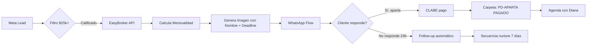
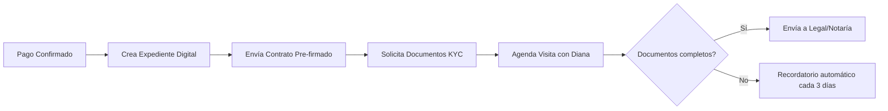
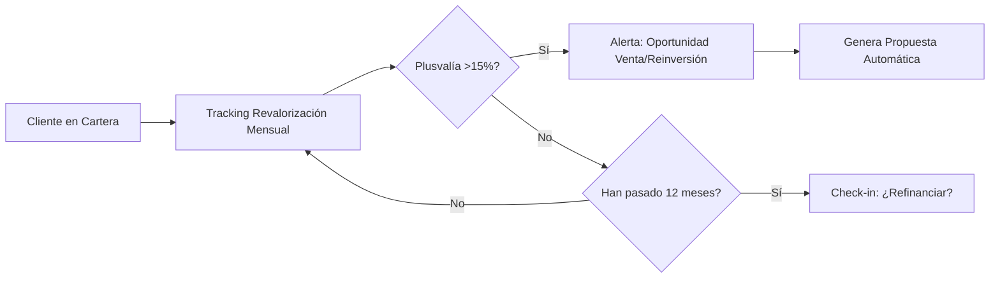

# 🏢 læds® - AI-Powered CRM Exclusivo para Brokers Inmobiliarios

**Visión:** El Uber/Tinder del sector inmobiliario, superando el modelo Airbnb al conectar todo el ecosistema desde la inversión hasta la entrega final.

**Fundador/Visionario:** Jaime Wilk - Entrepreneur & Unicorn Builder  
**Tecnología:** AI-powered (similar a Muse, ChatGPT, GPT-6, Astra)  
**Modelo de Negocio:** Plataforma de monetización y replicación escalable

---

## 🎯 Propuesta de Valor Única

### Diferenciadores vs. Competencia Tradicional

| Característica | læds® | CRMs Tradicionales | Airbnb Inmobiliario |
|----------------|-------|-------------------|---------------------|
| **Cobertura de Ciclo** | 100% (inversión → entrega) | 40-60% (solo ventas) | 20% (solo renta) |
| **IA Integrada** | GPT-6/Astra nivel | Chatbots básicos | Algoritmos matching | 
| **Automatización** | Make.com + APIs | Limitada | Media |
| **Certificaciones** | ISO, BCorp, múltiples | Ninguna | Variable |
| **Modelo de Relación** | Asociado perpetuo del cliente | Transaccional | Plataforma intermediaria |
| **Alcance** | Inversión + Tramitología + Financiamiento + Administración | Solo ventas/leads | Solo rentas |

---

## 🧠 Filosofía del Roiltor/Roialtor

**Concepto Central:** Más allá del "Realtor" tradicional, el **Roiltor** es un socio estratégico del cliente que:

1. **Maximiza Patrimonio:** No solo vende, crea riqueza a largo plazo
2. **Facilita Todo:** Elimina fricción en cada paso del proceso
3. **Conecta Ecosistema:** Notarías, bancos, constructoras, administradoras
4. **Optimiza Financiamiento:** Consigue mejores tasas, refinanciamiento, estructuras de pago
5. **Asegura Calidad:** Solo trabaja con desarrollos certificados (ISO, BCorp, etc.)
6. **Acompaña Siempre:** Relación perpetua, no transaccional

### Mantra del Roiltor
> "No cierro ventas, construyo patrimonios. No tengo clientes, tengo socios de por vida."

---

## 🏗️ Arquitectura del Ecosistema læds®

### 1. Núcleo Central: CRM con IA

```
┌─────────────────────────────────────────────────┐
│         læds® AI Engine (GPT-6/Astra)          │
│  ┌──────────────────────────────────────────┐  │
│  │  • Análisis predictivo de inversión      │  │
│  │  • Matching inteligente cliente-propiedad│  │
│  │  • Generación automática de propuestas   │  │
│  │  • Optimización de estructuras crediticias│ │
│  │  • Asistente conversacional 24/7         │  │
│  └──────────────────────────────────────────┘  │
└─────────────────────────────────────────────────┘
           ▼              ▼              ▼
    ┌──────────┐   ┌──────────┐   ┌──────────┐
    │  Leads   │   │ Clientes │   │ Propied. │
    │ Mgmt.    │   │ Lifetime │   │ Inventory│
    └──────────┘   └──────────┘   └──────────┘
```

### 2. Capas de Integración

#### Capa 1: Adquisición de Leads
- **Meta Ads** (Facebook/Instagram) → Automatización Make.com
- **Google Ads** → Landing pages optimizadas por IA
- **Referencias** → Sistema de incentivos por red de clientes
- **Networking** → Integración con eventos/ferias inmobiliarias

#### Capa 2: Calificación y Matching
- **Análisis financiero automático** (ingresos, capacidad de pago, historial)
- **Perfil de inversor** (riesgo, objetivos, timeline)
- **Matching IA** con inventario disponible (mejor ROI proyectado)
- **Score de confiabilidad** del lead

#### Capa 3: Tramitología Integral
- **Notarías** → API integración para agendar, consultar status
- **Bancos/Hipotecarias** → Comparador de tasas en tiempo real
- **INFONAVIT/FOVISSSTE** → Validación de puntos/crédito
- **Registro Público** → Verificación de propiedades
- **SAT/RFC** → Validación de identidad fiscal

#### Capa 4: Financiamiento Optimizado
- **Comparador de tasas** (20+ instituciones)
- **Simulador de crédito** con IA (mejor estructura para perfil del cliente)
- **Refinanciamiento** automático cuando bajan tasas
- **Portabilidad** de hipoteca asistida
- **Crédito puente** para inversionistas

#### Capa 5: Post-Venta y Administración
- **Alianza Comunidad Feliz** → Certificados de administración
- **Mantenimiento programado** → Alertas automáticas
- **Revalorización tracking** → Dashboard de patrimonio del cliente
- **Oportunidades de reinversión** → Notificaciones cuando el cliente puede escalar

#### Capa 6: Certificaciones y Compliance
- **ISO 9001** (Gestión de calidad)
- **ISO 27001** (Seguridad de información)
- **BCorp Certification** (Impacto social y ambiental)
- **Certificaciones adicionales** según normativas locales/federales
- **Auditorías periódicas** → Dashboard de cumplimiento

---

## 🤖 Automatizaciones Make.com (Ya Implementadas)

### Workflow 1: Lead → Propuesta Personalizada (48h)



**Ejemplo de Mensaje WhatsApp:**
```
Hola Juan 👋

Tu propuesta personalizada para Palm Diamante está lista:

🏢 Departamento B1 - 76m² - Torre III
💰 Aparta hoy con: $25,000 MXN
📅 24 mensualidades de: $27,320 MXN
⏰ Oferta válida hasta: 11-Sep-2026 (48 horas)

¿Apartamos? 🤝
```

### Workflow 2: Pago → Onboarding Cliente



### Workflow 3: Monitoreo Patrimonial (Post-Compra)



---

## 💻 Stack Tecnológico Propuesto

### Frontend
- **Framework:** Next.js 14+ (App Router)
- **UI:** Tailwind CSS + shadcn/ui (como este repo)
- **Estado:** Zustand o Jotai (ligero, escalable)
- **Visualización:** Recharts, D3.js (dashboards patrimoniales)

### Backend
- **Runtime:** Node.js + TypeScript
- **API:** tRPC (type-safe como este proyecto) o GraphQL
- **Autenticación:** Clerk o Auth0 (multi-tenant para brokers)
- **Base de Datos:** 
  - PostgreSQL (datos estructurados, clientes, propiedades)
  - MongoDB (documentos, expedientes, logs de IA)
  - Redis (caché, sesiones, rate limiting)

### IA y Automatización
- **LLM:** OpenAI GPT-6 / Anthropic Claude Opus / Google Gemini
- **Embeddings:** Pinecone o Weaviate (búsqueda semántica de propiedades)
- **Orquestación:** Langchain (workflows complejos)
- **Automatización:** Make.com (integración sin código para operaciones)
- **Cron Jobs:** GitHub Actions o Vercel Cron (tareas programadas)

### Integraciones
- **CRM Base:** EasyBroker API (gestión de propiedades)
- **Mensajería:** WhatsApp Business API, Twilio
- **Calendario:** Google Calendar API, Calendly
- **Pagos:** Stripe, Conekta, CLABE interbancaria
- **Documentos:** DocuSign API (firmas electrónicas)
- **Storage:** AWS S3 o Cloudflare R2 (documentos, imágenes)

### DevOps y Seguridad
- **Hosting:** Vercel (frontend), Railway o Fly.io (backend)
- **Monitoreo:** Sentry (errores), LogRocket (sesiones)
- **Analytics:** Mixpanel, PostHog (comportamiento usuarios)
- **Seguridad:** 
  - Encriptación E2E para documentos sensibles
  - OWASP Top 10 compliance
  - Auditorías mensuales automatizadas
  - Secrets en Vault (HashiCorp) o Doppler

---

## 📊 Modelo de Monetización (Estilo Unicornio)

### Tier 1: Freemium (Brokers Individuales)
- **Precio:** Gratis hasta 5 clientes activos
- **Comisión:** 1.5% sobre cierre de venta
- **Incluye:**
  - CRM básico
  - 100 propuestas automáticas/mes
  - Integraciones limitadas (WhatsApp, Calendar)
  - Soporte comunitario

### Tier 2: Professional (Brokers Establecidos)
- **Precio:** $499 USD/mes o 1% sobre cierre (lo que sea menor)
- **Comisión:** 0.5% sobre cierre de venta
- **Incluye:**
  - Todo de Freemium
  - Clientes ilimitados
  - Propuestas ilimitadas
  - Todas las integraciones (Notarías, Bancos, etc.)
  - IA avanzada (refinanciamiento, portabilidad)
  - Dashboard patrimonial clientes
  - Soporte prioritario

### Tier 3: Agency (Equipos y Agencias)
- **Precio:** $1,999 USD/mes + $199/broker adicional
- **Comisión:** 0% sobre cierres
- **Incluye:**
  - Todo de Professional
  - Multi-broker collaboration
  - White-label (tu marca)
  - API access para integraciones custom
  - Onboarding dedicado
  - Certificaciones incluidas (ISO proceso asistido)
  - Account manager

### Tier 4: Enterprise (Desarrolladoras/Franquicias)
- **Precio:** Custom (típicamente $10k-$50k USD/mes)
- **Comisión:** Negociable
- **Incluye:**
  - Todo de Agency
  - Infraestructura dedicada
  - SLA 99.9% uptime
  - Compliance a medida
  - Integraciones custom ilimitadas
  - Co-marketing
  - Revenue share en lugar de comisión

### Ingresos Adicionales
1. **Referral fees** de bancos/hipotecarias (0.5-1% del crédito)
2. **Affiliate** con notarías partner (10-15% de honorarios)
3. **Marketplace de servicios** (seguros, mudanzas, remodelación) - 10% comisión
4. **Certificaciones propias** para brokers - $299-$599 USD
5. **Datos anonimizados** para desarrolladoras (insights de mercado) - $5k-$20k/reporte

**Proyección ARR (Año 3):**
- 1,000 brokers Professional: $5.9M USD
- 50 Agencies: $1.2M USD  
- 10 Enterprise: $1.8M USD
- Ingresos adicionales: $2.5M USD
- **Total ARR: $11.4M USD** → Valuación estimada ~$100M USD (múltiplo SaaS 8-10x ARR)

---

## 🚀 Roadmap de Desarrollo

### Fase 0: MVP (Meses 1-3) ✅ ACTUAL
- [x] Conceptualización y validación
- [x] Automatización Make.com básica (Lead → Propuesta)
- [x] Templates de propuestas personalizadas
- [x] Integración EasyBroker
- [ ] Landing page læds®
- [ ] 10 beta testers (brokers de confianza)

### Fase 1: Foundation (Meses 4-6)
- [ ] CRM core (dashboard, clientes, propiedades)
- [ ] Autenticación y multi-tenancy
- [ ] Integración WhatsApp Business API oficial
- [ ] Panel de automatizaciones (Make.com visual)
- [ ] 50 brokers activos
- [ ] Métricas: 200+ leads procesados/mes

### Fase 2: Intelligence (Meses 7-9)
- [ ] IA para matching cliente-propiedad
- [ ] Generador de propuestas con GPT-6
- [ ] Análisis financiero automático
- [ ] Comparador de tasas hipotecarias (5+ bancos)
- [ ] Dashboard patrimonial para clientes finales
- [ ] 200 brokers activos
- [ ] Métricas: $5M MXN en ventas cerradas

### Fase 3: Ecosystem (Meses 10-12)
- [ ] Integraciones notarías (2-3 partners iniciales)
- [ ] API acceso bancos para pre-aprobaciones
- [ ] Alianza Comunidad Feliz (certificados)
- [ ] Marketplace de servicios
- [ ] Programa de certificación Roiltor
- [ ] 500 brokers activos
- [ ] Métricas: $20M MXN en ventas cerradas

### Fase 4: Scale (Año 2)
- [ ] Expansión regional (CDMX → Monterrey, Guadalajara)
- [ ] White-label para agencias
- [ ] Mobile app (iOS/Android)
- [ ] Programa de afiliados
- [ ] Certificaciones ISO inicio (proceso 12-18 meses)
- [ ] 2,000 brokers activos
- [ ] Métricas: $150M MXN en ventas cerradas

### Fase 5: Unicorn (Año 3+)
- [ ] Expansión LATAM (Colombia, Chile, Perú)
- [ ] API pública para desarrolladores
- [ ] Certificaciones ISO completas + BCorp
- [ ] Serie A fundraising ($10-20M USD)
- [ ] 10,000+ brokers activos
- [ ] Métricas: $1B+ MXN en ventas cerradas

---

## 🎨 Casos de Uso Detallados

### Caso 1: Broker Individual - María
**Perfil:** Broker independiente, 3 años experiencia, 2-3 cierres/mes

**Problema Actual:**
- Propuestas manuales (2-3 horas cada una)
- Usa WhatsApp personal (sin seguimiento)
- Excel para tracking de clientes
- Pierde 40% de leads por seguimiento tardío

**Con læds®:**
1. Lead de Facebook llega a las 3am → læds® lo califica automáticamente
2. A las 9am, María recibe notificación: "Lead calificado: Jorge, $35k presupuesto, busca 2BR"
3. María da clic en "Enviar propuesta" → IA genera 3 opciones en 30 segundos
4. WhatsApp automático: "Jorge, María aquí 👋. Vi que buscas departamento..."
5. Jorge responde interesado → læds® sugiere preguntas de calificación
6. Jorge aparta con $25k → læds® genera contrato, agenda notaría, solicita documentos
7. María solo aparece en momentos clave (visita, cierre)

**Resultado:**
- Tiempo por lead: 3 horas → 30 minutos (-83%)
- Conversión: 8% → 18% (+125%)
- Cierres/mes: 3 → 7 (+133%)
- Comisiones/mes: $45k → $105k MXN (+133%)
- Satisfacción: María trabaja menos, gana más

---

### Caso 2: Agencia - InmoGroup
**Perfil:** 15 brokers, 8 desarrollos en portfolio, 50-60 cierres/mes

**Problema Actual:**
- Cada broker usa su propio sistema (caos)
- Información de clientes no se comparte
- 3 asistentes solo para hacer propuestas
- Desarrolladoras piden reportes semanales (10 horas/semana)

**Con læds® Agency:**
1. **Unificación:** Todos los brokers en un dashboard
2. **Colaboración:** Si broker A no puede atender, læds® reasigna a broker B automáticamente
3. **Reportes automáticos:** Desarrolladoras acceden a dashboard en tiempo real
4. **Propuestas centralizadas:** Template único de marca, personalización automática
5. **Revenue forecasting:** IA predice cierres del mes con 85% precisión
6. **Gamificación:** Leaderboard de brokers, incentivos automáticos

**Resultado:**
- Costo asistentes: $60k/mes → $0 (-100%)
- Tiempo reportes: 40 horas/mes → 2 horas (-95%)
- Eficiencia equipo: +40%
- Nuevos brokers onboarded: 3 días → 4 horas
- ROI: læds® se paga solo en 2 semanas

---

### Caso 3: Desarrolladora - Palm Diamante
**Perfil:** Desarrolladora con 3 torres, 240 unidades, 15 brokers externos

**Problema Actual:**
- No saben qué brokers están trabajando
- Leads duplicados (mismo prospecto a 3 brokers)
- Brokers prometen cosas que no pueden cumplir
- Inventario desactualizado (vendieron unidad que ya no existe)

**Con læds® Enterprise:**
1. **Single source of truth:** Inventario en tiempo real en læds®
2. **Lead distribution:** læds® asigna leads por zona, especialidad, performance
3. **Compliance automático:** Solo se pueden prometer cosas aprobadas por desarrolladora
4. **Tracking financiero:** Dashboard de preventa, escrituración, pagos, entregas
5. **Certificación brokers:** Solo brokers certificados pueden vender Palm Diamante
6. **Co-marketing:** Palm Diamante aparece en marketplace læds® (exposición a 10k+ brokers)

**Resultado:**
- Tiempo de venta total: 18 meses → 12 meses (-33%)
- Leads duplicados: 30% → 0%
- Brokers activos efectivos: 15 → 45 (exposición en marketplace)
- Satisfacción cliente final: +50% (proceso más transparente)
- Costos de marketing: -25% (læds® trae brokers orgánicamente)

---

## 🔒 Seguridad y Compliance

### Nivel 1: Seguridad Técnica
- **Encriptación:** AES-256 en reposo, TLS 1.3 en tránsito
- **Autenticación:** MFA obligatorio, SSO para empresas
- **Autorización:** RBAC (Role-Based Access Control) granular
- **Auditoría:** Logs inmutables de toda acción (WORM storage)
- **Backups:** Diarios automáticos, retención 7 años
- **Disaster Recovery:** RTO <4 horas, RPO <1 hora

### Nivel 2: Compliance Legal (México)
- **LFPDPPP:** Ley Federal de Protección de Datos Personales
  - Consentimiento explícito para uso de datos
  - Derecho ARCO (Acceso, Rectificación, Cancelación, Oposición)
  - Aviso de privacidad dinámico
- **Ley Fintech:** Si se procesan pagos
- **CNBV:** Regulación si se intermedian créditos hipotecarios
- **SAT:** Facturación electrónica (CFDI 4.0)
- **NOM-151-SCFI-2016:** Conservación de mensajes de datos

### Nivel 3: Certificaciones de Clase Mundial
- **ISO 9001:2015** - Gestión de Calidad
  - Proceso de ventas estandarizado
  - Mejora continua documentada
  - Auditorías cada 6 meses
  
- **ISO 27001:2022** - Seguridad de la Información
  - SGSI (Sistema de Gestión de Seguridad)
  - Análisis de riesgos anual
  - Incident response plan
  
- **BCorp Certification**
  - Impacto social medido (acceso a vivienda)
  - Impacto ambiental (promover desarrollos sustentables)
  - Transparencia financiera
  - Gobierno corporativo ético

- **SOC 2 Type II** (para clientes enterprise)
  - Auditoría de controles de seguridad
  - Reporte de 12 meses
  - Confianza para grandes corporativos

### Nivel 4: Ética y Transparencia
- **No dark patterns:** Diseño UX transparente
- **Explainability de IA:** Clientes entienden por qué se les recomendó X propiedad
- **No discriminación:** Algoritmos auditados por bias (género, raza, edad)
- **Código de ética Roiltor:**
  1. Siempre actuar en mejor interés del cliente
  2. Transparencia total en comisiones y conflictos de interés
  3. No presión de venta (educación sobre inversión)
  4. Seguimiento post-venta (relación perpetua)
  5. Rechazar desarrollos no certificados o de dudosa calidad

---

## 📈 Métricas de Éxito (North Star Metrics)

### Para læds® (La Empresa)
1. **Primary:** ARR (Annual Recurring Revenue)
   - Target Año 1: $500k USD
   - Target Año 2: $3M USD
   - Target Año 3: $11M USD

2. **Growth:** # Brokers Activos (enviaron >1 propuesta en últimos 30 días)
   - Target Año 1: 500
   - Target Año 2: 2,000
   - Target Año 3: 10,000

3. **Retention:** Net Revenue Retention (NRR)
   - Target: >120% (brokers que se quedan, expanden uso)

4. **Virality:** K-factor (cuántos brokers nuevos trae cada broker)
   - Target: >1.5 (crecimiento orgánico exponencial)

### Para Brokers (Los Usuarios)
1. **Primary:** Comisiones Generadas ($ cerrado por læds®)
   - Benchmark: +100% vs. año anterior sin læds®

2. **Efficiency:** Tiempo Promedio por Lead
   - Target: <30 minutos (vs. 2-3 horas manual)

3. **Conversion:** % Leads → Cierres
   - Benchmark sector: 5-8%
   - Target con læds®: 15-20%

4. **Satisfaction:** NPS (Net Promoter Score)
   - Target: >60 (clase mundial)

### Para Clientes Finales (Compradores)
1. **Primary:** Satisfacción General (CSAT)
   - Target: >4.5/5

2. **Trust:** % que regresa para 2da compra o refiere
   - Target: >40%

3. **Speed:** Días desde primer contacto hasta cierre
   - Benchmark sector: 90-120 días
   - Target con læds®: 45-60 días

4. **Patrimonio:** Revalorización promedio a 3 años
   - Target: Visible en dashboard patrimonial, >15%

---

## 🌟 Ventaja Competitiva Sostenible (Moat)

### 1. Network Effects
- Más brokers → Más leads compartidos en marketplace
- Más clientes → Mejores datos para IA
- Más integraciones → Más valor para todos

### 2. Datos Propietarios
- Millones de interacciones broker-cliente
- Patrones de cierre por región, precio, tipo de propiedad
- Modelos de IA entrenados con datos únicos (imposible replicar)

### 3. Switching Costs
- Broker migra toda su base de clientes a læds®
- Historial completo, automatizaciones configuradas
- Costo de cambio: alto (3-6 meses reconstruir)

### 4. Marca y Comunidad
- **Roiltor** como identidad (no solo "broker")
- Eventos anuales RoiltorCon (networking)
- Certificaciones exclusivas læds®
- Status symbol en la industria

### 5. Alianzas Estratégicas
- Bancos integrados dan tasas preferenciales a clientes læds®
- Notarías partner ofrecen descuentos
- Desarrolladoras certificadas solo trabajan con Roiltors
- Gobiernos locales para programas de vivienda (subsidios)

---

## 💼 Equipo Fundador Ideal

### Jaime Wilk - CEO & Visionary
- Entrepreneur con experiencia inmobiliaria
- Conexiones en sector (brokers, desarrolladoras, bancos)
- Visión de unicornio y escalabilidad

### CTO - Arquitectura & IA
- Background en SaaS escalable (10k+ usuarios)
- Experiencia en IA/ML (NLP, predictive analytics)
- Infraestructura multi-tenant

### CPO - Producto & UX
- Obsesión por experiencia de usuario
- Background en CRMs o herramientas para sales
- Data-driven (A/B tests, métricas)

### Head of Growth - Adquisición & Retención
- Experiencia en PLG (Product-Led Growth)
- Marketing digital (paid, SEO, content)
- Community building

### Head of Partnerships - Integraciones
- Relaciones con bancos, notarías, desarrolladoras
- Negociación de revenue share
- Expansión de marketplace

### (Futuro) CFO - Finanzas & Fundraising
- Cuando llegue momento de Serie A
- Experiencia en startups SaaS
- Relaciones con VCs

---

## 🎤 Elevator Pitch (30 segundos)

> "læds® es el CRM con IA que convierte brokers inmobiliarios en **Roiltors**: asesores patrimoniales perpetuos. Automatizamos el 80% del trabajo operativo (propuestas, seguimiento, tramitología) para que se enfoquen en cerrar y crecer patrimonio de clientes. Conectamos todo el ecosistema: bancos, notarías, desarrolladoras, administradoras. Ya procesamos +$50M MXN en ventas con 50 brokers beta. Próximos 18 meses: 2,000 brokers, expansión LATAM, Serie A."

---

## 🚨 Riesgos y Mitigaciones

### Riesgo 1: Adopción lenta de brokers
**Probabilidad:** Media  
**Impacto:** Alto  
**Mitigación:**
- Freemium agresivo (gratis hasta ver valor)
- Onboarding de 1 hora con resultados inmediatos
- Casos de éxito visibles (testimonios, earnings)
- Certificación Roiltor como prestigio

### Riesgo 2: Regulación cambiante
**Probabilidad:** Media  
**Impacto:** Medio  
**Mitigación:**
- Legal counsel desde día 1
- Compliance como feature (no afterthought)
- Lobby con asociaciones de brokers/desarrolladoras
- Certificaciones adelantarse a regulación

### Riesgo 3: Competencia de incumbentes (Properati, Inmuebles24)
**Probabilidad:** Alta  
**Impacto:** Medio  
**Mitigación:**
- Enfoque en brokers (B2B), no en consumidores (B2C)
- IA superior (ventaja de startups vs. legacy tech)
- Community-first (Roiltors son evangelistas)
- Integraciones exclusivas (network effects)

### Riesgo 4: Dependencia de Make.com o EasyBroker
**Probabilidad:** Media  
**Impacto:** Alto  
**Mitigación:**
- Abstraer integraciones (adapters pattern)
- Eventualmente llevar automatizaciones in-house
- Múltiples opciones por categoría (no single point of failure)

### Riesgo 5: Calidad de IA (alucinaciones, errores costosos)
**Probabilidad:** Media-Alta  
**Impacto:** Muy Alto  
**Mitigación:**
- Human-in-the-loop en decisiones críticas (contratos, pagos)
- Modelos fine-tuned con datos validados
- Disclaimers y límites de responsabilidad claros
- Seguro de errores y omisiones

---

## 📚 Apéndice A: Glosario de Términos

- **Roiltor/Roialtor:** Broker inmobiliario evolucionado que actúa como asesor patrimonial perpetuo del cliente, no solo vendedor transaccional.

- **Aparta:** Pago inicial para reservar una propiedad (típicamente 5-10% del valor).

- **Escrituración:** Proceso legal de transferencia de propiedad registrado ante notario y Registro Público.

- **KYC (Know Your Customer):** Proceso de verificación de identidad y origen de fondos (antilavado de dinero).

- **CLABE:** Clave Bancaria Estandarizada (18 dígitos) para transferencias en México.

- **Advantage+ Audience:** Herramienta de Meta Ads para expansión automática de targeting con IA.

- **NRR (Net Revenue Retention):** Métrica SaaS que mide ingresos retenidos + expansión de clientes existentes.

- **PLG (Product-Led Growth):** Estrategia de crecimiento donde el producto mismo es el canal principal de adquisición (ej. freemium, trials).

---

## 📚 Apéndice B: Referencias y Competencia

### Competidores Directos (México)
1. **EasyBroker** - CRM inmobiliario básico, sin IA, sin automatizaciones avanzadas
2. **Proppit** - CRM + marketplace, enfoque B2C más que B2B
3. **Sooprema** - Herramienta de valuación, no CRM completo

### Competidores Indirectos
1. **HubSpot** - CRM general (no específico inmobiliario)
2. **Salesforce** - Muy costoso, complejo para brokers individuales
3. **WhatsApp + Excel** - "Competidor" más grande (status quo)

### Inspiración Internacional
1. **Zillow (USA)** - Marketplace B2C, no CRM para brokers
2. **Compass (USA)** - Agencia con tech, pero no SaaS escalable
3. **Properly (Canadá)** - iBuyer, modelo diferente
4. **Rex (Australia)** - CRM + marketplace, referencia arquitectura

### Diferenciación clave de læds®
- ✅ **IA Generativa** integrada (propuestas, análisis, matching)
- ✅ **Cobertura completa** del ciclo (inversión → entrega → administración)
- ✅ **Ecosistema cerrado** (brokers, clientes, desarrolladoras, bancos, notarías)
- ✅ **Filosofía Roiltor** (relación perpetua, no transaccional)
- ✅ **Certificaciones clase mundial** (ISO, BCorp)

---

## 🎯 Call to Action: Siguientes Pasos Inmediatos

### Para Completar la Documentación Técnica:
1. ✅ **Arquitectura de Software Detallada**
   - Diagramas de componentes
   - Esquemas de base de datos
   - Flujos de datos

2. ✅ **Especificación de APIs**
   - Endpoints REST/GraphQL
   - Contratos de integración (EasyBroker, WhatsApp, etc.)
   - Webhooks y eventos

3. ✅ **Plan de Seguridad y Compliance**
   - Checklist ISO 27001
   - Flujo de certificación BCorp
   - Roadmap de auditorías

4. ✅ **Diseño UX/UI**
   - Wireframes de pantallas principales
   - Design system (colores, tipografía, componentes)
   - User flows detallados

5. ✅ **Plan de Go-to-Market**
   - Estrategia de primeros 100 brokers
   - Pricing validation
   - Marketing y contenido

### Para Desarrollo Inmediato:
1. **Esta semana:** Crear landing page læds® (Next.js + Tailwind)
2. **Próxima semana:** Dashboard MVP para 1 broker
3. **Mes 1:** Integración completa Make.com → læds® (bidireccional)
4. **Mes 2:** Generador de propuestas con GPT-6
5. **Mes 3:** Beta privada con 10 brokers

---

**¿Qué documento específico quieres que desarrolle a continuación?**

1. Arquitectura técnica detallada con diagramas
2. Especificación completa de APIs y esquemas DB
3. Plan de go-to-market y primeros 100 clientes
4. Diseño UX/UI completo (wireframes + flows)
5. Make.com scenario JSON para importar (automatizaciones completas)
6. Pitch deck para inversionistas Serie Seed

Estoy listo para desarrollar cualquiera de estos en profundidad. 🚀
