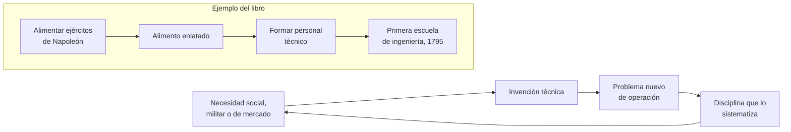
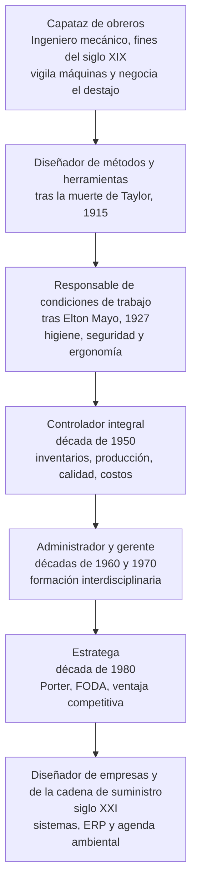

# 1. Cronología de la evolución de la ingeniería industrial

> Fuente: *Introducción a la Ingeniería Industrial*, 2.ª ed., cap. 1 «Generalidades de la ingeniería
> industrial» (pp. 1–23) y cap. 5 «Historia del concepto de calidad» (pp. 100–102).
> Verificado contra el texto, salvo lo marcado con `⚠ verificar`.

## El hilo conductor

El libro no cuenta la historia como una sucesión de inventos, sino como una cadena de **necesidades**
que fuerzan el ingenio: «la necesidad es la que despierta el ingenio» `[C1 · p. 2]`. Conviene leer la
línea de tiempo con ese esquema en mente, porque es el que da sentido a las fechas.

## Vista general

```mermaid
timeline
    title Cinco eras de la ingeniería industrial según el libro
    section Antecedentes preindustriales, siglos XVI-XVIII
        1560 : De re metallica de Jorge Agricola, tratado de geologia y mineria
        1587 : Tratado de Guido Toglieta sobre construccion de caminos
        1622 : Carreteras del imperio romano de Nicolas Bergier
        1794 : Escuela de Puentes y Pavimentos en Francia
        1795 : Primera escuela de ingenieria del mundo, Ecole Polytechnique
    section Primera Revolucion Industrial, 1765-1793
        1765 : Maquina de vapor de James Watt, la presion sustituye la fuerza del hombre
        1711-1776 : David Hume y las bases del metodo cientifico pragmatico
        1793 : Samuel Slater instala la primera fabrica textil masiva de America
    section Segunda Revolucion Industrial, 1793-1900
        Siglo XIX : Eli Whitney y Simeon North, partes intercambiables y estandarizacion
        1852 : Fundacion de la Sociedad Americana de Ingenieros Civiles
        1872 : Andrew Carnegie industrializa el acero con contabilidad de costos
        1880 : Fundacion de la ASME, foro cientifico de los primeros ingenieros industriales
    section Administracion cientifica, 1885-1930
        1885-1903 : Taylor presenta sus investigaciones ante la ASME
        1908 : Ford lanza el Modelo T, punto de partida de la linea de ensamble movil
        1916 : Fayol publica Administracion industrial y general
        1917 : Primera Sociedad de Ingenieros Industriales en Estados Unidos
        1924 : Shewhart crea la grafica de control
        1927 : Lote economico de Harris y experimentos de Elton Mayo
    section Sistemas, calidad y automatizacion, 1945-siglo XXI
        1948 : Instituto Norteamericano de Ingenieros Industriales
        1950 : Deming lleva el control estadistico de la calidad a Japon
        1956 : Von Bertalanffy publica Sistemas generales
        1981 : El instituto se vuelve Institute of Industrial Engineers, IIE
        1987 : Primera serie de normas ISO 9000
        2000 : ERP, CAD, robotica, comercio electronico y cadena de suministro
```

## Era 1 · Antecedentes preindustriales (siglos XVI–XVIII)

Antes de que existiera la palabra *ingeniero* como profesión, ya existía el oficio: el libro insiste en
que «el hombre siempre ha sido ingenioso para resolver problemas; es decir, siempre ha sido ingeniero,
aun sin saberlo» `[C1 · p. 2]`.

| Año | Hecho | Por qué importa | Ref. |
| --- | --- | --- | --- |
| Siglo XII | Se fundan las universidades de París, Oxford y Cambridge; sólo formaban doctores en teología, derecho y medicina | Explica el nombre actual del doctorado (Ph.D.) y que la ingeniería nazca fuera de la universidad medieval | `[C1 · p. 3]` |
| ~1000 | Reforma de las escuelas primitivas en Italia; enseñanza en *trivium* (gramática, retórica, lógica) y *quadrivium* (aritmética, geometría, música, astronomía) | Primer plan de estudios formal; la educación estaba controlada por el clero | `[C1 · p. 3]` |
| 1560 | Jorge Agrícola, *De re metallica* | Tratado de geología y minería; libro de ingeniería del Renacimiento | `[C1 · p. 2]` |
| 1587 | Guido Toglieta, *Tratado* | Describe con detalle la técnica de construcción de caminos | `[C1 · p. 2]` |
| 1622 | Nicolás Bergier, *Carreteras del imperio romano* | Sistematiza obra vial romana | `[C1 · p. 2]` |
| 1646 | Colbert forma un cuerpo de ingenieros franceses de carácter estrictamente militar | Antecedente militar de la profesión | `[C1 · p. 2]` |
| ~1700 | Las ciudades europeas destinan fondos públicos a redes de agua y drenaje | Nace la obra pública como demanda estable de ingeniería | `[C1 · p. 2]` |
| 1794 | Se funda la École des Ponts et Chaussées (Escuela de Puentes y Pavimentos) | Formó a los primeros ingenieros civiles con base científica; sus egresados influyeron en la ingeniería civil mundial y algunos construyeron puentes del Sena | `[C1 · pp. 2–3]` |
| 1795 | Se funda la École Polytechnique en París, «primera escuela de ingeniería del mundo», bajo el mandato de Napoleón | La necesidad militar (conservar alimentos para las tropas) financia la formación técnica; de ese premio surge el primer alimento enlatado, en envase de plomo | `[C1 · p. 2]` |

## Era 2 · Primera Revolución Industrial (1765–1793)

Antes: producción artesanal, a pequeña escala, para mercados limitados. Después: producción en masa.

| Año | Hecho | Por qué importa | Ref. |
| --- | --- | --- | --- |
| 1765 | James Watt inventa la máquina de vapor | Sustituye la fuerza del hombre por la presión de vapor; obliga a diseñar ejes, bandas y engranes, y traslada la tecnología a barcos, trenes y minas | `[C1 · p. 3]` |
| Siglo XVIII | Los centros industriales se asientan junto al agua y el carbón | Primera decisión de localización de instalaciones de la historia industrial | `[C1 · p. 3]` |
| 1711–1776 | David Hume sienta las bases del método científico | Propone que en los hechos siempre hay relación causa-efecto, y que ésta se descubre por la experiencia, no por la razón: origen del enfoque pragmático estadounidense | `[C1 · p. 4]` |
| 1793 | Samuel Slater construye en Pawtucket, Rhode Island, la primera fábrica textil de producción masiva del continente americano | Estados Unidos «importa ilegalmente» el primer ingenio textil; sus dueños (Slater, Moses Brown, William Almy) administran con integración vertical | `[C1 · p. 4]` |

**Consecuencia social que el libro subraya:** se relega la mano de obra artesanal y surge la clase
obrera, mano de obra no especializada y barata, necesaria para la producción en masa `[C1 · p. 3]`.

## Era 3 · Segunda Revolución Industrial y estandarización (1793–1900)

El libro define la Segunda Revolución Industrial por **dos hechos sin precedente**: la administración
por integración vertical de Brown y Slater, y **el uso de partes intercambiables** `[C1 · p. 4]`.

| Año | Hecho | Por qué importa | Ref. |
| --- | --- | --- | --- |
| Siglo XIX | Eli Whitney y Simeon North crean el «sistema uniforme de producción» al fabricar pistolas para el ejército | Nace la **estandarización de partes**: si una pieza falla se reemplaza; «incluso los obreros también eran intercambiables» | `[C1 · p. 4]` |
| 1520–1530 | Lucca Paccioli crea la contabilidad y la partida doble (fecha según el libro) | El conocimiento contable no cambia hasta mediados del siglo XIX, cuando las grandes empresas obligan a reinventarlo de forma pragmática | `[C1 · p. 5]` |
| 1852 | Se funda la Sociedad Americana de Ingenieros Civiles | Primera agrupación de ingenieros en Estados Unidos | `[C1 · p. 6]` |
| 1868–1902 | El acero estadounidense pasa de 8 500 t a más de 9 millones de t, mientras Inglaterra baja a 1 826 000 t | Muestra el efecto de la administración sobre la capacidad productiva | `[C1 · p. 6]` |
| 1871 | Instituto Americano de Ingenieros de Minas | Consolidación de las sociedades técnicas | `[C1 · p. 6]` |
| 1872 | Andrew Carnegie mezcla las técnicas de producción de acero con los métodos de administración ferroviaria y la contabilidad de costos | Primer caso documentado de ventaja competitiva por control de costos | `[C1 · p. 6]` |
| 1880 | Se funda la **ASME** (Sociedad Americana de Ingenieros Mecánicos) | Único foro para presentar investigación en ingeniería; será la tribuna de Taylor y la fuente de la simbología de diagramas de proceso | `[C1 · pp. 5–6]` |
| 1884 / 1908 | Sociedad Americana de Ingenieros Eléctricos / de Ingenieros Químicos | La especialización de la ingeniería sigue a la especialización de la industria | `[C1 · p. 5]` |
| Fines del siglo XIX | Henri Fayol, ingeniero de minas y director general durante 19 años, crea los conceptos administrativos vigentes hasta hoy | Describe el proceso administrativo y sostiene que administrar requiere estudios propios, no sólo ser ingeniero | `[C1 · pp. 5–6]` |

## Era 4 · Nacimiento de la administración científica (1885–1930)

Punto de partida que el libro pide imaginar: a fines del siglo XIX **no existía la administración**; los
métodos de trabajo se fijaban copiando al obrero que producía más, la capacitación era nula y las
máquinas se diseñaban por ingeniería inversa `[C1 · p. 5]`.

| Año | Hecho | Por qué importa | Ref. |
| --- | --- | --- | --- |
| 1883 | Taylor obtiene el título de ingeniero mecánico y entra a una compañía acerera | Como jefe de ingenieros genera el diseño del trabajo y la medición con cronómetro | `[C1 · p. 6]` |
| 1885–1903 | Taylor presenta una serie de artículos ante la ASME | Recibidos con escepticismo y a veces rechazados, «pero en la práctica siempre funcionaban»: llegó a cuadruplicar la producción | `[C1 · p. 6]` |
| — | Aportaciones de Taylor | Diseño del trabajo, medición con cronómetro, estandarización de tiempos, programación de la producción, geometría de herramientas de corte, capacitación del obrero | `[C1 · pp. 6–7]` |
| 1906–1920 | Ford baja el precio del automóvil de 1 000 a 290 dólares (Modelo T en 850 dólares en 1908; 730 000 unidades vendidas en 1916, casi 70 % del mercado) | Demuestra el efecto de la **velocidad de producción** sobre el costo y el inventario | `[C1 · p. 6]` |
| — | Ford crea la **línea de ensamble móvil** | En lugar de que el trabajador acuda al automóvil, el automóvil acude al trabajador: producción continua | `[C1 · p. 6]` |
| 1910 | Taylor es despedido de la compañía acerera y se dedica a conferencias y asesoría | Muere en 1915 «sin ver totalmente aceptadas sus teorías» | `[C1 · p. 7]` |
| 1916 | Fayol publica *Administración industrial y general* | Se publica un año después de la muerte de Taylor; ambos nunca se conocieron | `[C1 · pp. 5–6, 7]` |
| 1917 | Se forma en Estados Unidos la primera **Sociedad de Ingenieros Industriales** | Dedicada exclusivamente a la administración de la producción | `[C1 · p. 7]` |
| Principios del siglo XX | Frank B. y Lillian Gilbreth llevan al detalle el estudio de tiempos y **micromovimientos**, con cámaras de video | Optimización de procesos de ensamble manual | `[C1 · p. 7]` |
| Principios del siglo XX | Gantt crea su gráfica para el control de actividades a través del tiempo | Sigue en uso; el libro la retoma como herramienta de control de proyectos en el cap. 6 | `[C1 · p. 7]`, `[C6 · fig. 6.11 · p. 147]` |
| 1924 | W. A. Shewhart inventa la gráfica de control | Considerada el inicio del **control estadístico de la calidad** | `[C5 · p. 101]` |
| 1925 | Harold F. Dodge y Harry G. Romig crean los primeros conceptos de muestreo por atributos | Sustituirían a la inspección total | `[C5 · p. 101]` |
| 1927 | F. W. Harris crea el concepto de **lote económico** y el modelo de inventarios «diente de sierra» (fecha según el libro) | Más tarde conocido como modelo de Wilson | `[C1 · p. 7]` |
| 1927 | Elton Mayo estudia en la Western Electric el efecto de la iluminación y del mobiliario sobre el rendimiento | Concluye que lo que eleva la productividad es la **atención de la gerencia**: funda la escuela de relaciones humanas | `[C1 · p. 8]` |
| 1930–1950 | Los libros de control de calidad e ingeniería económica de esa época permanecen 40 años en el mercado | Señal de cuán escaso era el desarrollo de técnicas de control de la producción | `[C1 · p. 7]` |

## Era 5 · Sistemas, calidad y automatización (1945 – siglo XXI)

| Año | Hecho | Por qué importa | Ref. |
| --- | --- | --- | --- |
| 1945 | Al terminar la Segunda Guerra Mundial se crean la ONU, el Banco Mundial y el FMI | Marco institucional del que saldrá la metodología de evaluación de proyectos | `[C10 · p. 264]` |
| 1946 | Se funda la Sociedad Americana para el Control de Calidad (ASQC) | Publicaciones, conferencias y capacitación impulsan el control de calidad | `[C5 · p. 101]` |
| 1946–1947 | Delegados de 25 países crean la ISO, con sede en Ginebra; inicia actividades el 23 de febrero de 1947 | Unificación de estándares industriales | `[C5 · p. 101]` |
| 1948 | Se funda el **Instituto Norteamericano de Ingenieros Industriales** | Representa por primera vez los intereses de la profesión | `[C1 · p. 7]` |
| 1949 | `⚠ verificar` Surge formalmente la ergonomía como disciplina | El cap. 13 (pp. 341 y ss.) desarrolla los antecedentes históricos; confirma ahí fecha y nombre de la sociedad fundadora antes de citarla | `[C13 · p. 341]` |
| 1950 | **W. Edward Deming** imparte en Japón, por invitación de la JUSE, cursos de métodos estadísticos a los responsables de calidad de las mayores empresas japonesas | «El resultado fue extraordinario»: los japoneses implantan el control de calidad y elevan su productividad | `[C5 · p. 101]` |
| 1950 | K. Ishikawa inicia sus investigaciones sobre control de calidad | Deriva en las siete herramientas y en los círculos de calidad | `[C5 · p. 101]` |
| 1954 | J. M. Juran es invitado a Japón a dar seminarios a gerentes altos y medios | La calidad pasa a ser **instrumento de la gerencia**, no sólo técnica de taller | `[C5 · p. 101]` |
| 1954 / 1957 | Se funda la Sociedad para el Avance de la Teoría General de Sistemas, que cambia su nombre a Sociedad para la Investigación General de Sistemas | Antecedente institucional del enfoque de sistemas | `[C1 · p. 11]` |
| 1955 | Ishikawa introduce las gráficas de control en las empresas japonesas | Consolida el control estadístico en Japón | `[C5 · p. 101]` |
| 1955 | La ONU publica el *Manual de evaluación de proyectos* | Primera metodología formal para planificar grandes proyectos de desarrollo regional | `[C10 · p. 264]` |
| 1956 | Ludwig von Bertalanffy publica *Sistemas generales* | «El todo es más que la suma de sus partes» (Hegel) aplicado a la empresa: base del cap. 11 | `[C1 · p. 11]` |
| Década de 1950 | El ingeniero industrial amplía su papel: controla inventarios, planea y controla la producción, aplica estudio de tiempos, controla estadísticamente la calidad y puede llegar a gerente | Supera al administrador puro porque domina los aspectos técnicos | `[C1 · p. 8]` |
| Década de 1960 | Nace el **control total de calidad** y los primeros círculos de control de calidad en Japón | La calidad se vuelve estructura organizativa, no departamento | `[C5 · p. 102]` |
| Década de 1960 | La mano de obra encarece en Estados Unidos y las industrias migran a países de mano de obra barata | Esa migración genera la necesidad de formar ingenieros industriales en economías emergentes | `[C1 · pp. 8–9]` |
| 1967 | La ASQC publica la revista *Quality Progress* | Difusión del conocimiento en calidad | `[C5 · p. 102]` |
| 1969 | Se crea el ANSI, con origen en el Comité Americano de Estándares en Ingeniería (1918) | Institucionalización de los estándares | `[C5 · p. 102]` |
| Década de 1970 | Aparece en México la primera licenciatura en ingeniería industrial, con carácter **interdisciplinario** | Se enseña química sin ser químico, y además administración, contabilidad, derecho y economía | `[C1 · p. 9]` |
| 1978 | El ANSI y la ASQC definen la calidad como «la totalidad de los rasgos y características de un producto o servicio con el fin de satisfacer determinadas necesidades» | Una de las primeras definiciones formales | `[C5 · p. 102]` |
| Década de 1980 | Reagan y Thatcher imponen la política neoliberal; Porter publica su obra sobre planeación estratégica | El ingeniero industrial pasa de administrador a **estratega**: FODA y ventaja competitiva | `[C1 · pp. 9–10]` |
| 1981 | El instituto local se convierte en el **IIE**, Institute of Industrial Engineers, con presencia en más de 70 países | Internacionalización de la profesión | `[C1 · p. 7]` |
| 1980s (2.ª mitad) | Aparece la Administración de la Calidad Total (TQM) | Base del control total de calidad de Feigenbaum | `[C5 · p. 102]` |
| 1987 | La ISO publica la serie **ISO 9000** (9001, 9002, 9003 y 9004) | Aseguramiento de la calidad; revisiones en 1994, 2000 y 2008 | `[C5 · p. 102]` |
| 1993 | Hammer y Champy publican la reingeniería de procesos (BPR) | Enfoque radical de rediseño de procesos | `[C6 · p. 137]` |
| — | Con el éxito de ISO 9000 se generan **ISO 14000** (ambiente) y la serie 18000 | El ingeniero industrial asume la agenda ambiental | `[C1 · pp. 10, 21–22]` |
| Tercera Revolución Industrial | Uso de computadoras en la industria (tesis de Forrester): automatización, software de cálculo, simulación | «Los principios básicos de la ingeniería industrial han cambiado poco, lo que se ha modificado es la velocidad» | `[C1 · pp. 7–8]` |
| Siglo XXI | Logística y cadena de suministro, **ERP**, **CAD**, robots, inventarios que se reordenan solos entre sistemas de proveedor y comprador, **comercio electrónico** | El ingeniero industrial es «diseñador de empresas» y busca clientes satisfechos **y leales** | `[C1 · pp. 8, 22]` |

## De capataz a diseñador de empresas

El capítulo 1 dedica un apartado completo a la evolución del **papel** del profesional; conviene
esquematizarlo aparte de las fechas, porque es materia frecuente de examen `[C1 · pp. 8–10]`.

## Notas de precisión histórica

El libro es la referencia para tu examen, pero varias fechas y nombres difieren del registro histórico
documentado, y en un par de casos el propio libro se contradice entre capítulos. Vale la pena
anotarlo al margen para no arrastrar el dato a una cita bibliográfica.

| Tema | Lo que dice el libro | Registro documentado | Nota |
| --- | --- | --- | --- |
| Máquina de vapor de Watt | 1765 `[C1 · p. 3]`; en otro capítulo, 1782 `[C5 · p. 100]` | Newcomen construye una máquina de vapor operativa en 1712; Watt patenta el condensador separado en 1769 y la máquina de doble efecto en 1782 | Watt **perfeccionó** la máquina de vapor; las dos fechas del libro corresponden a hitos distintos de Watt |
| Primera escuela de ingeniería | École Polytechnique, 1795, «durante el mandato de Napoleón» `[C1 · p. 2]` | Fundada en 1794 por la Convención como *École centrale des travaux publics*; Napoleón la militariza en 1804 | El libro mismo matiza que Colbert ya había formado un cuerpo de ingenieros en 1646 |
| École des Ponts et Chaussées | 1794 `[C1 · p. 2]` | Creada en 1747 | Es anterior, no posterior, a la Polytechnique |
| Sociedad Americana de Ingenieros Civiles | «La primera escuela de ingeniería en Estados Unidos se formó en 1852, conocida como Sociedad Americana de Ingenieros Civiles» `[C1 · p. 6]` | La ASCE se funda en 1852, pero es una **sociedad profesional**, no una escuela; las primeras escuelas fueron West Point (1802) y Rensselaer (1824) | Lapsus de redacción del texto |
| Lote económico | F. W. Harris, 1927 `[C1 · p. 7]` | Ford W. Harris publica «How Many Parts to Make at Once» en 1913; R. H. Wilson lo populariza en 1934, de ahí «modelo de Wilson» | La secuencia Harris → Wilson que narra el libro es correcta; las fechas están corridas |
| Gantt | «Lawrence Gantt» `[C1 · p. 7]`; «Henry Gantt, durante la Primera Guerra Mundial» `[C6 · p. 147]` | Henry Laurence Gantt (1861–1919), colaborador de Taylor | Ambas menciones son la misma persona: cítalo como Henry L. Gantt |
| Línea de ensamble móvil | El libro la atribuye a Ford sin fecharla; el Modelo T se lanza en 1908 `[C1 · p. 6]` | El Modelo T es de 1908; la línea de ensamble móvil entra en operación en Highland Park en 1913 | No confundas la fecha del automóvil con la del sistema de producción |
| Proceso administrativo de Fayol | «Planeación, dirección, administración y control» `[C1 · p. 6]`; «14 pasos… planeación, organización, coordinación y control» `[C9 · p. 241]` | Fayol define cinco funciones (prever, organizar, mandar, coordinar, controlar) y 14 principios de administración | Distingue **funciones** de **principios**; el conteo de 14 corresponde a los principios |
| Partida doble | Lucca Paccioli, entre 1520 y 1530 `[C1 · p. 5]` | Luca Pacioli publica *Summa de arithmetica* en 1494 y muere en 1517 | La aportación es anterior al rango que da el libro |
| Padre de la disciplina | Taylor es «el padre de la ingeniería industrial» `[C1 · p. 6]` y «el padre de la administración científica» `[C9 · p. 240]`; Fayol es «el padre de la administración moderna» `[C9 · p. 241]` | Consistente con la literatura | No es contradicción: son tres paternidades distintas, y es una pregunta típica de examen |
| Ergonomía | `⚠ verificar` en cap. 13 (p. 341) | La reunión fundacional de la *Ergonomics Research Society* se celebra el 12 de julio de 1949 en el Almirantazgo británico, y la sociedad se constituye formalmente en 1950 | Si citas la fecha exacta, revisa primero cómo la enuncia el cap. 13 |

## Cómo estudiar esta cronología

1. Memoriza **cinco eras y un hecho detonante por era**, no cuarenta fechas: 1765 (vapor), partes
   intercambiables, 1880 (ASME), 1885–1903 (Taylor en la ASME), 1950 (Deming en Japón).
2. Para cada personaje, responde en una línea: *¿qué problema concreto resolvió?* Taylor, el método de
   trabajo; los Gilbreth, el micromovimiento; Gantt, el tiempo; Harris, el tamaño de lote; Mayo, la
   motivación; Deming, la variabilidad; Fayol, la administración de toda la empresa.
3. Cierra con las preguntas 1 a 20 del [cuestionario](06-cuestionario.md).
