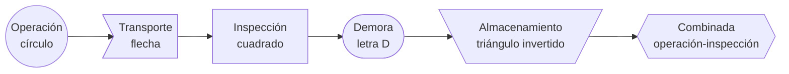
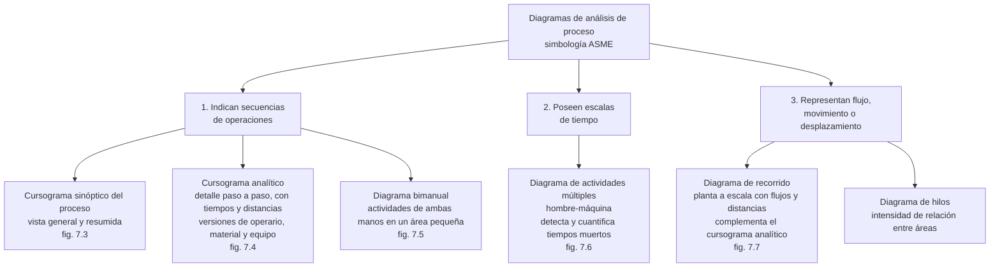
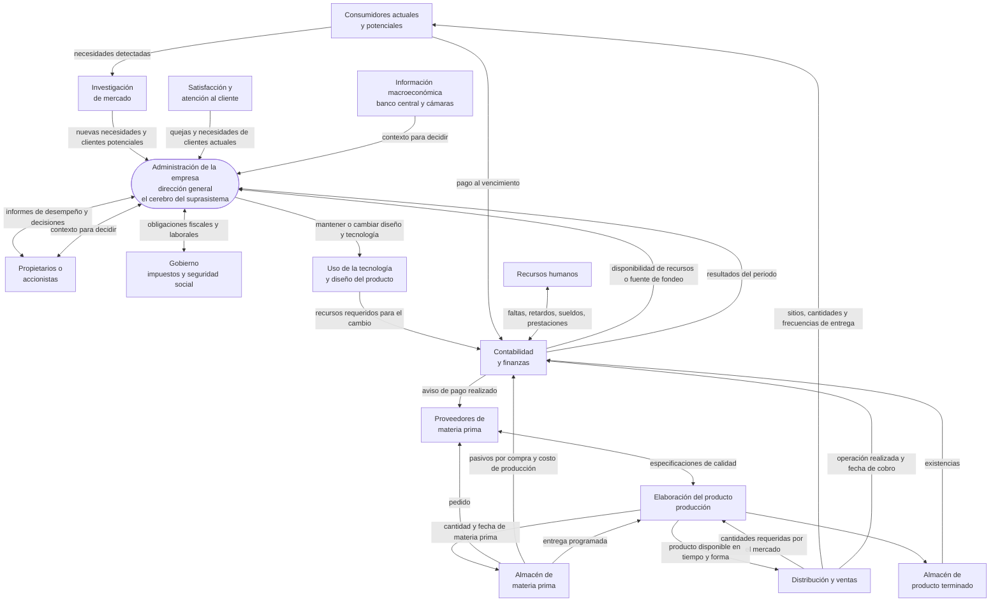
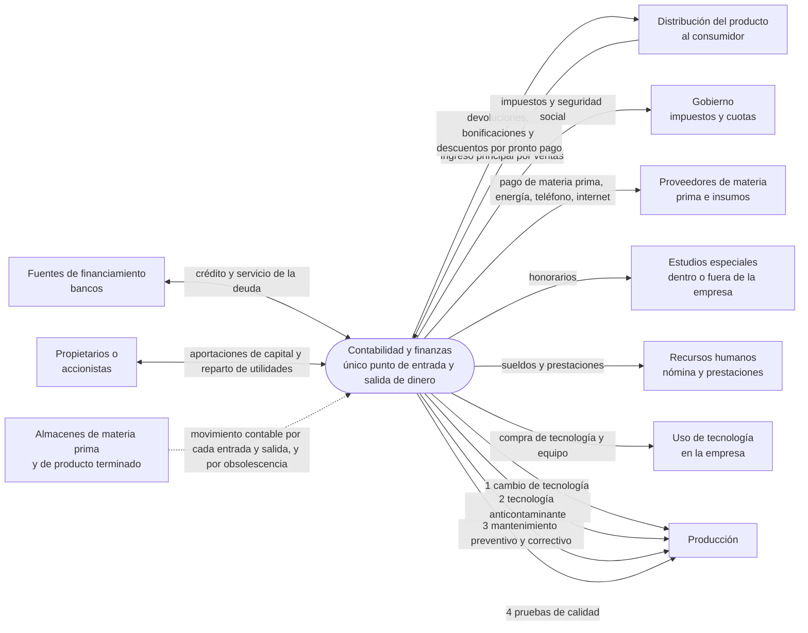
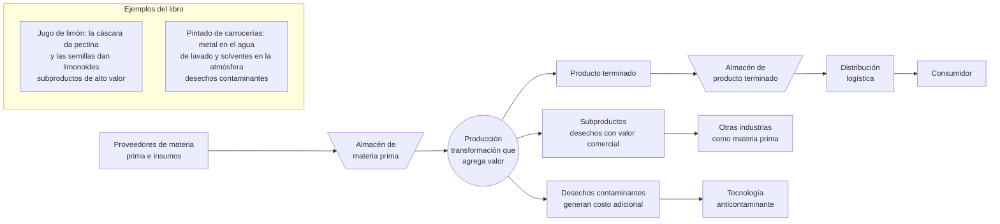
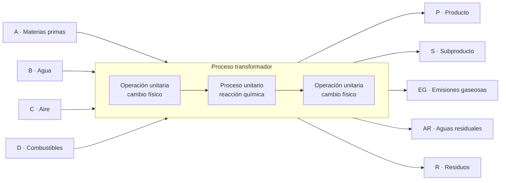
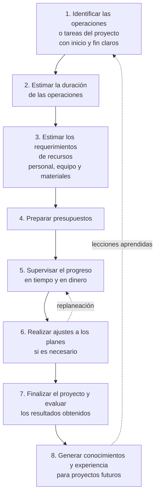
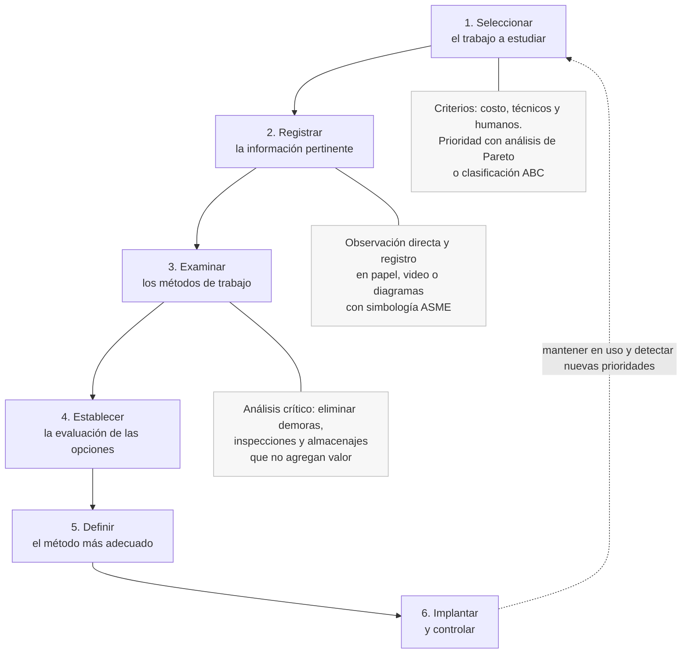
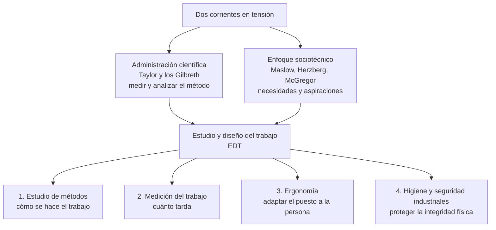
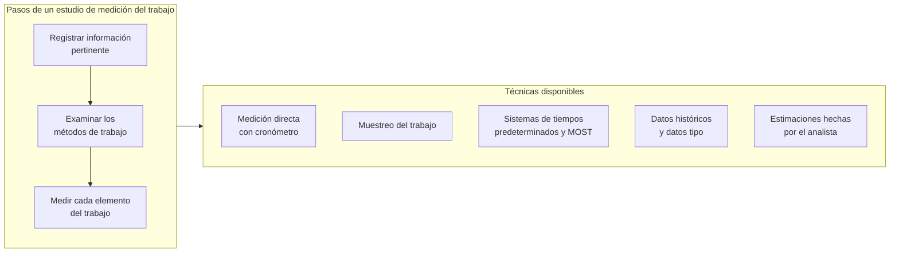

# 2. Diagramas de flujo: los procesos del libro esquematizados

> Fuente: caps. 1, 2, 6 y 7 de la 2.ª edición. Simbología y taxonomía de diagramas: cap. 7, «Estudio de
> métodos» (pp. 176–185). Verificado contra el texto.

El punto de partida es la tesis del capítulo 1: la empresa debe verse como **una serie de procesos**
interrelacionados por los que fluyen sin parar tres elementos —información, dinero y materia prima—,
igual que el cuerpo humano hace circular información genética, gases y nutrientes `[C1 · p. 11]`.

## Simbología ASME para diagramas de proceso

La simbología «fue generada por la Asociación de Ingenieros Mecánicos de Estados Unidos de América, por
lo que es estándar y permite que el mismo diagrama sea entendido por analistas en cualquier parte del
mundo» `[C7 · p. 177]`.

| Símbolo | Nombre | Qué representa | Ejemplos del libro |
| --- | --- | --- | --- |
| ○ círculo | **Operación** (o acción) | Actividades fundamentales que propician cambios en materiales u objetos, transferencia de información o planeación de algo | Clavar con martillo, tornear una pieza, barrenar una placa, dibujar un plano, teclear en la computadora |
| → flecha | **Transporte** | Personas, materiales o equipo se trasladan **sin** que se les efectúe trabajo adicional | Transportar material en carretilla, elevar objetos con poleas, llevar documentos de un escritorio a otro |
| □ cuadrado | **Inspección** | Verificación de calidad o cantidad, y lecturas de indicadores o de información impresa | Contar piezas de un depósito, inspección de calidad, leer manómetros de tanques |
| D semicircular | **Demora** | Interferencias en el flujo, imposibilidad de pasar al siguiente paso, trabajo en suspenso o abandono momentáneo | Espera en ascensores, cuellos de botella en una máquina, documentos que aguardan su archivo |
| ▽ triángulo invertido | **Almacenamiento** | Depósito del material o producto en algún lugar, idealmente almacenes | Materia prima, producto en proceso, producto terminado, papel moneda en caja de seguridad |
| símbolos combinados | **Actividades combinadas** | Dos actividades ejecutadas simultáneamente; la más común es operación-inspección | Verificar mientras se ensambla |

Dos advertencias del texto que suelen preguntarse:

- La **inspección** «por lo general no añade valor al producto, por lo que se deberá ser muy crítico en
  su existencia» `[C7 · p. 177]`.
- El **almacenamiento** debería ocurrir en almacenes, «aunque es probable que en el método actual se
  encuentren mercancías almacenadas en pisos o pasillos por error» `[C7 · p. 178]`.

Equivalencia con las formas de Mermaid, para que puedas dibujar los diagramas en texto (Mermaid no
tiene el círculo, la «D» ni el triángulo invertido de la norma, así que se aproximan):

## Las tres familias de diagramas de análisis de proceso

El capítulo 7 clasifica los diagramas en tres familias; conocer la clasificación evita el error típico de
llamar «diagrama de flujo» a todo `[C7 · pp. 178–184]`.

Detalles que el texto pide no olvidar:

- El **cursograma analítico** ordena los símbolos siempre igual: operaciones, transportes, demoras,
  inspecciones y almacenajes; incluye encabezado (versión, trabajo, método actual o propuesto, fecha,
  lugar, autoría) y un **resumen** con totales de cada actividad, distancias y tiempos `[C7 · pp. 178–180]`.
- La línea quebrada que une las actividades es un diagnóstico visual: si «la línea estará más cargada
  hacia la derecha» hay muchas actividades que no agregan valor y se debe pasar de inmediato al análisis
  crítico `[C7 · p. 180]`.
- En el diagrama **hombre-máquina** el rectángulo blanco es inactividad, el negro es operación
  independiente y el gris es actividad simultánea `[C7 · pp. 182–183]`.

Plantilla mínima del cursograma analítico, para copiar en el cuaderno:

| # | Descripción del elemento | ○ | → | D | □ | ▽ | Tiempo (min) | Distancia (m) | Observaciones |
| --- | --- | --- | --- | --- | --- | --- | --- | --- | --- |
| 1 | | | | | | | | | |
| 2 | | | | | | | | | |
| | **Resumen (totales)** | | | | | | | | |

## 1. Los tres flujos de la empresa (capítulo 1)

Tres diagramas de bloque sobre los mismos departamentos. El libro advierte que para «ver viva» a la
industria hay que **unir las tres figuras en una sola** e imaginar la información fluyendo sin parar,
mientras el dinero y los materiales fluyen más lento `[C1 · p. 15]`.

### 1.1 Flujo de información (figura 1.1, p. 12)

La dirección general es el óvalo del diagrama: «se puede considerar el cerebro del suprasistema, pues es
la única entidad que debe tener información en ambos sentidos» `[C1 · p. 12]`. El ciclo no tiene
principio: «los suprasistemas viven e intercambian información de manera permanente» `[C1 · p. 12]`.

Preguntas de control sobre esta figura: ¿por qué la información entre producción y proveedores es de
doble sentido? (control de especificaciones de calidad). ¿Por qué contabilidad conversa con recursos
humanos? (faltas, retardos, sueldos, promociones, prestaciones y jubilaciones) `[C1 · pp. 13–14]`.

### 1.2 Flujo de dinero (figura 1.2, p. 14)

Clave de lectura: «Contabilidad es la única que distribuye y recibe dinero, dentro y fuera de la
empresa» y en varias flechas «no hay flujo de dinero real entre áreas», sino **movimientos contables**
`[C1 · p. 14]`.

Las **cuatro razones** por las que contabilidad envía dinero a producción son materia de examen: cambio
de tecnología, control de la contaminación, mantenimiento y pruebas de calidad `[C1 · pp. 14–15]`. El
ejemplo de obsolescencia del libro: la leche fresca tiene vida de almacén de dos o tres días; pasada
esa fecha se da de baja física y contablemente `[C1 · p. 14]`.

### 1.3 Flujo de materia prima e insumos (figura 1.3, p. 15)

La idea central: cada proceso, «por simple que éste sea», **agrega valor**; el ejemplo del libro es el
frijol a granel frente al frijol envasado en bolsas de 1 kg `[C1 · p. 13]`.

Distinción que el capítulo remarca: comprar tecnología (maquinaria, fórmulas, planos) es una cosa;
**usarla eficientemente** es otra, y «en esta distinción, que puede parecer sutil, radica la esencia de
la ingeniería industrial» `[C1 · p. 15]`.

## 2. Representación general de un proceso industrial (capítulo 2)

Figura 2.5, p. 32. El esquema entradas → proceso transformador → salidas, con la distinción entre
**operación unitaria** (cambio físico) y **proceso unitario** (cambio químico).

Al dibujarlo, agrega en el margen las operaciones unitarias que el capítulo desarrolla, porque son la
lista de verificación de cualquier proceso: transporte de materiales, bombeo de líquidos y gases,
compresión de gases, reducción de tamaño (quebrantado, trituración, molienda), transferencia de calor,
mezclado y operaciones de separación —destilación, evaporación, secado, filtración, centrifugación y
tamizado— `[C2 · pp. 39–43]`.

## 3. Proceso de administración de proyectos (capítulo 6)

Figura 6.8, p. 145. Ocho pasos, del desglose de tareas al aprendizaje organizacional.

Observación crítica del autor, útil para justificar el paso 5 en un examen: la supervisión estricta del
avance «especialmente en lo referente al dinero… no es una actividad muy frecuente en la administración
de proyectos en Latinoamérica» `[C6 · p. 145]`.

Como caso concreto, el libro esquematiza las fases de implementación de un software de administración de
almacenes (WMS) `[C6 · fig. 6.9 · p. 146]`:

Para el **control** del proyecto, el capítulo desarrolla la gráfica de Gantt (actividades en el eje
vertical, escala de tiempo en el horizontal, barras y reglas de precedencia) y el CPM `[C6 · pp. 147–153]`.

## 4. Las seis etapas de un estudio de métodos (capítulo 7)

Figura 7.1, p. 176. El estudio de métodos es «el registro y el examen crítico sistemático que se efectúa
a las maneras de realizar actividades, con el fin de proponer mejoras» `[C7 · p. 176]`.

Detalle de la etapa 1 que conviene memorizar: se atienden primero los trabajos que representan mayor
costo para la empresa —en dinero, distancias o tiempos—, los que involucren cambios de tecnología y los
que ocasionen problemas importantes al empleado; la prioridad se fija con análisis de Pareto (principio
80-20) o clasificación ABC `[C7 · pp. 176–177]`.

### El estudio de métodos dentro del estudio y diseño del trabajo

`[C7 · pp. 175–176]`

### Medición del trabajo (figuras 7.11 y 7.12, pp. 186–188)

Variantes del estudio de tiempos con cronómetro, en orden `[C7 · pp. 187–190]`: seleccionar el trabajo →
seleccionar un operario **calificado** (trabajador promedio, ritmo normal) → analizar el trabajo →
dividirlo en elementos → mediciones de prueba con al menos 20 observaciones iniciales → determinar el
tamaño de muestra con base estadística (la OIT recomienda 95.45 % de confianza).

## Ejercicio propuesto

Elige un proceso que conozcas de primera mano (sacar una impresión en la escuela, preparar un café,
inscribirte a materias) y:

1. Levanta el **cursograma analítico** con la plantilla de arriba, usando los cinco símbolos.
2. Suma cuántas actividades **no agregan valor** (transportes, demoras, inspecciones, almacenajes) y qué
   porcentaje del tiempo total consumen.
3. Aplica la etapa 3 (examinar) y propón un método alternativo; cuantifica el ahorro en tiempo y
   distancia.

Ese ejercicio reproduce, en pequeño, lo que el capítulo 7 llama análisis crítico del proceso, y es la
forma más rápida de fijar la simbología.
