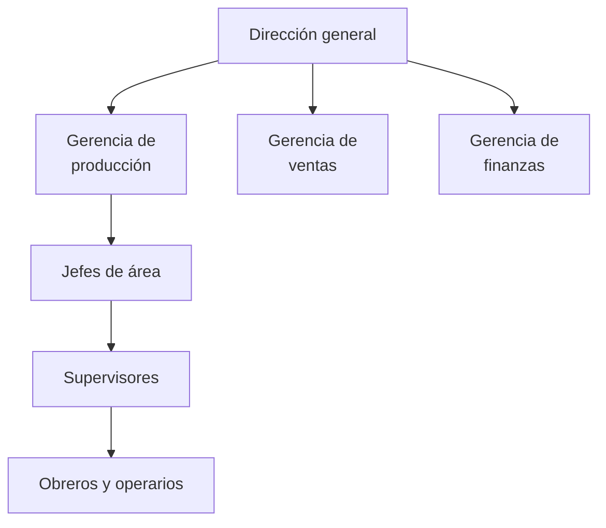
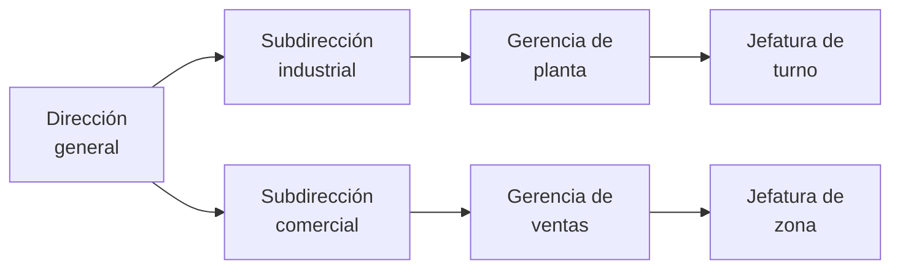
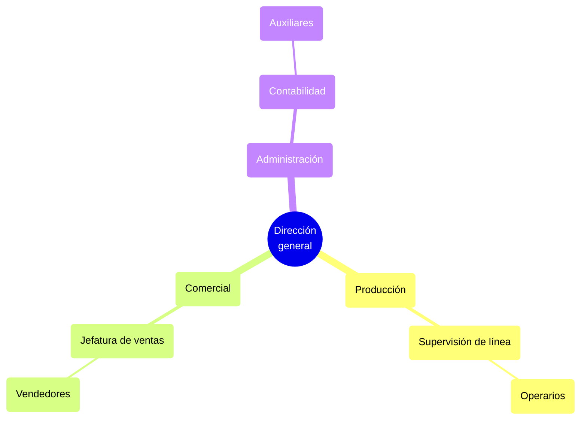
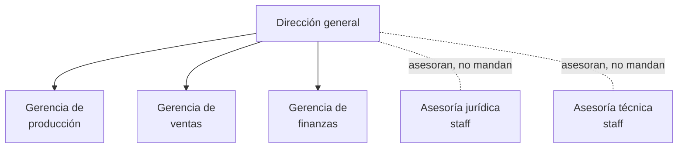
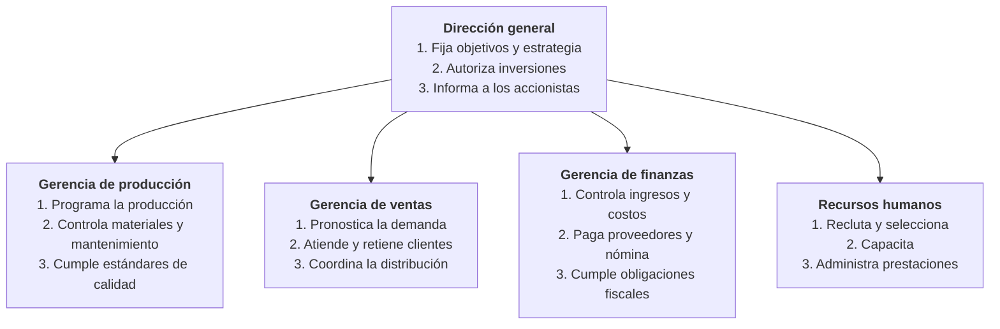
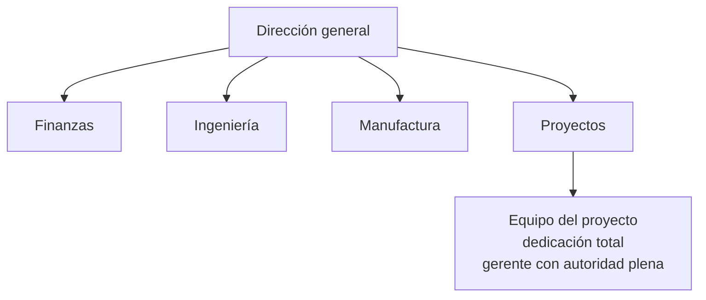
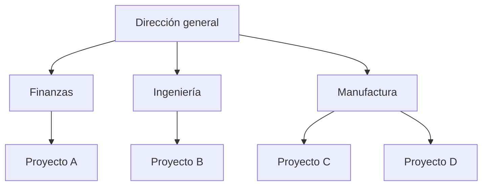
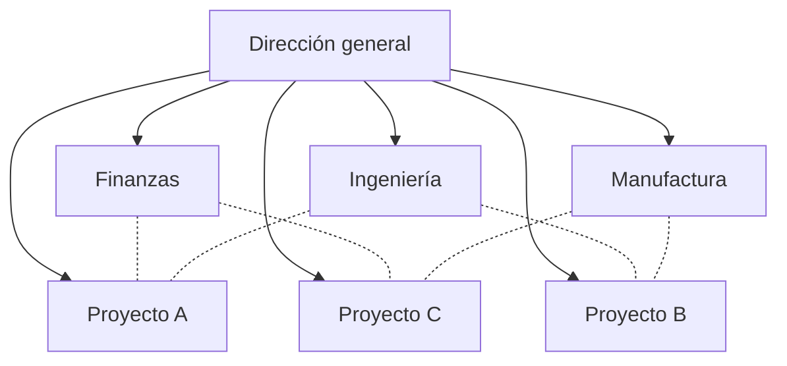
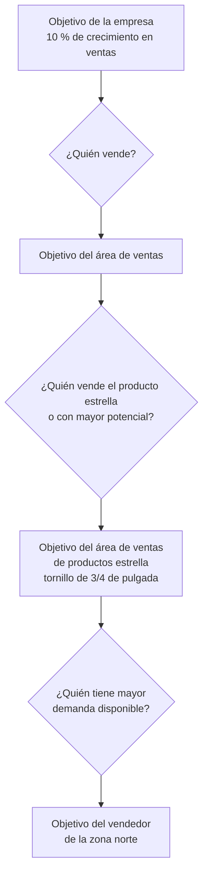
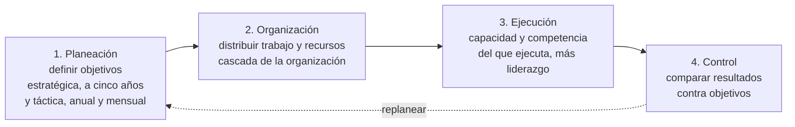

# 3. Organigramas y estructuras organizacionales

> Fuentes: cap. 6 «Organización del recurso humano» (pp. 146–147, fig. 6.10) y cap. 9 «La organización»
> (p. 247, fig. 9.1), verificados contra el texto; tipología general de organigramas del cap. 10,
> «Estudio técnico o ingeniería del proyecto» (pp. 269 y ss., fig. 10.8), marcada `⚠ verificar`.

Un organigrama plasma visualmente dos cosas distintas que conviene no mezclar al estudiar: los **niveles
jerárquicos** (quién decide sobre quién) y las **funciones** de cada puesto (qué hace cada quien). Los
tipos que siguen se diferencian por cuál de las dos privilegian y por la forma geométrica en que la
representan.

## Tipología de organigramas

`⚠ verificar`: la clasificación y la figura 10.8 corresponden al capítulo 10; confirma en el libro el
nombre exacto de cada tipo y qué ejemplo usa la figura antes de citarlos en un trabajo.

### Jerárquico o militar

Forma de pirámide: el puesto superior (director general o gerente) ocupa el vértice y la jerarquía
decrece conforme se ensancha la base hasta los obreros.

**Cuándo lo usa el libro:** es la representación por defecto de una empresa manufacturera. **Riesgo:**
muestra autoridad pero no dice nada de las funciones.

### Horizontal

Despliega de izquierda a derecha la cantidad de niveles jerárquicos: un director, subdirectores,
gerentes, y así sucesivamente. Es el mismo contenido del jerárquico, girado 90 grados, y se prefiere
cuando hay muchos niveles y poco espacio vertical.

### De escalera

Distribución progresiva de puestos donde el nivel máximo está en el escalón más alto; cada nivel baja un
peldaño. Su ventaja es que hace evidente la **profundidad** de la estructura (cuántos escalones hay
entre la dirección y el piso).

### De pastel

Serie de círculos concéntricos: el puesto directivo está en el centro y los puestos operativos en el
círculo exterior. Transmite la idea de una dirección que irradia hacia afuera, en lugar de una cúspide
que manda hacia abajo. Mermaid no dibuja círculos concéntricos; el equivalente más cercano es un
diagrama radial, que conserva la lectura «del centro hacia la periferia»:

### De staff

Introduce asesores técnicos o jurídicos que colaboran directamente con los altos mandos pero **no poseen
autoridad de línea** dentro de la empresa. La convención de dibujo es la clave del concepto: la línea
continua es autoridad; la discontinua, asesoría.

### Funcional

Mezcla del militar y del horizontal que **detalla la función de cada integrante en su puesto**. Es el
tipo que el libro recomienda, porque un organigrama sirve para algo más que exhibir jerarquías: permite
detectar funciones duplicadas y funciones que nadie realiza.

### Comparación

| Tipo | Privilegia | Ventaja | Límite |
| --- | --- | --- | --- |
| Jerárquico o militar | Autoridad | Cadena de mando inequívoca | No muestra funciones |
| Horizontal | Autoridad | Cabe en una hoja cuando hay muchos niveles | Se lee peor a primera vista |
| De escalera | Profundidad de niveles | Evidencia estructuras excesivamente largas | Poco usual, exige explicación |
| De pastel | Cercanía a la dirección | Sugiere una organización menos impositiva | Difícil de dibujar y de leer con muchos puestos |
| De staff | Distinción línea/asesoría | Ubica a asesores sin autoridad formal | Si se abusa, diluye la responsabilidad |
| Funcional | Funciones por puesto | Detecta duplicidades y huecos de función | Ocupa más espacio |

## Estructuras de proyecto (capítulo 6, figura 6.10)

Verificado contra el texto `[C6 · pp. 146–147]`. La figura compara tres formas de organizar el recurso
humano de un proyecto: **a) puro, b) funcional y c) matriz**.

### a) Proyecto puro

«El equipo trabajará como un organismo autónomo de la empresa»: sus integrantes pueden ser externos
contratados para el proyecto, o personal propio que se aparta temporalmente de sus actividades.

### b) Proyecto funcional

«El proyecto pertenece a un área funcional dentro de la empresa»: hay proyectos de manufactura, de
calidad, de mercadotecnia, y cada uno cuelga de su departamento.

### c) Estructura en matriz

Los administradores de los distintos proyectos y el resto de los participantes provienen de diferentes
áreas funcionales: el personal no deja de trabajar para su área, lo hace **a la par** de las actividades
del proyecto.

Lectura tabular de la misma figura, que es como el libro la dibuja (una X donde el área aporta personal
al proyecto):

| | Finanzas | Ingeniería | Manufactura |
| --- | --- | --- | --- |
| Proyecto A | X | X | |
| Proyecto B | | X | X |
| Proyecto C | X | | X |

### Comparación de las tres estructuras

| | Puro | Funcional | Matriz |
| --- | --- | --- | --- |
| Autoridad del gerente de proyecto | Plena sobre el equipo | Del jefe funcional | Compartida |
| Dedicación del personal | Exclusiva al proyecto | Puede estar en varios proyectos a la vez | Trabaja en su área y en el proyecto |
| Comunicación | Líneas cortas dentro del equipo | Dentro del departamento; la información confidencial no sale de él | Interdepartamental mejorada |
| Motivación y pertenencia | Alta motivación, compromiso y orgullo de equipo, pero sensación de aislamiento | Fuerte sentido de pertenencia y especialización, motivación débil | Sentido de pertenencia conservado |
| Riesgos | Duplicidad de funciones y falta de apego a las políticas de la empresa | Los temas ajenos al área funcional no se tratan con la debida profundidad | Varios jefes a quienes reportar y riesgo de subutilizar recursos |
| Valoración del autor | «La forma más común de organización» | — | «Quizás la forma más adecuada», porque toma lo positivo de las otras dos |

## La cascada de la organización (capítulo 9, figura 9.1)

Verificado contra el texto `[C9 · p. 247]`. No es un organigrama, es el mecanismo que **conecta el
organigrama con los objetivos**: se va de lo general a lo particular hasta llegar a la persona que
ejecuta. El ejemplo del libro es una fábrica de tornillos que busca 10 % de crecimiento en ventas.

El capítulo añade dos condiciones para que la cascada funcione: reparto óptimo de recursos limitados
(personal, dinero, equipos) y **comunicación**, porque «de nada serviría establecer quién hará
determinada actividad, si no lo sabe hacer o no sabe que debe hacerlo» `[C9 · p. 247]`.

## El proceso administrativo que enmarca a la organización

La organización es sólo el segundo paso del proceso administrativo del capítulo 9. Vale la pena
esquematizarlo junto a los organigramas, porque en el examen suele pedirse ubicar el organigrama dentro
del proceso.

`[C9 · pp. 241–250]`

## Ejercicio propuesto

1. Dibuja el organigrama **funcional** de una empresa que conozcas (tu escuela sirve), anotando tres
   funciones por puesto.
2. Marca con línea discontinua los puestos que en realidad son de **staff**.
3. Señala en rojo las funciones **duplicadas** y en azul las que nadie tiene asignadas. Esa es
   exactamente la utilidad práctica que el libro atribuye al organigrama funcional.
4. Toma un proyecto real de esa organización y decide si conviene estructurarlo como puro, funcional o
   matricial, justificando con la tabla comparativa.
