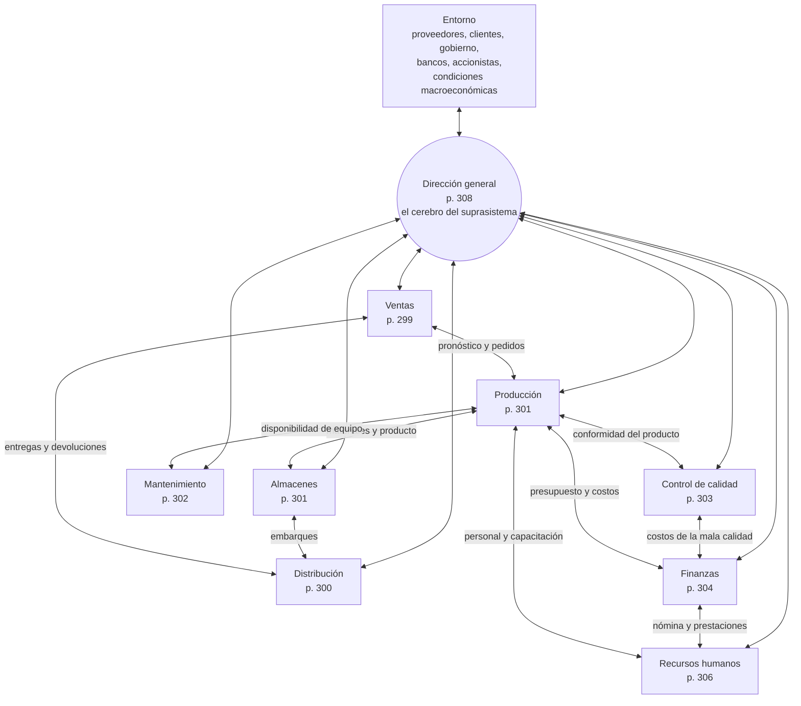

# 4. Mapa de sistemas de la empresa

> Fuentes: cap. 1, «La empresa vista como una serie de procesos» (pp. 11–15), verificado contra el
> texto; cap. 11, «La empresa vista como un conjunto de sistemas» (pp. 291–311), cuyo índice de
> apartados y páginas se usa como esqueleto del mapa.

Este es el esquema integrador: si los diagramas de flujo muestran *cómo* se mueve el trabajo y los
organigramas *quién* manda, el mapa de sistemas muestra *cómo se sostiene el conjunto*.

## El concepto de sistema

El libro llega al enfoque de sistemas por la vía de la historia de las ideas `[C1 · p. 11]`:

- 1954: se funda la Sociedad para el Avance de la Teoría General de Sistemas; en 1957 cambia su nombre a
  Sociedad para la Investigación General de Sistemas.
- 1956: Ludwig von Bertalanffy publica *Sistemas generales*, con el propósito de integrar las ciencias
  naturales y sociales.
- El antecedente filosófico es Hegel (1770–1831), con cuatro proposiciones que conviene copiar
  literalmente porque estructuran todo el capítulo 11:

  1. El todo es más que la suma de sus partes.
  2. El todo determina la naturaleza de las partes.
  3. Las partes no pueden comprenderse si se consideran en forma aislada del todo.
  4. Las partes están dinámicamente relacionadas o son interdependientes.

La analogía que usa el texto: como el cuerpo humano hace circular **información genética, gases y
nutrientes**, la industria necesita que fluyan continuamente **información, materias primas y dinero**;
la empresa es un **suprasistema** integrado por sistemas más simples, y «si cada pequeño sistema funciona
de manera óptima, el suprasistema o empresa funcionará mejor» `[C1 · pp. 11–12]`.

## El mapa

La dirección general va en el centro porque es «el cerebro del suprasistema, pues es la única entidad que
debe tener información en ambos sentidos» `[C1 · p. 12]`. Los nueve subsistemas son los que desarrolla el
capítulo 11, en su orden y con sus páginas.

## Fichas por subsistema

La forma más rentable de estudiar el capítulo 11 es llenar, para cada subsistema, cuatro casillas:
**objetivo, entradas, salidas e índices de medición del desempeño**. Abajo va la plantilla con una
propuesta de contenido derivada de los flujos verificados del capítulo 1 y de la lógica del texto.

`⚠ verificar`: los objetivos, las entradas/salidas y sobre todo los **índices** deben confirmarse contra
las pp. 299–309 antes de darlos por citables. Trata esta tabla como borrador de trabajo, no como cita del
libro; el trabajo de contrastarla es, en sí mismo, el ejercicio de estudio del capítulo.

| Subsistema | Objetivo (propuesto) | Entradas principales | Salidas principales | Índices de desempeño candidatos | p. |
| --- | --- | --- | --- | --- | --- |
| **Ventas** | Colocar en el mercado lo que la empresa produce y detectar las necesidades del cliente | Necesidades del consumidor, estudios de mercado, existencias de producto terminado | Pedidos, pronóstico de ventas, información de satisfacción del cliente | Ventas contra pronóstico, participación de mercado, clientes perdidos, devoluciones | 299 |
| **Distribución** | Entregar el producto en el sitio, cantidad y momento acordados | Programa de embarques, producto terminado, rutas y transporte | Producto entregado, información de sitios, cantidades y frecuencias | Entregas a tiempo, costo de distribución por unidad, pedidos completos | 300 |
| **Almacenes** | Resguardar y controlar materia prima y producto terminado | Recepciones de proveedores y de producción, requisiciones | Entregas a producción y a distribución, movimientos contables | Rotación de inventarios, exactitud de registro, obsolescencia, faltantes | 301 |
| **Producción** | Transformar la materia prima agregándole valor, en la cantidad y calidad requeridas | Materia prima, mano de obra, energía, tecnología, programa de producción | Producto terminado, subproductos, residuos y emisiones | Productividad, cumplimiento del programa, costo unitario, desperdicio | 301 |
| **Mantenimiento** | Conservar la capacidad de los activos fijos productivos | Programa de mantenimiento preventivo, avisos de falla, refacciones | Equipo disponible y confiable, historial de fallas | Disponibilidad de equipo, tiempo entre fallas, proporción preventivo/correctivo | 302 |
| **Control de calidad** | Verificar y asegurar la conformidad del producto y del proceso | Especificaciones, muestras, datos de proceso | Aceptación o rechazo, gráficas de control, acciones correctivas | Producto no conforme, capacidad del proceso, costo de la mala calidad, reclamaciones | 303 |
| **Finanzas** | Administrar el dinero de la empresa y su rentabilidad | Ingresos por ventas, financiamiento, presupuestos | Pagos a proveedores, nómina, impuestos, estados financieros | Rentabilidad, liquidez, rotación de cuentas por cobrar, cumplimiento del presupuesto | 304 |
| **Recursos humanos** | Proveer y desarrollar al personal que la empresa requiere | Requisiciones de personal, plan de capacitación, marco legal laboral | Personal contratado y capacitado, control de asistencia y prestaciones | Rotación, ausentismo, horas de capacitación, accidentes | 306 |
| **Dirección general** | Decidir el rumbo con información interna y externa | Información de todos los subsistemas, entorno macroeconómico, mandato de los accionistas | Objetivos, decisiones de inversión, informes a los accionistas | Rentabilidad económica, cumplimiento del plan estratégico, crecimiento | 308 |

Cierra el capítulo el apartado «La complejidad del sistema llamado empresa» (p. 309), que retoma la
advertencia del capítulo 1: es imposible representar todos los flujos, y la ciencia médica tampoco ha
explicado todas las relaciones entre sistemas corporales `[C1 · p. 12]`.

## Cómo construir tu mapa a mano

1. Dibuja el círculo central (dirección general) y los ocho subsistemas alrededor.
2. Traza **flechas de doble sentido** de información entre el centro y cada subsistema; añade después las
   relaciones laterales (ventas–producción, producción–almacenes, producción–mantenimiento…).
3. Al lado de cada subsistema pega un recuadro con las cuatro casillas: objetivo, entradas, salidas,
   índices.
4. Con tres colores distintos, repasa encima las rutas de **información**, **dinero** y **materia
   prima** de las figuras 1.1, 1.2 y 1.3. Al terminar tendrás en una hoja el contenido de los capítulos
   1 y 11 y el hilo que los conecta con el resto del libro.
5. Verifica una propiedad: si eliminas mentalmente un subsistema, ¿qué flujos se rompen? Es la forma
   práctica de comprobar la cuarta proposición de Hegel (interdependencia).

## Enlace con el resto del libro

Cada subsistema del mapa tiene un capítulo que lo desarrolla. Anotar esa correspondencia en el propio
mapa convierte el esquema en índice de estudio.

| Subsistema | Capítulos que lo desarrollan |
| --- | --- |
| Ventas y distribución | 3 (logística y sistemas de información), 10 (estudio de mercado) |
| Almacenes | 3 (inventarios), 6 (administración de los inventarios) |
| Producción | 2 (procesos industriales), 6 (administración de operaciones), 7 (estudio del trabajo), 8 (diseño de instalaciones) |
| Mantenimiento | 1 y 11 (referencias), 8 (instalaciones) |
| Control de calidad | 5 (calidad: concepto, gestión y control estadístico) |
| Finanzas | 10 (análisis económico, evaluación económica, ingeniería económica) |
| Recursos humanos | 7 (ergonomía, higiene y seguridad), 9 (liderazgo), 13 (ergonomía) |
| Dirección general | 9 (proceso administrativo), 10 (planeación estratégica), 4 (productividad y mejora continua) |
| Entorno ambiental | 12 (contaminación y su gestión) |
