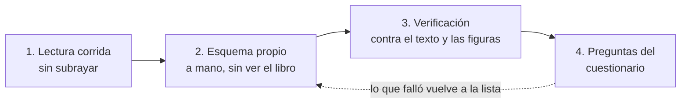
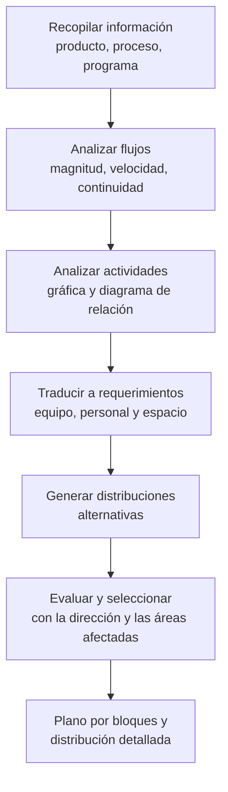
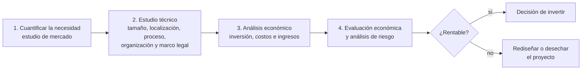
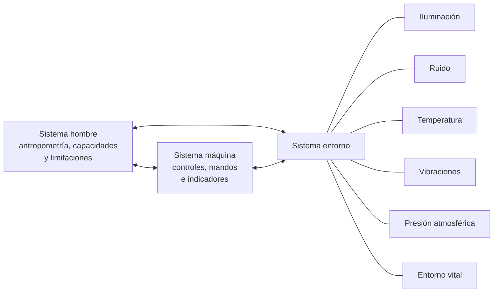

# 5. Guía de estudio capítulo por capítulo

> Ruta de trabajo sobre *Introducción a la Ingeniería Industrial*, 2.ª ed. Para cada capítulo: qué
> persigue, conceptos clave, **el esquema que debes construir** y cómo autoevaluarte.

## Cómo trabajar cada sesión

Una sesión por capítulo, con la misma secuencia de cuatro pasos:

Regla práctica: si no puedes redibujar el esquema del capítulo en menos de cinco minutos y sin mirar, no
lo tienes; no sigas al capítulo siguiente.

| Sesión | Capítulos | Esquema entregable |
| --- | --- | --- |
| 1 | 1 | Cronología de cinco eras + los tres flujos de la empresa |
| 2 | 2 | Cadena productiva + proceso industrial (entradas, transformación, salidas) |
| 3 | 3 | Actividades logísticas sobre la cadena de suministro |
| 4 | 4 | Productividad (resultados) frente a mejora continua (procesos) |
| 5 | 5 | Cronología de la calidad + tabla de pensadores + las siete herramientas |
| 6 | 6 | Proceso de administración de proyectos + Gantt y CPM + estructuras de proyecto |
| 7 | 7 | Simbología ASME + seis etapas del estudio de métodos + medición del trabajo |
| 8 | 8 | Secuencia SLP y tipos básicos de distribución |
| 9 | 9 | Proceso administrativo + cascada de la organización + tipos de liderazgo |
| 10 | 10 | Etapas de la evaluación de proyectos + organigramas del estudio técnico |
| 11 | 11 | Mapa de sistemas con fichas por subsistema |
| 12 | 12 | Corrientes contaminantes (agua, suelo, aire) y su tratamiento |
| 13 | 13 | Sistema hombre – máquina – entorno |
| 14 | Integración | Un solo mapa que una el mapa de sistemas con el capítulo que desarrolla cada subsistema |

---

## Capítulo 1 · Generalidades de la ingeniería industrial (pp. 1–23)

**Qué persigue:** presentar el bosquejo histórico de la disciplina y el papel del ingeniero industrial
con enfoque de sistemas `[C1 · p. 1]`.

**Conceptos clave:** definición de ingeniería del ACT (aplicación de la ciencia, no ciencia); ingeniería
como arte más que como ciencia; primera y segunda revoluciones industriales; administración científica;
tercera revolución industrial; multidisciplina frente a interdisciplina; los tres flujos (información,
dinero, materia prima); definición del IIE.

**Esquema a construir:** [cronología](01-cronologia.md) + [los tres flujos](02-diagramas-de-flujo.md#1-los-tres-flujos-de-la-empresa-capítulo-1).

**Distinción que suele preguntarse:** *multidisciplina* es usar muchas disciplinas en un área de estudio;
*interdisciplina* es hacerlas interactuar para resolver un problema concreto —el ejemplo del libro es una
encuesta de mercado, donde además de estadística intervienen sociología, psicología y mercadotecnia—
`[C1 · pp. 20–21]`.

---

## Capítulo 2 · Naturaleza de los procesos industriales (pp. 25–52)

**Qué persigue:** clasificar sectores y empresas, y dar el vocabulario de los procesos.

**Conceptos clave:** sectores productivos y cadena productiva; clasificación de empresas; áreas generales
de una empresa industrial; **operación unitaria** (cambio físico) frente a **proceso unitario** (reacción
química); procesos de la industria metal-mecánica (vaciado, taladrado, esmerilado, fresado, torneado,
corte); protección de metales y electrólisis (recubrimiento electrolítico, anodizado); unión de metales
(soldadura de arco, de punto); operaciones unitarias: transporte, bombeo, compresión, reducción de
tamaño, transferencia de calor, mezclado, destilación, evaporación, secado, filtración, centrifugación,
tamizado; sistemas de unidades y equivalencias de temperatura.

**Esquema a construir:** [proceso industrial general](02-diagramas-de-flujo.md#2-representación-general-de-un-proceso-industrial-capítulo-2), rodeado de la lista de operaciones unitarias.

**Ejercicio del libro:** el diagrama de flujo para fabricar jugo de maracuyá (fig. 2.32) es el mejor
modelo de examen: reprodúcelo con simbología ASME `[C2 · pp. 47–50]`.

---

## Capítulo 3 · Logística y sistemas de información (pp. 53–71)

**Qué persigue:** pasar de la logística militar a la logística empresarial y a la cadena de suministro.

**Conceptos clave:** actividades logísticas a través de la historia (origen militar) y actividades
logísticas empresariales; definición de logística; relación entre logística y *supply chain management*;
servicio al cliente; inventarios; localización de instalaciones; transporte; sistemas logísticos de
información; conceptos logísticos actuales.

**Esquema a construir:** una línea horizontal proveedor → almacén → planta → almacén → distribuidor →
cliente, y sobre ella, en cajas, cada actividad logística; debajo, el sistema de información que la
soporta. Marca cuáles son actividades **clave** y cuáles de **apoyo**.

**Enlace:** este capítulo es el subsistema *ventas y distribución* del [mapa de sistemas](04-mapa-de-sistemas.md).

---

## Capítulo 4 · Productividad y mejora continua (pp. 73–98)

**Qué persigue:** distinguir dos enfoques complementarios: la productividad mira **resultados**, la
mejora continua mira **procesos** `[C4 · pp. 74, 77]`.

**Conceptos clave:** definición y medición de la productividad; mejora continua y su metodología; otras
dimensiones de la mejora continua (política y macroeconómica).

**Esquema a construir:** dos columnas enfrentadas —productividad (resultados) y mejora continua
(procesos)— unidas por una flecha circular que represente el ciclo de mejora; en cada columna, sus
indicadores y sus herramientas.

**Cuidado con el error frecuente:** productividad no es producción. Escribe la razón salidas/entradas y
resuelve un caso con dos insumos distintos (mano de obra y energía) para ver que puede subir la
productividad total y bajar una parcial.

---

## Capítulo 5 · Calidad: su concepto, gestión y control estadístico (pp. 99–132)

**Qué persigue:** historia, gestión y herramientas estadísticas de la calidad.

**Conceptos clave:** artesano → inspector → control estadístico → control total → TQM → ISO; los
pensadores (Deming, Juran, Ishikawa, Feigenbaum, Crosby, Hirano); cliente y proveedores; momentos y
funcionalidad de la calidad; sistemas de gestión de calidad, documentación y auditorías; implementación y
verificación ISO; **las siete herramientas**: estratificación, diagrama de causa y efecto, hoja de
verificación, histograma, diagrama de Pareto, diagrama de dispersión y gráficas de control.

**Esquemas a construir:**

1. La [línea de tiempo de la calidad](01-cronologia.md#era-5--sistemas-calidad-y-automatización-1945--siglo-xxi): 1924 Shewhart, 1925 Dodge y Romig, 1946 ASQC, 1947 ISO, 1950 Deming en Japón, 1954 Juran, 1955 gráficas de Ishikawa, 1960s control total y círculos de calidad, 1980s TQM, 1987 ISO 9000.
2. Una tabla de pensadores con tres columnas: aportación central, herramienta asociada, frase que lo identifica.
3. Las siete herramientas, cada una con la pregunta que responde (¿qué causa qué?, ¿cuánto varía?, ¿qué es prioritario?, ¿hay relación entre dos variables?).

---

## Capítulo 6 · La administración de las operaciones (pp. 133–173)

**Qué persigue:** qué hace un administrador de operaciones y con qué herramientas.

**Conceptos clave:** concepto y evolución de la administración de las operaciones; las operaciones como
estrategia competitiva; administración de proyectos y organización del recurso humano; control de
proyectos (Gantt, CPM); pronósticos (métodos de juicio y objetivos); planeación agregada; administración
de inventarios; tendencias.

**Esquemas a construir:** [proceso de administración de proyectos](02-diagramas-de-flujo.md#3-proceso-de-administración-de-proyectos-capítulo-6) y [estructuras de proyecto](03-organigramas.md#estructuras-de-proyecto-capítulo-6-figura-610).

**Ejercicio numérico obligado:** una red con CPM (ruta crítica y holguras) y un pronóstico por dos
métodos objetivos distintos, comparando el error.

---

## Capítulo 7 · Estudio y diseño del trabajo (pp. 175–214)

**Qué persigue:** las cuatro áreas del estudio y diseño del trabajo: estudio de métodos, medición del
trabajo, ergonomía, e higiene y seguridad industriales.

**Conceptos clave:** administración científica frente a enfoque sociotécnico; simbología ASME; familias
de diagramas (cursograma sinóptico, cursograma analítico, bimanual, hombre-máquina, recorrido, hilos);
las seis etapas del estudio de métodos; estudio de tiempos con cronómetro y tamaño de muestra; muestreo
del trabajo; tiempos predeterminados y MOST; umbrales de tolerancia; OSHA y análisis de higiene y
seguridad.

**Esquemas a construir:** [simbología](02-diagramas-de-flujo.md#simbología-asme-para-diagramas-de-proceso) y [las seis etapas](02-diagramas-de-flujo.md#4-las-seis-etapas-de-un-estudio-de-métodos-capítulo-7).

**Este es el capítulo más «dibujable» del libro:** aquí es donde el esfuerzo de esquematizar rinde más,
porque la evaluación casi siempre pide levantar un diagrama y criticarlo.

---

## Capítulo 8 · Diseño de instalaciones (pp. 215–237)

**Qué persigue:** decidir **dónde** se instala la planta y **cómo** se acomoda por dentro.

**Conceptos clave:** problemática y objetivos del diseño; localización en la cadena de suministro y
factores que la impactan; modelación de distancias en el plano; problemas continuos y discretos de
localización única; carga recorrida; **SLP** (Systematic Layout Planning, R. Muther, 1961) con sus tres
fases —análisis del problema, búsqueda de diseños alternativos y evaluación—; análisis de flujos; tipos
básicos de distribución (por producto, por proceso, celular, por posición fija); diagramas de relación de
actividades y de espacios; plano por bloques.

**Esquema a construir:**

`[C8 · pp. 226–233]`

---

## Capítulo 9 · Administración de la empresa (pp. 239–262)

**Qué persigue:** el proceso administrativo y el factor humano que lo hace funcionar.

**Conceptos clave:** historia de la administración (Taylor, sus cuatro principios, Fayol, Mayo);
planeación estratégica y táctica; objetivos por accionistas, clientes, procesos y personal; organización
y cascada de la organización; ejecución y nivel de incompetencia; control; liderazgo autocrático,
participativo y liberal; administrador frente a líder; creatividad y visión estratégica; ética en los
negocios.

**Esquemas a construir:** [proceso administrativo y cascada](03-organigramas.md#la-cascada-de-la-organización-capítulo-9-figura-91), más una tabla de los tres estilos de liderazgo con la situación en que cada uno rinde mejor.

**Los cuatro principios de Taylor**, tal como los enuncia este capítulo `[C9 · p. 240]`: procedimiento
estructurado para todo proceso; selección científica y mejora progresiva del operador; adaptar al
operador para trabajar con base en la ciencia; separar a quienes definen el trabajo de quienes lo
ejecutan. El capítulo también señala su costo: el trabajador «se sentía como si fuera un objeto».

---

## Capítulo 10 · La planeación y las decisiones de inversión (pp. 263–289)

**Qué persigue:** planear con dos lentes —evaluación de proyectos (planeación idealizada) y planeación
estratégica (no idealizada)— y decidir con criterios económicos.

**Conceptos clave:** origen de la metodología (ONU, 1955); las cuatro partes de la evaluación de
proyectos: cuantificación de necesidades (estudio de mercado), estudio técnico o ingeniería del proyecto,
análisis económico, y evaluación económica con análisis de riesgo; planeación financiera; valor del dinero
en el tiempo.

**Esquema a construir:**

`[C10 · pp. 264–286]`

**Aquí viven los organigramas** que estudia el capítulo: la organización del recurso humano es parte del
estudio técnico. Complementa con [la tipología de organigramas](03-organigramas.md#tipología-de-organigramas) y confirma la figura 10.8.

---

## Capítulo 11 · La empresa vista como un conjunto de sistemas (pp. 291–311)

**Qué persigue:** integrar todo el libro con el enfoque de sistemas.

**Conceptos clave:** concepto y características de un sistema; la empresa como sistema diseñado por el
hombre; características de los sistemas industriales; los subsistemas (ventas, distribución, almacenes,
producción, mantenimiento, control de calidad, finanzas, recursos humanos, dirección general); la
complejidad del sistema llamado empresa.

**Esquema a construir:** el [mapa de sistemas](04-mapa-de-sistemas.md) con una ficha de cuatro casillas
por subsistema (objetivo, entradas, salidas, índices).

**Este es el capítulo que conviene estudiar dos veces:** una al principio del curso, para tener el mapa
donde colgar cada tema, y otra al final, para comprobar que todos los capítulos encontraron su lugar.

---

## Capítulo 12 · La contaminación y su gestión (pp. 313–337)

**Qué persigue:** reconocer las corrientes contaminantes de los procesos industriales y cómo se tratan.

**Conceptos clave:** contaminación del agua, composición y sistemas integrales de tratamiento;
contaminación del suelo y tratamientos de contaminantes; contaminantes del aire (particulado y gases) y
procesos para tratarlos; gestión de la contaminación en los procesos industriales.

**Esquema a construir:** retoma la figura 2.5 y prolonga cada salida no deseada —emisiones gaseosas,
aguas residuales y residuos— hasta su tratamiento, y anota junto a cada rama la norma o el criterio de
gestión aplicable. Así el capítulo 12 deja de ser un anexo y se vuelve la continuación natural del
capítulo 2.

---

## Capítulo 13 · Ergonomía (pp. 339–371)

**Qué persigue:** adaptar el puesto de trabajo a las capacidades y limitaciones de la persona.

**Conceptos clave:** antecedentes históricos de la ergonomía; sistema hombre; sistema máquina; sistema
entorno con sus factores: iluminación, ruido, temperatura, vibraciones, presión atmosférica y entorno
vital.

**Esquema a construir:**

**Enlace con el capítulo 1:** la ergonomía es consecuencia directa de los experimentos de Elton Mayo
(1927) y de la responsabilidad que asumió el ingeniero industrial sobre las condiciones físicas del
trabajo, incluidos los **umbrales de tolerancia** de ruido, luz, calor, radiación y solventes
`[C1 · p. 8]`.

---

## Cierre: la pregunta de integración

Cuando termines los 13 capítulos, responde por escrito esta pregunta usando tus propios esquemas:

> Una empresa detecta que sus entregas llegan tarde y que su producto tiene devoluciones crecientes.
> ¿Con qué capítulos del libro atacarías el problema, en qué orden, y qué diagrama levantarías en cada
> paso?

Una respuesta completa recorre, como mínimo: el mapa de sistemas (cap. 11) para ubicar los subsistemas
implicados; los flujos del capítulo 1 para ver qué información no está circulando; el estudio de métodos
y el cursograma analítico (cap. 7) para el proceso interno; las herramientas de calidad (cap. 5) para las
devoluciones; la logística (cap. 3) y el diseño de instalaciones (cap. 8) para las entregas y los
recorridos; y la administración de proyectos (cap. 6) para organizar la intervención.
