# PD-SGC-MAN-001 Manual del Sistema de Gestión de Procesos

Palm Diamante — `palm-lab-practica`

Nota de integración: la versión 1.1 incorpora la revisión externa y el orden SQL por proceso, manual, PDCA y workflow. Los controles se reescribieron contra el catálogo real. Donde el borrador nombraba una columna que no existe, el control usa la columna vigente y el hueco queda como requisito de salida de PD-P10. La primera pasada se ejecutó el 2026-10-05.

Marco de referencia: ISO 9001:2015, ISO/IEC 27001 y PDCA. Este documento es control interno. Un organismo certificador no ha emitido un certificado.

## Control del documento

| Campo | Valor |
| --- | --- |
| Código | PD-SGC-MAN-001 |
| Versión | 1.1 |
| Fecha | 2026-10-05 |
| Estado | Vigente — pendiente de aprobación del CTO |
| Autor | Backend Lead |
| Aprobador | CTO |
| Próxima revisión | 2026-11-05 |
| Clasificación | Interno — Confidencial |
| Fuentes de verdad | Supabase para datos operativos. Git para migraciones, funciones y este manual. |

## 1. Objetivo y alcance

**Objetivo.** Estandarizar los 12 procesos del CRM con códigos, ligas, controles SQL y PDCA.

**Alcance.** Del mensaje de WhatsApp a la comisión cobrada.

**Fuera de alcance.** Diseño creativo de campañas, contratos de compraventa e hipotecas externas.

## 2. Convenciones

| Prefijo | Uso |
| --- | --- |
| `PD-P##` | Proceso |
| `PD-P##.#` | Subproceso |
| `PD-EV-###` | Evidencia |
| `PD-KPI-###` | Indicador |
| `PD-RIE-###` | Riesgo |
| `PD-CTRL-###` | Control SQL o prueba de aceptación |
| `PD-ING-###` | Liga de ingreso |
| `PD-WF-001` | Workflow n8n |

Una liga **verificada** respondió en el corte. Una liga **declarada** sigue abierta. No quedan marcas `-- VERIFICAR` en este manual: lo no confirmado está en la columna Estado.

Los controles se corren con `service_role` o un rol de lectura, en el SQL Editor. `pg_cron` no está instalado. n8n no tiene host. `anon` no lee el CRM.

## 3. Mapa de códigos

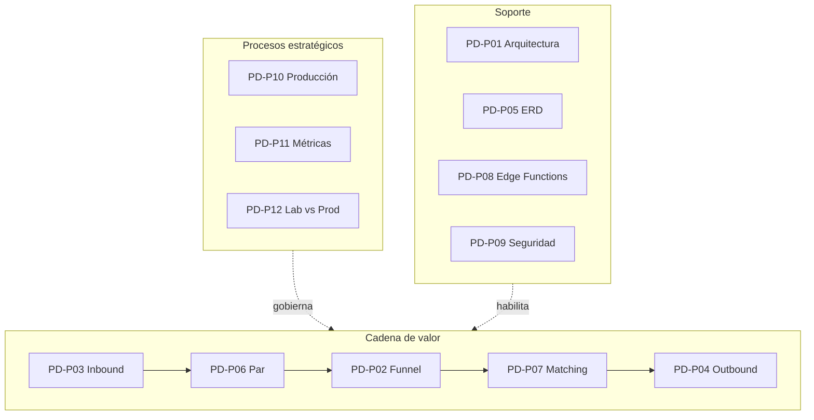

La numeración PD-P01 a PD-P12 conserva el orden de los mapas. La flecha de la cadena de valor es el orden de ejecución.

## 4. Protocolos

### PD-P01 — Arquitectura

**Objetivo.** Supabase guarda el dato operativo. Git guarda migraciones, funciones y documentos.

**Ligas**

| Código | Liga | Estado |
| --- | --- | --- |
| PD-ING-001 | [https://wa.me/525540180018](https://wa.me/525540180018) | Chat verificado. Webhook no desplegado. |
| PD-ING-010 | [https://supabase.com/dashboard/project/plgfhtvzxhrdfmrlknru](https://supabase.com/dashboard/project/plgfhtvzxhrdfmrlknru) | Studio. |
| PD-ING-011 | `https://plgfhtvzxhrdfmrlknru.supabase.co` | API. |
| PD-ING-012 | `https://<n8n-host>/webhook/meta-inbound` | Declarada. Requisito PD-P10 §6.1. JSON en `n8n/PD-WF-001_meta-inbound.json`. |

**Entradas.** Mensajes, sync EasyBroker, aprobaciones.

**Salidas.** Filas en Supabase. HTTP a Meta y correo de lead caliente del núcleo: declarados.

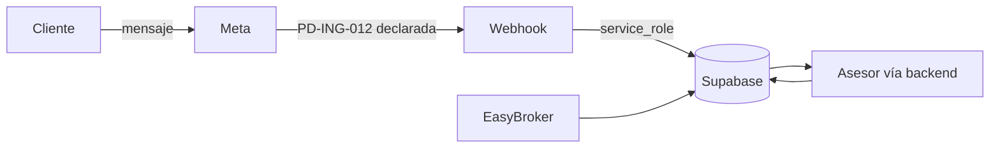

**Pasos.** Escribir en `public` con actor y tiempo. Guardar `service_role` en secretos. Clasificar cada liga. Anotar PD-EV-001.

**Evidencia.** PD-EV-001. **KPI.** PD-KPI-001 tránsito por Supabase, objetivo 100 %. **Riesgo.** PD-RIE-001 escritura que no deja fila.

**PD-CTRL-001**

```sql
select 'prospectos' as tabla, count(*) as filas, max(created_at) as ultimo_evento
from public.prospectos
union all
select 'leads', count(*), max(created_at) from public.leads
union all
select 'interacciones', count(*), max(created_at) from public.interacciones
union all
select 'webhook_eventos', count(*), max(recibido_at) from public.webhook_eventos;
```

Primera pasada: prospectos 15 (2026-09-28), leads 15 (2026-10-05), interacciones 0, webhook_eventos 0. En operación real las cuatro tablas tienen fila reciente. Hoy el canal está en cero vacío.

### PD-P02 — Funnel

**Objetivo.** Cada etapa tiene fila. El estado es la etapa actual, no el historial.

**Liga.** No existe `v_funnel_*`. Lectura verificada: `v_leads_temperatura`, `v_prospectos_nuevos`, `v_leads_frios`. Editor: [https://supabase.com/dashboard/project/plgfhtvzxhrdfmrlknru/editor](https://supabase.com/dashboard/project/plgfhtvzxhrdfmrlknru/editor)

**Salidas.** `leads.estado` en `nuevo`, `contactado`, `calificado`, `cita`, `apartado`, `cerrado`, `descartado`. Citas en `citas`. Comisión desde `matches`.

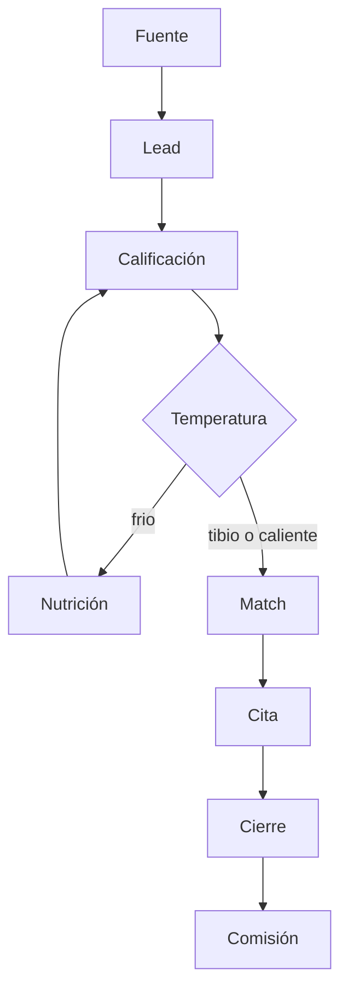

**PD-CTRL-002.** Contar solo `estado = 'calificado'` deja fuera a quien ya está en cita. El control usa la etapa actual y, aparte, el acumulado.

```sql
select estado::text, count(*) as n
from public.leads
group by 1
order by 1;

select
  count(*) as total,
  count(*) filter (where estado in ('calificado','cita','apartado','cerrado')) as llegaron_a_calificado,
  count(*) filter (where estado in ('cita','apartado','cerrado')) as llegaron_a_cita,
  count(*) filter (where estado = 'cerrado') as cerrados,
  (select count(*) from public.matches) as matches_total,
  (select count(*) from public.comisiones) as comisiones_total
from public.leads;
```

Primera pasada: nuevo 5, contactado 3, calificado 1, cita 3, apartado 1, cerrado 1, descartado 1. Acumulado a calificado 6 de 15. Matches 0. Comisiones 0.

**Evidencia.** PD-EV-002. **KPI.** PD-KPI-002 conversión por etapa acumulada. **Riesgo.** PD-RIE-002 avance sin fila que lo explique.

### PD-P03 — Inbound

**Objetivo.** Integridad del mensaje antes de automatizar.

**Liga.** PD-ING-001 y PD-ING-012.

**Salida mínima.** `webhook_eventos`, `prospectos`, `leads`, `interacciones`. `interacciones` no tiene `origen`, `metadata`, `message_id` ni `telefono`. El id de Meta va en `id_externo`. La dirección válida es `entrante`.

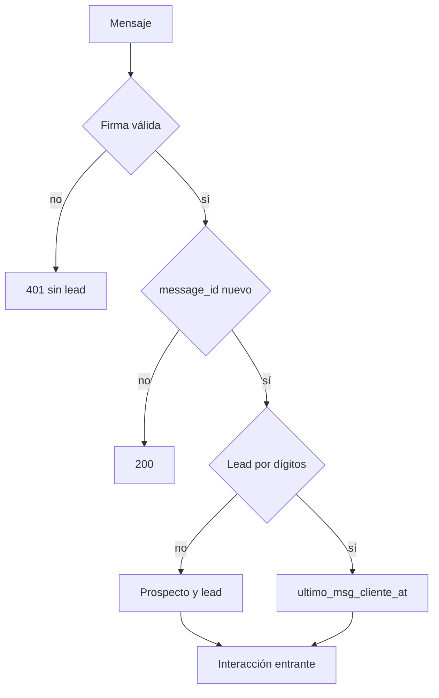

**Pasos.** HMAC sobre el cuerpo crudo. `webhook_eventos.clave_idempotencia = message_id`. Teléfono E.164 en `prospectos.telefono`. El trigger llena `telefono_normalizado` con dígitos. Interacción `canal = whatsapp`, `direccion = entrante`, `estado = recibido`. La alerta `lead-alert-email` no sirve para el lead caliente del núcleo.

**PD-CTRL-003.** La consulta con `metadata ->> firma_validada` no se puede ejecutar. El control vigente es:

```sql
select
  count(*) as eventos,
  count(*) filter (where estado = 'error') as con_error,
  count(*) filter (where estado = 'recibido' and procesado_at is null) as sin_procesar
from public.webhook_eventos;

select count(*) as interacciones_entrantes
from public.interacciones
where canal = 'whatsapp'
  and direccion = 'entrante';
```

Primera pasada: 0 eventos y 0 interacciones. Cero vacío. PD-RIE-003 sigue abierto. Guardar `firma_validada` exige una columna nueva; hasta entonces la firma se exige antes del insert.

**Evidencia.** PD-EV-003. **KPI.** PD-KPI-003 firmas válidas sobre mensajes aceptados, objetivo 100 %. **Riesgo.** PD-RIE-003 procesar sin firma.

### PD-P04 — Outbound

**Objetivo.** Separar borrador aprobado de evento aceptado por Meta.

**Liga.** Declarada: `POST https://graph.facebook.com/{version}/{phone-number-id}/messages`. El id del número no está en el esquema. `https://api.whatsapp.com/v1/messages` no es el contrato de esta cuenta.

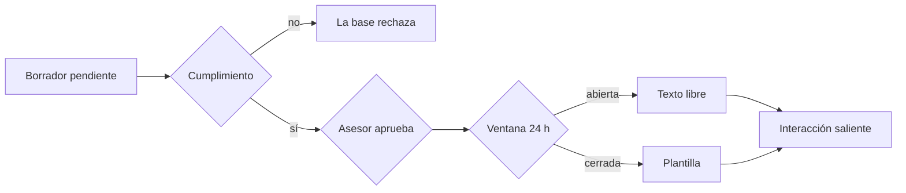

**PD-CTRL-004**

```sql
select id, prospecto_id, estado, aprobado_por, aprobado_at
from public.borradores
where estado = 'enviado'
  and aprobado_por is null;

select i.id, i.lead_id, i.ocurrido_at, i.estado
from public.interacciones i
join public.leads l on l.id = i.lead_id
left join public.prospectos p on p.id = l.prospecto_id
where i.direccion = 'saliente'
  and i.estado = 'enviado'
  and i.ocurrido_at > coalesce(p.ultimo_msg_cliente_at, l.ultimo_msg_cliente_at, '-infinity'::timestamptz) + interval '24 hours'
  and not exists (
    select 1 from public.borradores b
    where b.prospecto_id = p.id
      and b.plantilla is not null
      and b.estado = 'enviado'
  );
```

No existe `borradores.lead_id`, `interacciones.direccion = 'out'`, `es_plantilla` ni `draft_id`. El tercer control del borrador externo queda como requisito §6.3, no como query.

Primera pasada: 0 borradores enviados sin aprobador. 0 interacciones, cero vacío.

**Evidencia.** PD-EV-004. **KPI.** PD-KPI-004 envíos con borrador aprobado, objetivo 100 %. **Riesgo.** PD-RIE-004 envío sin aprobación o fuera de ventana.

### PD-P05 — ERD

**Objetivo.** Las llaves del diagrama existen en la base. Git versiona las migraciones.

**Liga.** [https://supabase.com/dashboard/project/plgfhtvzxhrdfmrlknru/database/schemas](https://supabase.com/dashboard/project/plgfhtvzxhrdfmrlknru/database/schemas)

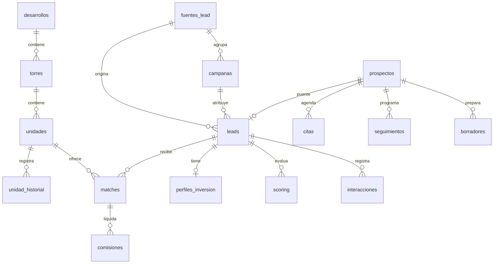

Citas, seguimientos y borradores no cuelgan de `leads`. Las comisiones no tienen `lead_id`.

**PD-CTRL-005**

```sql
select tc.table_name, kcu.column_name,
       ccu.table_name as tabla_referenciada,
       ccu.column_name as columna_referenciada
from information_schema.table_constraints tc
join information_schema.key_column_usage kcu
  on tc.constraint_name = kcu.constraint_name
 and tc.table_schema = kcu.table_schema
join information_schema.constraint_column_usage ccu
  on ccu.constraint_name = tc.constraint_name
 and ccu.table_schema = tc.table_schema
where tc.constraint_type = 'FOREIGN KEY'
  and tc.table_schema = 'public'
order by 1, 2;
```

**Evidencia.** PD-EV-005, este diagrama en la versión 1.1. **KPI.** PD-KPI-005 relaciones dibujadas presentes en el catálogo. **Riesgo.** PD-RIE-005 documentar una FK que no existe.

### PD-P06 — Prospectos y leads

**Objetivo.** Cero huérfanos y cero temperaturas distintas en el par.

**Liga.** PD-CTRL-006. No existe la vista `v_prospectos_sin_lead`.

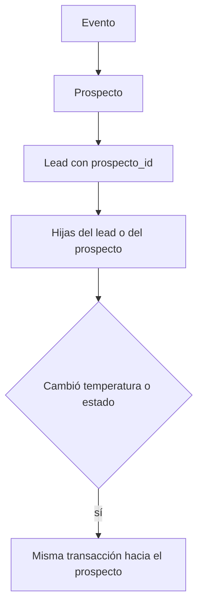

**PD-CTRL-006**

```sql
select p.id as prospecto_id, p.created_at
from public.prospectos p
left join public.leads l on l.prospecto_id = p.id
where l.id is null;

select l.id, l.prospecto_id
from public.leads l
left join public.prospectos p on p.id = l.prospecto_id
where l.prospecto_id is null or p.id is null;

select l.id, l.temperatura::text as temp_lead, p.temperatura as temp_prospecto
from public.leads l
join public.prospectos p on p.id = l.prospecto_id
where l.temperatura::text is distinct from p.temperatura;
```

Primera pasada: 0, 0 y 0. El listado operativo puede añadir `telefono` en el SQL Editor. Este manual no archiva teléfonos.

**Evidencia.** PD-EV-006. **KPI.** PD-KPI-006 = 0. **Riesgo.** PD-RIE-006 huérfano. No hay trigger de espejo.

### PD-P07 — Inventario y matching

**Objetivo.** Un tibio o caliente recibe de 1 a 3 unidades disponibles. Nunca una unidad no disponible.

**Liga.** `POST https://plgfhtvzxhrdfmrlknru.supabase.co/functions/v1/easybroker-sync` sincroniza el catálogo. No inserta `matches`.

`unidades` es el inventario del match. `inventario` sigue sincronizado por trigger: 605 y 605, cero huérfanas. No está deprecado.

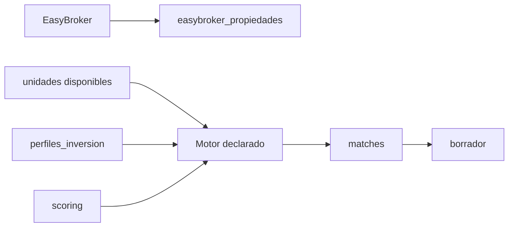

**PD-CTRL-007**

```sql
select l.id, l.temperatura::text, l.estado::text
from public.leads l
where l.temperatura in ('tibio', 'caliente')
  and not exists (
    select 1 from public.matches m
    where m.lead_id = l.id
      and m.estado in ('propuesto', 'ofrecido', 'aceptado')
  );

select m.id, m.estado::text, u.estatus::text
from public.matches m
join public.unidades u on u.id = m.unidad_id
where m.estado in ('propuesto', 'ofrecido')
  and u.estatus <> 'disponible';

select
  (select count(*) from public.inventario i
    left join public.unidades u on u.clave = i.clave
   where u.id is null) as inventario_sin_unidad,
  (select count(*) from public.unidades u
    left join public.inventario i on i.clave = u.clave
   where i.id is null) as unidad_sin_inventario;
```

Un `full outer join` de claves presentes devuelve los 605 pares conciliados, no las duplicidades. El control de conciliación son los dos conteos de huérfanos.

Primera pasada: 12 sin match, 0 matches sobre unidad no disponible, 0 y 0 huérfanas. `lista_vigente` es falso en las 605.

**Evidencia.** PD-EV-007. **KPI.** PD-KPI-007 cobertura ≥ 95 %. Corte: 0 de 12. **Riesgo.** PD-RIE-007.

### PD-P08 — Edge Functions

**Ligas**, base `https://plgfhtvzxhrdfmrlknru.supabase.co`:

| Función | `verify_jwt` | Corte 2026-10-05 |
| --- | --- | --- |
| `/functions/v1/easybroker-load` | verdadero | HTTP 410. Retirar. |
| `/functions/v1/easybroker-sync` | falso | Sin `SYNC_SECRET` responde 503 y no escribe. Cabecera real: `x-webhook-secret`. |
| `/functions/v1/lead-alert-email` | falso | Sin secreto, o con secreto corto, responde 401. Solo acepta insert de `leads_prueba_formulario`. |

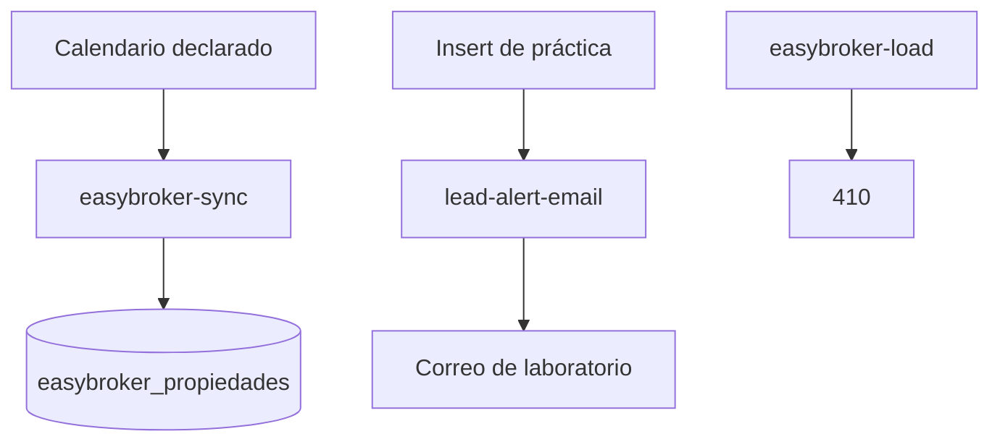

**PD-CTRL-008.** No usar `x-shared-secret`. No enviar un secreto válido en la prueba de rechazo.

```bash
curl -s -o /dev/null -w "%{http_code}\n" -X POST \
  https://plgfhtvzxhrdfmrlknru.supabase.co/functions/v1/easybroker-sync

curl -s -o /dev/null -w "%{http_code}\n" -X POST \
  https://plgfhtvzxhrdfmrlknru.supabase.co/functions/v1/lead-alert-email
```

Primera pasada: sync `503` con cuerpo `not_configured` / `SYNC_SECRET missing`, también con cabecera inválida, porque el secreto se evalúa antes que la firma. Alerta `401`. Ninguna escribió filas. El criterio «secreto incorrecto → 401» del sync se cumple cuando el secreto exista. Hoy el sync está apagado.

**Evidencia.** PD-EV-008, fecha y responsable, sin el valor del secreto. **KPI.** PD-KPI-008 funciones JWT-false que no escriben sin secreto. **Riesgo.** PD-RIE-008.

### PD-P09 — Seguridad

**Liga.** [https://supabase.com/dashboard/project/plgfhtvzxhrdfmrlknru/auth/policies](https://supabase.com/dashboard/project/plgfhtvzxhrdfmrlknru/auth/policies)

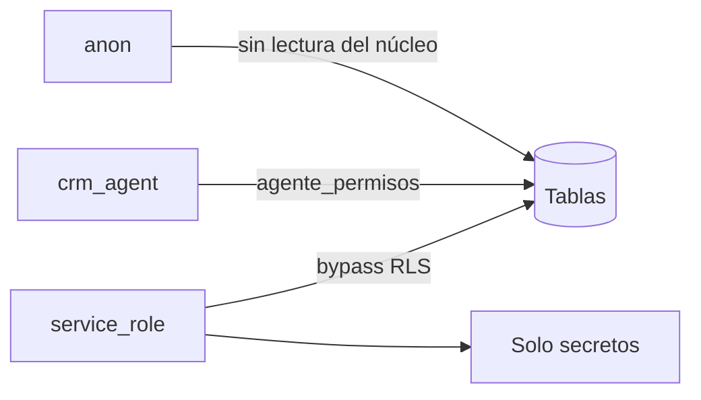

**PD-CTRL-009**

```sql
select tablename
from pg_tables
where schemaname = 'public' and rowsecurity = false;

select tablename, policyname, roles::text, cmd
from pg_policies
where schemaname = 'public'
order by 1, 2;

select table_name, privilege_type
from information_schema.role_table_grants
where grantee = 'anon'
  and table_schema = 'public'
  and table_name in (
    'leads','prospectos','interacciones','comisiones',
    'scoring','matches','perfiles_inversion'
  );
```

Primera pasada: 0 tablas sin RLS. 0 grants de `anon` sobre esas tablas. El único insert anónimo sigue siendo `leads_prueba_formulario`. Los avisos `rls_enabled_no_policy` cierran tablas al rol sin bypass.

**Evidencia.** PD-EV-009. **KPI.** PD-KPI-009 tablas sin RLS = 0. **Riesgo.** PD-RIE-009.

### PD-P10 — Producción

**Objetivo.** La pauta espera a los hitos y a los seis requisitos de salida.

**Liga.** PD-EV-010 en Git, esta sección.

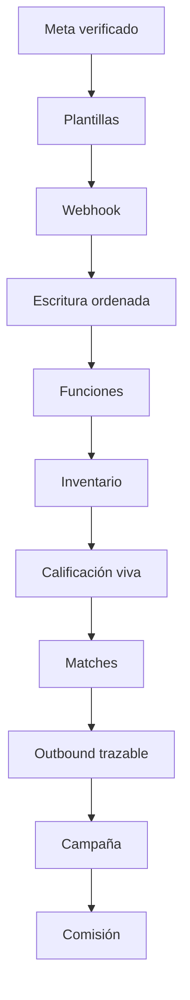

**Evidencia.** PD-EV-010 firmado. **KPI.** PD-KPI-010 hitos cerrados. **Riesgo.** PD-RIE-010 pauta con webhook vacío.

#### Requisitos de salida

| # | Área | Requisito | Criterio | Corte |
| --- | --- | --- | --- | --- |
| 6.1 | Webhook Meta | HTTPS público y verificación del challenge | Firma inválida no crea lead. Host real sustituye a `<n8n-host>`. | Abierto |
| 6.2 | Funciones sin JWT | Secreto antes de escribir | Sync hoy responde 503 por secreto ausente. Alerta responde 401. Cabecera del sync: `x-webhook-secret`. | Parcial |
| 6.3 | Outbound | Borrador aprobado distinto del acuse de Meta | Hace falta persistir borrador, id de Meta, estatus HTTP y tiempo. `draft_id` no existe. | Abierto |
| 6.4 | Fuentes de verdad | Dato en Supabase. Cambio de esquema en Git. | Migración versionada y versión de este manual. | Vigente para el esquema actual |
| 6.5 | Inventario | Reserva transaccional | `private.match_reglas` rechaza unidad no disponible y aparta al aceptar. Sigue en cero matches. | Regla activa, motor ausente |
| 6.6 | Privacidad | Retención, minimización y acceso por rol | RLS probado en PD-CTRL-009. La retención por plazo todavía no está escrita. | Parcial |

### PD-P11 — Métricas

**Objetivo.** Comisión por fuente. Vacía mientras no haya comisiones.

**Liga.** Vistas de la sección PD-P02 y Studio.

**PD-CTRL-011.** `citas` no tiene `lead_id`. `comisiones` no tiene `lead_id` ni estado `confirmada`. Estados de dinero: `devengada` y `pagada`.

```sql
with base as (
  select l.fuente_id,
         count(*) as leads_total,
         count(*) filter (where l.temperatura in ('tibio','caliente')) as tibios_o_calientes,
         count(*) filter (where exists (
           select 1 from public.matches m where m.lead_id = l.id
         )) as con_match,
         count(*) filter (where exists (
           select 1 from public.citas c
           where c.prospecto_id = l.prospecto_id
         )) as con_cita
  from public.leads l
  where l.created_at >= now() - interval '7 days'
  group by l.fuente_id
),
dinero as (
  select l.fuente_id, sum(co.monto) as comision_total
  from public.comisiones co
  join public.matches m on m.id = co.match_id
  join public.leads l on l.id = m.lead_id
  where co.estado in ('devengada', 'pagada')
  group by l.fuente_id
)
select b.fuente_id, b.leads_total, b.tibios_o_calientes, b.con_match, b.con_cita,
       coalesce(d.comision_total, 0) as comision_total
from base b
left join dinero d on d.fuente_id = b.fuente_id
order by comision_total desc;

select count(*) as fuera_de_5_min
from public.prospectos p
where p.ultimo_msg_cliente_at is not null
  and (p.ultimo_msg_asesor_at is null
       or p.ultimo_msg_asesor_at > p.ultimo_msg_cliente_at + interval '5 minutes');
```

Primera pasada: comisiones 0. Respuestas fuera de 5 minutos: 12. Los leads de semilla no nacieron todos en los últimos 7 días.

**Evidencia.** PD-EV-011, semana ISO. **KPI.** PD-KPI-011. **Riesgo.** PD-RIE-011 decidir sin fuente o con datos de laboratorio.

### PD-P12 — Laboratorio

**Objetivo.** La demo no entra en PD-KPI-011.

**Liga.** Esquema `lab_meta_demo`. Formulario `POST /rest/v1/leads_prueba_formulario`.

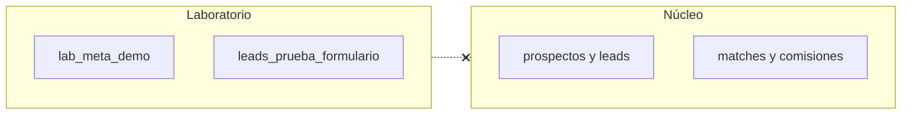

**PD-CTRL-012**

```sql
select count(*) as fuera_de_e164
from public.prospectos
where telefono !~ '^\+52[0-9]{10}$';

select count(*) as formulario from public.leads_prueba_formulario;

select 'campaigns' as t, count(*) from lab_meta_demo.campaigns
union all select 'adsets', count(*) from lab_meta_demo.adsets
union all select 'ads', count(*) from lab_meta_demo.ads
union all select 'insights_daily', count(*) from lab_meta_demo.insights_daily;

select count(*) as campanas from public.campanas;
```

Primera pasada: E.164 conforme en los 15. Formulario 3. Laboratorio 4, 8, 16 y 224. Campañas 0. Antes de la pauta, formulario y laboratorio en 0 y campañas reales mayores a 0. El formato telefónico no cierra la semilla: eso es PD-EV-012.

**Evidencia.** PD-EV-012. **KPI.** PD-KPI-012 demo dentro de la comisión = 0. **Riesgo.** PD-RIE-012.

### Subprocesos

| Código | Actividad |
| --- | --- |
| PD-P03.1 | HMAC |
| PD-P03.2 | Idempotencia por `message_id` |
| PD-P03.3 | Alta del par |
| PD-P04.1 | Aprobación del borrador |
| PD-P04.2 | Ventana de 24 h |
| PD-P07.1 | Sync EasyBroker |
| PD-P07.2 | Uno a tres matches |
| PD-P12.1 | Purga de laboratorio |
| PD-P12.2 | Revisión de la semilla |

## 5. PDCA

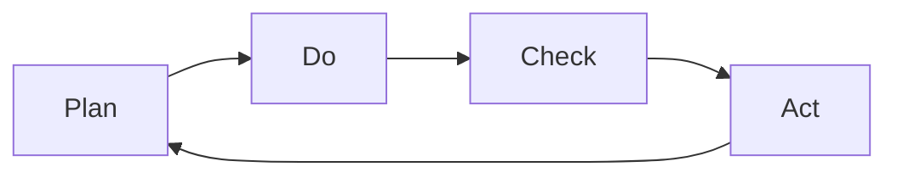

| Fase | Acción | Evidencia | Frecuencia |
| --- | --- | --- | --- |
| Plan | Objetivo, KPI, riesgo y liga | PD-SGC-PDCA-001 | Trimestral y 2026-11-05 |
| Do | Protocolo | Bitácora | Con tráfico |
| Check | PD-CTRL-* | PD-EV-CHECK | Semanal |
| Act | Corrección y versión | PD-EV-ACT | Al hallazgo |

P0 el mismo día. P1 en menos de 24 horas. P2 en la semana. El cambio de versión lo aprueba el CTO.

La pasada 2026-W41 está en [PD-SGC-PDCA-001](PD-SGC-PDCA-001-auditoria-trimestral.md).

## 6. Nomenclatura de evidencias

```text
PD-EV-003_2026-10-05_webhook-meta-validacion.csv
PD-EV-006_2026-10-05_prospectos-sin-lead.csv
PD-EV-009_2026-10-05_rls-advisors.pdf
PD-EV-011_2026-W41_tablero-semanal-funnel.pdf
PD-EV-ACT-08_2026-10-05_sync-secret.md
```

Cada evidencia lleva código, proceso, periodo, responsable, consulta o workflow, esperado, obtenido, hallazgo, acción y, cuando aplica, aprobación del CTO. Los CSV de huérfanos se generan en el SQL Editor y no se suben al repositorio si contienen teléfonos.

## 7. Plantilla trimestral

El formato de `PD-EV-CHECK-Q_AAAA-QQ_auditoria-trimestral.md` está en PD-SGC-PDCA-001, con la pasada de arranque ya llena y la firma del CTO pendiente.

## 8. RACI

| Proceso | R | A | C | I |
| --- | --- | --- | --- | --- |
| PD-P01 | Backend Lead | CTO | Asesores | Dirección |
| PD-P02 | Comercial Lead | Dirección | Backend | Asesores |
| PD-P03 | Backend Lead | CTO | Comercial | Asesores |
| PD-P04 | Comercial Lead | Dirección | Backend | Asesores |
| PD-P05 | Backend Lead | CTO | Comercial | Dirección |
| PD-P06 | Backend Lead | CTO | Comercial | Asesores |
| PD-P07 | Backend y Comercial | CTO | Asesores | Dirección |
| PD-P08 | Backend Lead | CTO | — | Dirección |
| PD-P09 | Backend Lead | CTO | Legal | Dirección |
| PD-P10 | CTO | Dirección | Comercial | Todos |
| PD-P11 | Comercial Lead | Dirección | Backend | Asesores |
| PD-P12 | Backend Lead | CTO | Comercial | Dirección |

## 9. Workflow PD-WF-001

Archivo: `docs/palm-lab-practica/n8n/PD-WF-001_meta-inbound.json`. Inactivo. Sin secretos.

El esqueleto valida la firma y normaliza el teléfono. La búsqueda Postgres está en el archivo y queda deshabilitada hasta asignar la credencial del backend. Los insert usan estas columnas, no las del borrador externo:

| Tabla | Columnas reales |
| --- | --- |
| `prospectos` | `nombre`, `telefono` E.164, `origen`, `ultimo_msg_cliente_at` |
| `leads` | `prospecto_id`, `nombre`, `telefono`. El trigger escribe `telefono_normalizado`. |
| `interacciones` | `lead_id`, `canal`, `direccion = entrante`, `estado = recibido`, `contenido`, `id_externo` |
| `webhook_eventos` | `clave_idempotencia = message_id` |

`timingSafeEqual` compara longitudes antes, para no convertir una firma de otro tamaño en error 500. La firma inválida responde 401.

Importar en n8n, asignar `META_APP_SECRET` y la credencial Postgres, y repetir PD-CTRL-003 con un payload de prueba.

## 10. Bitácora

| Versión | Fecha | Cambio | Autor | Aprobó |
| --- | --- | --- | --- | --- |
| 1.0 | 2026-10-05 | Emisión de códigos y protocolos | Backend Lead | Pendiente |
| 1.1 | 2026-10-05 | PD-CTRL ejecutados, requisitos §6 de PD-P10, PDCA y PD-WF-001 | Backend Lead | Pendiente |

## 11. Regla de oro

Un proceso del SGC tiene código, liga, control, evidencia, indicador y riesgo. La liga declarada permanece abierta. El cambio lleva versión, commit y aprobación del CTO.

Siguiente ciclo: configurar `SYNC_SECRET`, publicar el host de PD-ING-012, y volver a correr PD-CTRL-003, PD-CTRL-007 y PD-CTRL-008. La pauta espera el cierre de PD-P10 §6.1 a §6.6.
