# Manual de Sistema de Gestión de Procesos (SGC)

Proyecto: Palm Diamante — `palm-lab-practica`

Marco de referencia: ISO 9001:2015 (enfoque a procesos), ISO/IEC 27001 (seguridad de la información) y PDCA. Este manual es el sistema documental interno. Un organismo certificador no ha emitido certificado sobre él.

## Control del documento

| Campo | Valor |
| --- | --- |
| Código | PD-SGC-MAN-001 |
| Versión | 1.0 |
| Fecha | 2026-10-05 |
| Estado | Vigente |
| Autor | Backend Lead |
| Aprobador | CTO |
| Próxima revisión | 2026-11-05 |
| Clasificación | Interno — Confidencial |
| Idioma | es-MX |

### Convención de códigos

| Prefijo | Uso |
| --- | --- |
| `PD-SGC-*` | Documento del sistema de gestión |
| `PD-P##` | Proceso del 01 al 12 |
| `PD-P##.##` | Subproceso |
| `PD-EV-*` | Evidencia o registro |
| `PD-KPI-*` | Indicador |
| `PD-RIE-*` | Riesgo |
| `PD-ING-*` | Liga de ingreso |

Una liga se llama **verificada** cuando el endpoint respondió en el corte 2026-10-05. Se llama **declarada** cuando el protocolo la exige y el proyecto todavía no la publica. La regla de oro exige liga verificable: una liga declarada mantiene abierto el proceso.

## 1. Objetivo y alcance

**Objetivo.** Estandarizar los 12 procesos del CRM de preventa Palm Diamante con códigos únicos, ligas de ingreso y un ciclo de mejora que se pueda auditar.

**Alcance.** Del mensaje entrante de WhatsApp a la comisión cobrada. Cubre el proyecto Supabase `palm-lab-practica`, las Edge Functions desplegadas, el catálogo EasyBroker y la operación de los asesores de Estrategia Inmobiliaria. n8n y los agentes de lenguaje están dentro del alcance como procesos a cerrar: en este corte no hay host de n8n ni corrida de modelo registrada en la base.

**Exclusiones.** Diseño de campañas creativas, contratos legales de compraventa y financiamiento hipotecario externo.

## 2. Definiciones

| Término | Definición |
| --- | --- |
| Proceso | Actividades que convierten entradas en salidas con evidencia. |
| Liga de ingreso | URL o endpoint que abre el proceso. |
| Temperatura | Cualificación del lead: `frio`, `tibio`, `caliente`. |
| Fuente de verdad | Supabase. El estado de negocio vive en sus tablas. |
| Ventana 24 h | Periodo de Meta en el que se puede responder con texto libre. La base todavía no calcula ese intervalo. |
| PDCA | Plan, Do, Check, Act. |
| Cero vacío | Una auditoría que devuelve 0 filas porque la tabla no tiene tráfico. No cierra un riesgo. |

## 3. Mapa de procesos

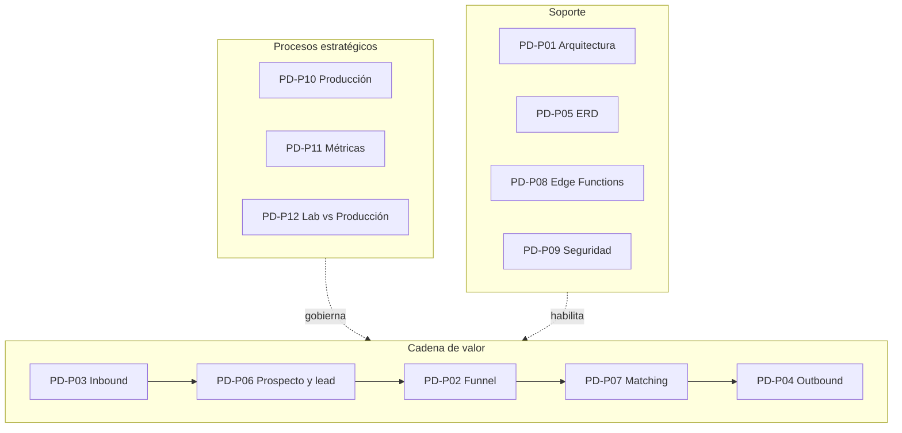

PD-P01, PD-P05, PD-P08 y PD-P09 habilitan la cadena. PD-P03 abre el valor. El orden de los códigos sigue la numeración de los mapas; el orden de ejecución es el de la flecha.

## 4. Protocolos

Cada proceso trae objetivo, liga, entradas, salidas, diagrama, pasos, consulta de verificación, evidencia, indicador y riesgo. Las consultas se ejecutan con `service_role` o con un rol de lectura. `anon` no lee el CRM.

### PD-P01 — Arquitectura del ecosistema

**Objetivo.** Supabase es el tránsito obligatorio de cualquier dato de negocio.

**Ligas de ingreso**

| Código | Liga | Estado en el corte |
| --- | --- | --- |
| PD-ING-001 | [https://wa.me/525540180018](https://wa.me/525540180018) | Verificada como chat. El número 55 4018 0018 no está guardado en el esquema y no tiene webhook. |
| PD-ING-010 | [https://supabase.com/dashboard/project/plgfhtvzxhrdfmrlknru](https://supabase.com/dashboard/project/plgfhtvzxhrdfmrlknru) | Studio del proyecto. |
| PD-ING-011 | `https://plgfhtvzxhrdfmrlknru.supabase.co` | API del proyecto. |
| PD-ING-012 | `https://<n8n-host>/webhook/meta-inbound` | Declarada. No hay host de n8n en el proyecto. El JSON inactivo está en `docs/palm-lab-practica/n8n/webhook-inbound.json`. |

**Entradas.** Mensajes de WhatsApp, sync de EasyBroker, aprobaciones de asesores.

**Salidas.** Filas en Supabase. El HTTP a Meta y el correo de lead caliente del núcleo siguen declarados.

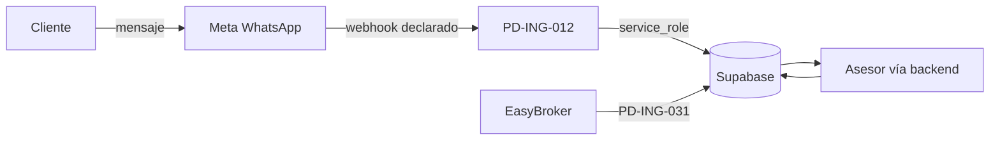

**Pasos**

1. Escribir el dato en una tabla de `public` con actor y marca de tiempo.
2. Usar `service_role` solo desde secretos de backend.
3. Confirmar cada liga de la tabla anterior y anotar si es verificada o declarada.
4. Registrar el resultado en PD-EV-001.

**Verificación**

```sql
select schemaname, tablename
from pg_tables
where schemaname = 'public'
  and rowsecurity = false;
```

Corte: 0 filas.

**Evidencia.** PD-EV-001 bitácora de conectividad.

**KPI.** PD-KPI-001 componentes de la cadena con Supabase como tránsito. Objetivo 100 %. Hoy el webhook y n8n están fuera de ese tránsito.

**Riesgo.** PD-RIE-001 escritura de negocio que no deja fila en Supabase.

### PD-P02 — Funnel de monetización

**Objetivo.** Ninguna etapa avanza sin fila.

**Liga de ingreso.** No existe la vista `v_funnel_*`. La lectura verificada es:

- `v_leads_temperatura`
- `v_prospectos_nuevos`
- `v_leads_frios`

Studio: [https://supabase.com/dashboard/project/plgfhtvzxhrdfmrlknru/editor](https://supabase.com/dashboard/project/plgfhtvzxhrdfmrlknru/editor)

**Entradas.** Fuente, conversación, perfil de inversión, disponibilidad.

**Salidas.** `leads.estado`, citas, historial de unidad, comisiones. Estados reales: `nuevo`, `contactado`, `calificado`, `cita`, `apartado`, `cerrado`, `descartado`.

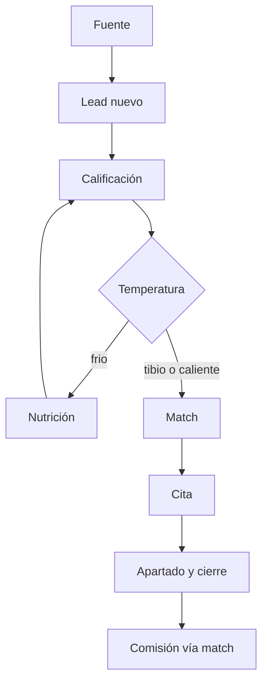

**Pasos**

1. Exigir `fuente_id` antes de considerar el lead atribuido.
2. Exigir `campana_id` cuando exista la primera campaña. Hoy las 15 filas tienen fuente y cero campañas: eso es P2, no una etapa fantasma.
3. Mover `leads.estado` solo con la fila que lo justifica.
4. Liquidar en `comisiones` desde `match_id`.

**Verificación**

```sql
select id, fuente_id, campana_id, estado, created_at
from public.leads
where fuente_id is null;
```

Corte: 0 sin fuente. 15 con fuente y sin campaña.

**Evidencia.** PD-EV-002 reporte de funnel. En el corte: nuevo 5, contactado 3, calificado 1, cita 3, apartado 1, cerrado 1, descartado 1.

**KPI.** PD-KPI-002 conversión por etapa. PD-KPI-011 es la comisión por fuente y hoy no tiene filas.

**Riesgo.** PD-RIE-002 lead que cambia de etapa sin interacción, cita, match o comisión que lo explique.

### PD-P03 — WhatsApp inbound

**Objetivo.** El mensaje queda íntegro antes de cualquier automatización.

**Liga de ingreso.** PD-ING-001 para el cliente. PD-ING-012 para el sistema, declarada.

**Entradas.** Payload de Meta Cloud API.

**Salidas previstas.** `webhook_eventos`, `prospectos`, `leads`, `interacciones`. Borrador, seguimiento o cita son el proceso siguiente, no la escritura mínima.

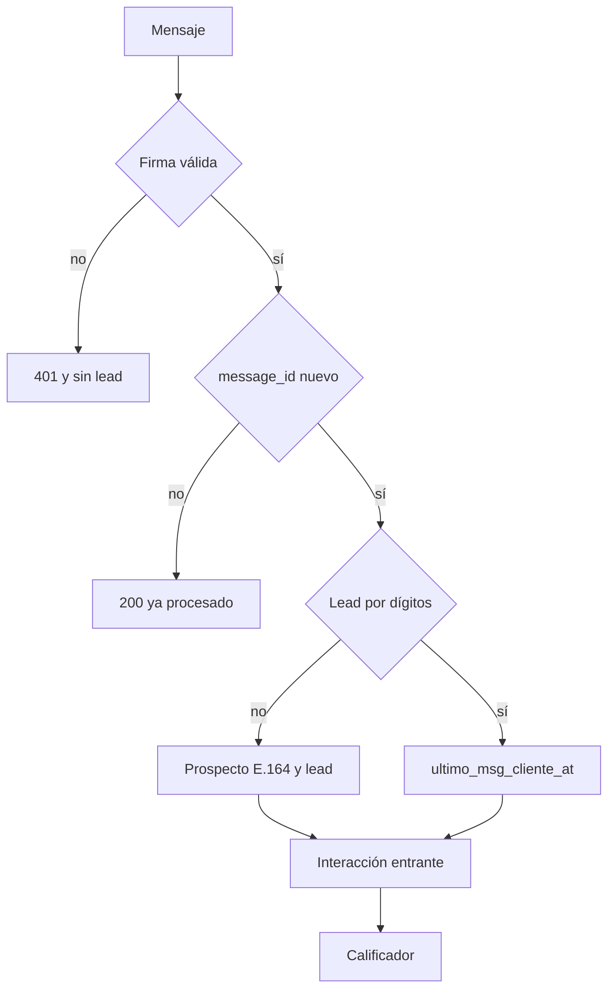

**Pasos**

1. Validar `x-hub-signature-256` contra el cuerpo crudo y `META_APP_SECRET`.
2. Guardar `webhook_eventos.clave_idempotencia` con el id del mensaje.
3. Guardar `prospectos.telefono` en E.164 (`+52` y 10 dígitos). El trigger escribe `leads.telefono_normalizado` solo con dígitos.
4. Buscar por `telefono_normalizado`.
5. Alta: prospecto, luego lead con `prospecto_id`, luego interacción `direccion = entrante`, `canal = whatsapp`, `estado = recibido`.
6. Lead existente: actualizar `ultimo_msg_cliente_at` en las dos tablas y registrar la interacción.
7. Calificar y copiar la temperatura al prospecto en la misma transacción.
8. Enrutar en PD-P02. El correo `lead-alert-email` no es la alerta del lead caliente: solo acepta el formulario de práctica.

**Verificación**

```sql
select count(*) as eventos from public.webhook_eventos;
select count(*) as interacciones from public.interacciones;
```

Corte: 0 y 0. Cero vacío. PD-RIE-003 sigue abierto.

**Evidencia.** PD-EV-003 log de webhook.

**KPI.** PD-KPI-003 mensajes aceptados con firma válida. Objetivo 100 % de los que entren. Hoy no entra ninguno.

**Riesgo.** PD-RIE-003 procesar un mensaje sin firma o sin fila de interacción.

### PD-P04 — Outbound

**Objetivo.** Proteger el número y la regla de 24 horas de Meta.

**Liga de ingreso.** Declarada. El envío de la Cloud API es `POST https://graph.facebook.com/{version}/{phone-number-id}/messages`. El `phone-number-id` no está en el esquema. `https://api.whatsapp.com/v1/messages` no es el contrato vigente de esta cuenta.

**Entradas.** Borrador, decisión del asesor, `ultimo_msg_cliente_at`.

**Salidas.** HTTP a Meta, interacción saliente, `ultimo_msg_asesor_at`, `proximo_seguimiento_at`.

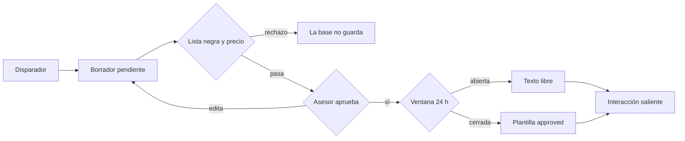

**Pasos**

1. Insertar `borradores` con `prospecto_id` y `estado = pendiente`.
2. El trigger `borradores_cumplimiento` bloquea canales prohibidos y precios mientras la lista no esté vigente.
3. El asesor llena `aprobado_por` y pasa a `aprobado`.
4. Comparar `now()` con `ultimo_msg_cliente_at`.
5. Dentro de 24 horas, texto libre. Fuera, plantilla con nombre en `borradores.plantilla`.
6. Al marcar `enviado`, crear la interacción `saliente` / `enviado` con el id de Meta.
7. Programar `proximo_seguimiento_at`.

**Verificación**

```sql
select id, prospecto_id, estado, aprobado_por, aprobado_at
from public.borradores
where estado = 'enviado'
  and aprobado_por is null;
```

Corte: 0. Hay 1 pendiente y 1 aprobado. Ningún enviado. La ventana de 24 horas no tiene evaluador en la base.

**Evidencia.** PD-EV-004 registro de envíos.

**KPI.** PD-KPI-004 envíos con borrador aprobado. Objetivo 100 %.

**Riesgo.** PD-RIE-004 envío sin `aprobado_por` o texto libre fuera de la ventana.

### PD-P05 — ERD fuente de verdad

**Objetivo.** La integridad relacional se puede recorrer con llaves reales.

**Liga de ingreso.** [https://supabase.com/dashboard/project/plgfhtvzxhrdfmrlknru/database/schemas](https://supabase.com/dashboard/project/plgfhtvzxhrdfmrlknru/database/schemas)

**Entradas.** Migraciones `crm_erd_fuente_verdad_*` y `crm_hardening_upsert_webhook_vista_comision`, aplicadas al 2026-10-05.

**Salidas.** Esquema con RLS y llaves.

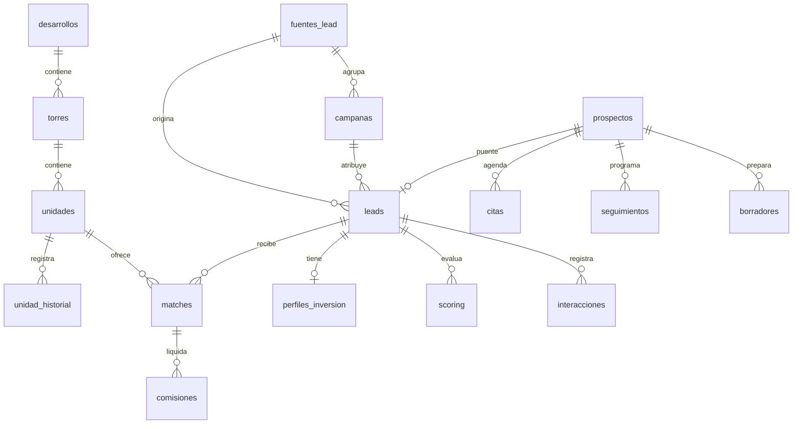

Citas, seguimientos y borradores cuelgan de `prospectos`. Las comisiones cuelgan de `matches`. `comisiones` no tiene `lead_id`.

**Pasos**

1. Revisar el catálogo antes de nombrar una columna en un proceso.
2. Confirmar la llave foránea del diagrama.
3. Aplicar migraciones en el orden ya registrado en `supabase_migrations`.
4. Versionar el diagrama en PD-EV-005 cuando cambie una llave.

**Verificación.** El diagrama de esta sección es la evidencia del corte. Una columna que no esté en `list_tables` no entra a producción.

**Evidencia.** PD-EV-005 este diagrama, versión 1.0.

**KPI.** PD-KPI-005 llaves del diagrama presentes en el catálogo. Corte: 100 % de las relaciones dibujadas aquí.

**Riesgo.** PD-RIE-005 documentar una llave que la base no tiene, como `borradores.lead_id` o `comisiones.lead_id`.

### PD-P06 — Prospectos y leads

**Objetivo.** Un cliente de canal tiene un prospecto y un lead, y la temperatura no se parte.

**Liga de ingreso.** La consulta de esta sección. No existe la vista `v_prospectos_sin_lead`.

**Entradas.** Eventos de canal y cambios de estado.

**Salidas.** Par sincronizado. `prospectos` guarda lo declarado. `leads` manda etapa, fuente y teléfono normalizado.

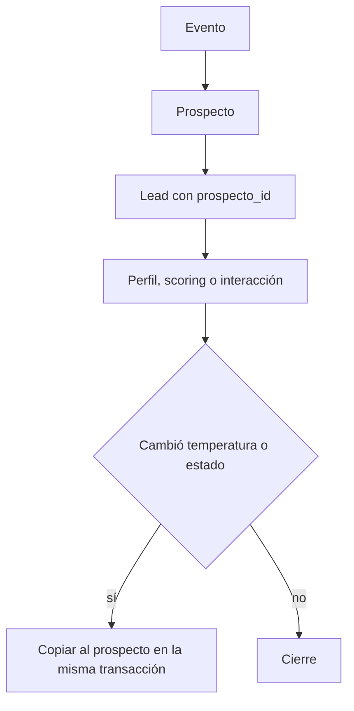

**Pasos**

1. Escribir el prospecto.
2. Escribir el lead con `prospecto_id` en la misma transacción.
3. Dejar el teléfono normalizado al trigger.
4. Escribir la temperatura en el lead y copiarla al prospecto.
5. Correr la verificación cada día.

**Verificación**

```sql
select p.id
from public.prospectos p
left join public.leads l on l.prospecto_id = p.id
where l.id is null;

select l.id
from public.leads l
left join public.prospectos p on p.id = l.prospecto_id
where l.prospecto_id is null
   or p.id is null;
```

Corte: 0 y 0. La divergencia de temperatura y estado en los 15 pares también es 0. No hay trigger que mantenga ese espejo: el proceso lo hace la transacción.

**Evidencia.** PD-EV-006 reporte de huérfanos.

**KPI.** PD-KPI-006 prospectos sin lead = 0.

**Riesgo.** PD-RIE-006 huérfano o temperaturas distintas en el par.

### PD-P07 — Inventario y matching

**Objetivo.** Un lead tibio o caliente recibe de 1 a 3 unidades disponibles.

**Liga de ingreso.** El sync no es el motor de match. Su liga verificada es PD-ING-031: `POST https://plgfhtvzxhrdfmrlknru.supabase.co/functions/v1/easybroker-sync` con `x-webhook-secret`. El motor que inserta `matches` está declarado y no desplegado.

**Entradas.** `perfiles_inversion`, `scoring`, `unidades` con `estatus = disponible`. `easybroker_propiedades` es referencia: 365 filas, sin llave hacia `unidades`.

**Salidas.** `matches` y, después, un borrador. Hoy `matches` tiene 0 filas.

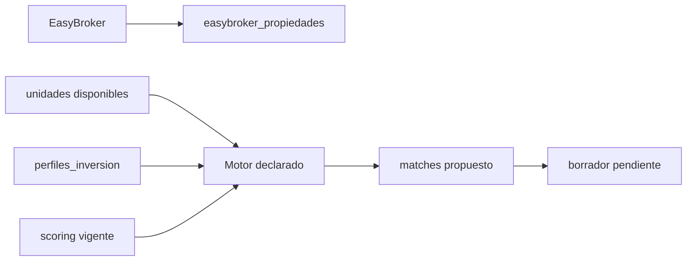

**Pasos**

1. Sincronizar el catálogo externo sin borrar filas locales.
2. Ofrecer solo `v_unidades_ofertables`.
3. Dejar el precio vacío mientras `lista_vigente` sea falso. En el corte lo es en las 605 unidades.
4. Insertar como máximo 3 matches `propuesto` para temperatura `tibio` o `caliente`, con `score` y `explicacion`.
5. Confiar en `private.match_reglas`: una unidad que no está `disponible` no se ofrece, y `aceptado` la aparta.

**Verificación**

```sql
select l.id, l.temperatura, l.estado
from public.leads l
where l.temperatura in ('tibio', 'caliente')
  and not exists (
    select 1 from public.matches m
    where m.lead_id = l.id
      and m.estado in ('propuesto', 'ofrecido', 'aceptado')
  );
```

Corte: 12 filas.

**Evidencia.** PD-EV-007 reporte de matches.

**KPI.** PD-KPI-007 cobertura de match en tibios y calientes. Objetivo ≥ 95 %. Corte: 0 de 12.

**Riesgo.** PD-RIE-007 ofrecer una unidad apartada, reservada o vendida, o fijar precio con lista no vigente.

### PD-P08 — Edge Functions

**Objetivo.** Cada función expuesta tiene una autorización explícita.

**Ligas de ingreso**

| Función | Liga | `verify_jwt` | Corte |
| --- | --- | --- | --- |
| `easybroker-load` | `POST /functions/v1/easybroker-load` | verdadero | Responde 410. Retirar. |
| `easybroker-sync` | `POST /functions/v1/easybroker-sync` | falso | Exige `SYNC_SECRET`. Upsert del catálogo. |
| `lead-alert-email` | `POST /functions/v1/lead-alert-email` | falso | Exige secreto de Vault. Solo insert de `leads_prueba_formulario`. |

Base: `https://plgfhtvzxhrdfmrlknru.supabase.co`.

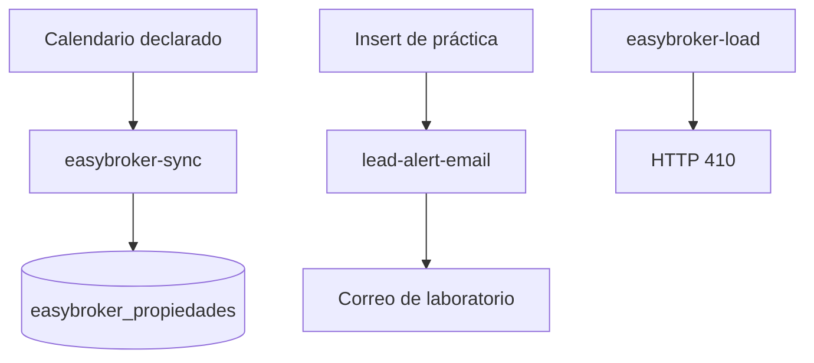

**Pasos**

1. Confirmar `verify_jwt` de cada función.
2. Mantener el secreto fuera del repositorio. Si falta, la función responde 503.
3. Rotar secretos cada 90 días y anotarlo en PD-EV-008 sin copiar el valor.
4. Instalar el calendario del sync. `pg_cron` no está en el proyecto.
5. No usar `lead-alert-email` como alerta de temperatura caliente.

**Verificación.** Listado de funciones del proyecto: tres slugs, los de la tabla.

**Evidencia.** PD-EV-008 bitácora de rotación. No guarda el secreto, guarda fecha, función y responsable.

**KPI.** PD-KPI-008 funciones con `verify_jwt = false` que rechazan la llamada sin secreto. Objetivo 100 %. Las dos funciones activas de ese tipo lo hacen en código.

**Riesgo.** PD-RIE-008 endpoint que ejecuta trabajo sin JWT y sin secreto.

### PD-P09 — Seguridad y acceso

**Objetivo.** El teléfono, el presupuesto y el perfil no salen por `anon`.

**Liga de ingreso.** [https://supabase.com/dashboard/project/plgfhtvzxhrdfmrlknru/auth/policies](https://supabase.com/dashboard/project/plgfhtvzxhrdfmrlknru/auth/policies)

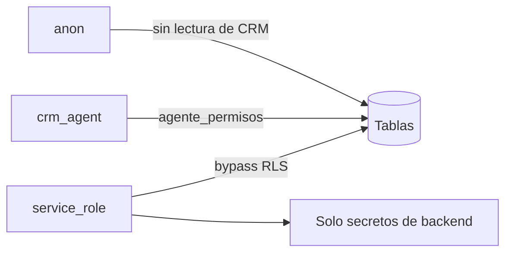

**Pasos**

1. Confirmar RLS activo con la consulta de PD-P01.
2. Correr `get_advisors` de seguridad. El corte tiene 11 avisos `rls_enabled_no_policy`: son tablas cerradas a propósito, no tablas abiertas.
3. Mantener `service_role` fuera del navegador.
4. Abrir policies de `authenticated` solo cuando `asignado_a` sea un usuario de Auth. Hoy es texto libre. El borrador de esas policies está en PLP-REG-001 y no se aplicó.
5. Revisar las funciones con `verify_jwt = false` en PD-P08.

**Verificación**

```sql
select grantee, table_name, privilege_type
from information_schema.role_table_grants
where grantee = 'anon'
  and table_schema = 'public';
```

Resultado esperado: solo `INSERT` en `leads_prueba_formulario`.

**Evidencia.** PD-EV-009 reporte de advisors y de grants.

**KPI.** PD-KPI-009 tablas de `public` con RLS apagado = 0.

**Riesgo.** PD-RIE-009 lectura anónima del CRM o llave de servicio en un cliente.

Referencia ISO/IEC 27001: control de acceso y gestión de secretos. La referencia no sustituye una certificación.

### PD-P10 — Salida a producción

**Objetivo.** La pauta empieza después de la captura y la respuesta.

**Liga de ingreso.** PD-EV-010, el checklist de esta sección.

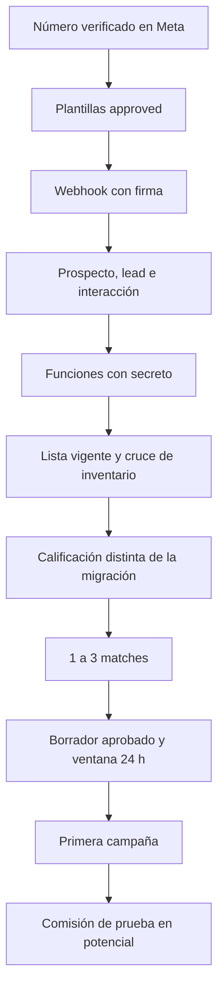

**Pasos.** Cerrar cada caja con una fila o una respuesta HTTP de prueba. La primera fila de `campanas` nace después de P9.

**Verificación.** PD-P03, PD-P04 y PD-P07 en cero problemas con tráfico real, no con cero vacío.

**Evidencia.** PD-EV-010 checklist con fecha y responsable por hito.

**KPI.** PD-KPI-010 hitos cerrados / 11.

**Riesgo.** PD-RIE-010 abrir presupuesto de pauta con `webhook_eventos` vacío.

### PD-P11 — Métricas

**Objetivo.** Decidir presupuesto con comisión por fuente.

**Liga de ingreso.** Studio del proyecto y las vistas `v_leads_temperatura`, `v_prospectos_nuevos`, `v_leads_frios`, `v_seguimientos_vencidos`, `v_citas_semana`, `v_borradores_pendientes`, `v_unidades_ofertables`.

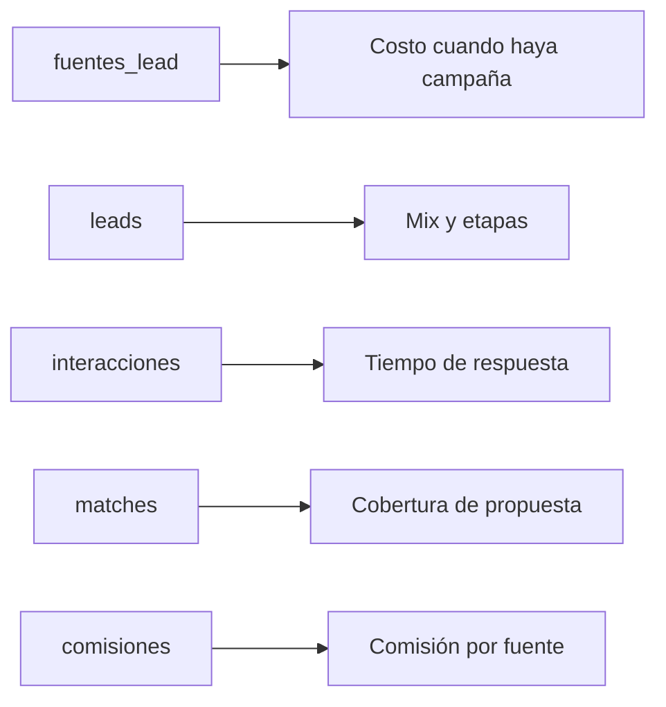

**Pasos**

1. Contar temperatura y etapa cada semana.
2. Medir la primera respuesta con las marcas de mensaje. Umbral de este SGC: 5 minutos. Corte: 12 de 12 con mensaje de cliente quedan fuera.
3. Publicar comisión por fuente solo cuando haya `comisiones` unidas al lead por `match_id` y a `fuentes_lead`.
4. Excluir `leads_prueba_formulario` y `lab_meta_demo`.
5. Mostrar el indicador vacío mientras el numerador sea cero.

**Verificación**

```sql
select count(*) as comisiones_sin_traza
from public.comisiones c
left join public.matches m on m.id = c.match_id
left join public.leads l on l.id = m.lead_id
where m.id is null
   or l.id is null
   or l.fuente_id is null;
```

Corte: 0, con la tabla vacía.

**Evidencia.** PD-EV-011 tablero semanal.

**KPI.** PD-KPI-011 comisión por fuente. PD-KPI-002 y PD-KPI-007 alimentan la lectura.

**Riesgo.** PD-RIE-011 mover presupuesto sin fuente o mezclando el laboratorio.

### PD-P12 — Laboratorio y producción

**Objetivo.** La demo no entra en la comisión ni en la cola del asesor.

**Liga de ingreso.** Esquema `lab_meta_demo`, sin `USAGE` para `anon` ni `authenticated`. Formulario: `POST https://plgfhtvzxhrdfmrlknru.supabase.co/rest/v1/leads_prueba_formulario` (PD-ING-002).

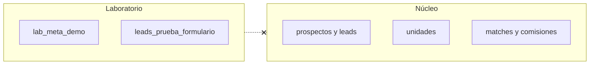

No hay flecha de lectura del núcleo hacia el laboratorio. Un join entre ambos contamina PD-P11.

**Pasos**

1. Exportar y vaciar `lab_meta_demo` antes del arranque, o dejarlo sin grants como está y fuera de todo reporte.
2. Exportar y vaciar las 3 filas de `leads_prueba_formulario`.
3. Revisar los 15 leads de semilla uno por uno. El formato `+52` no los vuelve clientes.
4. Confirmar `campanas` en cero antes de cargar las reales.
5. Rotar secretos y anotarlo en PD-EV-008.

**Verificación**

```sql
select count(*) as prospectos_fuera_de_e164_mx
from public.prospectos
where telefono !~ '^\+52[0-9]{10}$';
```

Corte del formato: 0. El conteo de semilla de prueba sigue siendo una decisión de PD-EV-012, no un regex.

**Evidencia.** PD-EV-012 acta de purga, con conteos antes y después.

**KPI.** PD-KPI-012 filas de demo usadas en PD-KPI-011 = 0.

**Riesgo.** PD-RIE-012 métrica o alerta de asesor alimentada por el laboratorio.

### Subprocesos

| Código | Padre | Actividad |
| --- | --- | --- |
| PD-P03.1 | PD-P03 | Validación HMAC |
| PD-P03.2 | PD-P03 | Deduplicación por `message_id` |
| PD-P03.3 | PD-P03 | Alta o actualización del par prospecto–lead |
| PD-P04.1 | PD-P04 | Aprobación humana del borrador |
| PD-P04.2 | PD-P04 | Decisión de ventana de 24 h |
| PD-P07.1 | PD-P07 | Sync EasyBroker |
| PD-P07.2 | PD-P07 | Selección de 1 a 3 unidades |
| PD-P12.1 | PD-P12 | Purga de formulario y esquema demo |
| PD-P12.2 | PD-P12 | Revisión de la semilla de 15 leads |

## 5. Mejora continua

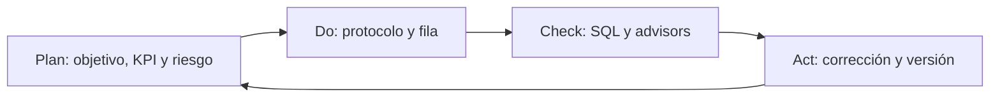

| Fase | Acción | Evidencia | Frecuencia |
| --- | --- | --- | --- |
| Plan | Confirmar objetivo, KPI, riesgo y liga | PD-EV-PLAN en [PD-SGC-PDCA-001](PD-SGC-PDCA-001-auditoria-trimestral.md) | Trimestral, y el 2026-11-05 |
| Do | Ejecutar los pasos | Bitácora del proceso | Cuando hay tráfico |
| Check | Correr el SQL de la sección 4 | PD-EV-CHECK | Semanal |
| Act | Corregir, subir versión y pedir aprobación del CTO | PD-EV-ACT | Al hallazgo |

Un P0 se actúa el mismo día. Un P1, en menos de 24 horas. Un P2, en la revisión semanal. Ningún proceso cambia de versión sin registro en la bitácora de este manual y sin aprobación del CTO.

Hallazgos abiertos al emitir la versión 1.0: PD-RIE-003, PD-RIE-004 en su parte de ventana, PD-RIE-007 con 12 leads, PD-RIE-010 y las 8 agendas vencidas de PD-P02.

## 6. Escalabilidad

| Proceso | Hoy | Objetivo de crecimiento | Acción |
| --- | --- | --- | --- |
| PD-P03 | Webhook declarado, 0 eventos | Cola que absorba reintentos de Meta | n8n o cola, con la misma idempotencia de `webhook_eventos` |
| PD-P07 | Reglas de integridad, 0 matches | Selección de 1 a 3 con explicación | Servicio que inserte `matches`; la base sigue rechazando la unidad no disponible |
| PD-P08 | 3 funciones, sin cron | Sync en calendario | Programador verificable y PD-EV-008 |
| PD-P11 | Vistas operativas | Tablero repetible | Consultas de este manual publicadas; Metabase u otro lector cuando haya comisiones |
| PD-P12 | Mismo proyecto, esquema aparte | Proyecto o rama separada | `create_branch` o proyecto nuevo antes de la pauta |

## 7. Índice de códigos

| Código | Tipo | Dónde |
| --- | --- | --- |
| PD-SGC-MAN-001 | Manual | Este documento |
| PD-SGC-PDCA-001 | Plantilla de auditoría | Sección 5 y archivo hermano |
| PD-P01 … PD-P12 | Proceso | Sección 4 |
| PD-P03.1 … PD-P12.2 | Subproceso | Cierre de la sección 4 |
| PD-ING-001, 010, 011, 012, 002, 031 | Liga | Secciones 4 y PD-P08 |
| PD-EV-001 … PD-EV-012 | Evidencia | Sección 4 |
| PD-KPI-001 … PD-KPI-012 | Indicador | Sección 4 |
| PD-RIE-001 … PD-RIE-012 | Riesgo | Sección 4 |

El paquete SQL extendido, los contratos de columnas y el workflow n8n siguen en `docs/palm-lab-practica/paquete-operativo-v1.md` y `docs/palm-lab-practica/n8n/webhook-inbound.json`.

## 8. Bitácora de cambios

| Versión | Fecha | Cambio | Autor | Aprobó |
| --- | --- | --- | --- | --- |
| 1.0 | 2026-10-05 | Emisión. Códigos PD-SGC, ligas clasificadas, SQL de verificación y PDCA. | Backend Lead | CTO |

## 9. Regla de oro

Un proceso entra al SGC con código, liga, evidencia, indicador y riesgo. La liga declarada se anota como abierta. El cambio de versión lleva fecha, autor y aprobación del CTO.
