# PLP-MAN-001 Manual de procesos

| Campo | Valor |
| --- | --- |
| Código | PLP-MAN-001 |
| Revisión | 01 |
| Fecha | 2026-10-05 |
| Proceso | Sistema de preventa Palm Diamante en `palm-lab-practica` |
| Estado del documento | Vigente para el laboratorio |
| Dueño del documento | Backend Lead |
| Aprobador | CTO |

Estos códigos ordenan el trabajo. Son control documental interno, alineado a la forma de una norma ISO 9001:2015. Un organismo certificador todavía no ha emitido un certificado sobre este sistema. La columna «Cláusula de referencia» dice qué requisito de la norma cubre cada proceso cuando el sistema se audite.

El detalle de columnas, reglas y la primera pasada de auditoría está en `docs/palm-lab-practica/paquete-operativo-v1.md` (código PLP-REG-001).

## 1. Liga de ingreso

Hay una sola puerta de cliente prevista para la preventa y dos puertas técnicas ya desplegadas. La puerta de cliente todavía no escribe en el CRM.

| Código | Quién entra | Liga | Qué hace hoy |
| --- | --- | --- | --- |
| PLP-ING-001 | Cliente | [https://wa.me/525540180018](https://wa.me/525540180018) | Número declarado 55 4018 0018. Abre el chat de WhatsApp. Meta todavía no tiene, en esta base, un webhook que reciba ese mensaje. |
| PLP-ING-002 | Formulario de práctica | `POST https://plgfhtvzxhrdfmrlknru.supabase.co/rest/v1/leads_prueba_formulario` | Alta anónima en la tabla de laboratorio. No crea `prospectos` ni `leads`. |
| PLP-ING-003 | Catálogo EasyBroker | `POST https://plgfhtvzxhrdfmrlknru.supabase.co/functions/v1/easybroker-sync` | Exige cabecera `x-webhook-secret`. Actualiza `easybroker_propiedades`. |
| PLP-ING-004 | Alerta de formulario | `POST https://plgfhtvzxhrdfmrlknru.supabase.co/functions/v1/lead-alert-email` | La dispara el insert de PLP-ING-002. Rechaza cualquier otro cuerpo. |
| PLP-ING-005 | Carga histórica EasyBroker | `https://plgfhtvzxhrdfmrlknru.supabase.co/functions/v1/easybroker-load` | Responde 410. Fuera de uso. |
| PLP-ING-006 | Asesor | Pendiente | No hay URL de panel. El asesor entra hoy por SQL o por el backend con `service_role`. |

Protocolo de ingreso del cliente, cuando PLP-PRO-003 esté cerrado:

1. El cliente abre PLP-ING-001.
2. Meta entrega el mensaje al webhook del proyecto.
3. El sistema valida la firma, guarda `webhook_eventos` y deduplica por `message_id`.
4. Crea o actualiza `prospectos` y `leads`.
5. A partir de ahí manda el protocolo PLP-PRO-002.

PLP-ING-002 no es ingreso comercial. Quien llegue por el formulario de práctica no entra al funnel.

## 2. Lista maestra

| Código | Nombre | Mapa | Cláusula de referencia | Dueño |
| --- | --- | --- | --- | --- |
| PLP-MAN-001 | Este manual | — | ISO 9001:2015, 4.4 y 7.5 | Backend Lead |
| PLP-PRO-001 | Arquitectura y tránsito por Supabase | 01 | 4.4, 7.5 | Backend Lead |
| PLP-PRO-002 | Funnel de monetización | 02 | 8.1, 8.2 | Comercial Lead |
| PLP-PRO-003 | Ingreso WhatsApp | 03 | 8.2, 8.5 | Backend Lead |
| PLP-PRO-004 | Salida de mensajes | 04 | 8.5, 8.6 | Comercial Lead |
| PLP-PRO-005 | Modelo de datos | 05 | 7.5 | Backend Lead |
| PLP-PRO-006 | Prospecto y lead | 06 | 8.5 | Backend Lead |
| PLP-PRO-007 | Inventario y matching | 07 | 8.5, 8.6 | Backend Lead y Comercial |
| PLP-PRO-008 | Funciones de borde | 08 | 8.1, 8.5 | Backend Lead |
| PLP-PRO-009 | Seguridad y acceso | 09 | 7.5; referencia ISO/IEC 27001 A.5 y A.8 | Backend Lead |
| PLP-PRO-010 | Salida a producción | 10 | 8.1, 6.1 | CTO |
| PLP-PRO-011 | Métricas | 11 | 9.1 | Comercial Lead |
| PLP-PRO-012 | Laboratorio y producción | 12 | 7.5, 8.7 | Backend Lead |
| PLP-PRO-013 | Mejora continua | Transversal | 9.1, 10.2, 10.3 | CTO |
| PLP-REG-001 | Paquete de auditoría y contratos | — | 7.5, 9.1 | Backend Lead |

Revisión de un código: se sube el número de revisión en este manual y se anota en el historial del apartado 5. El código no se recicla.

## 3. Cómo se recorre el sistema

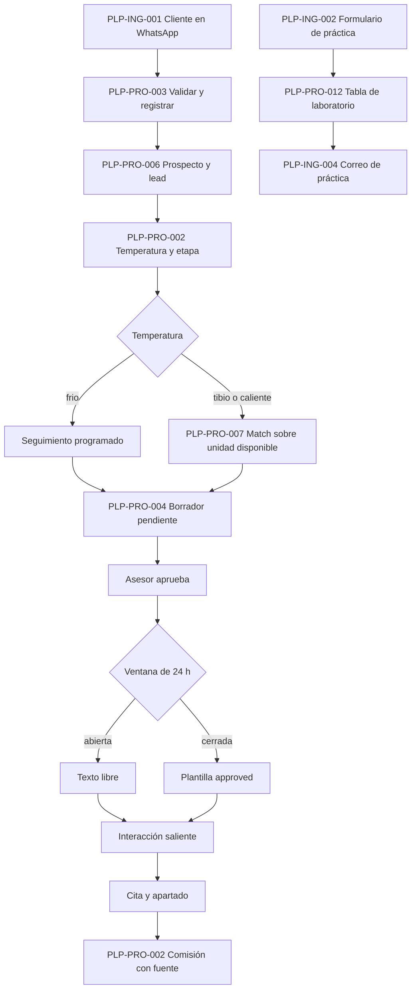

Supabase es el único cuaderno. Cada paso deja una fila. El paso siguiente lee esa fila. PLP-PRO-001 y PLP-PRO-009 aplican a todos los pasos. PLP-PRO-013 revisa el resultado con el SQL de PLP-REG-001.

## 4. Protocolos

### PLP-PRO-001 Arquitectura

Cláusula 4.4. Dueño: Backend Lead.

1. Identificar el dato de negocio: mensaje, inventario, match, cita, borrador o comisión.
2. Escribirlo en una tabla de `public` con su actor y su marca de tiempo.
3. Si quien escribe es un agente, asumir el agente con `asumir_agente` y dejar que `agente_permisos` acepte o rechace.
4. Si quien escribe es el backend, usar `service_role` desde un secreto.
5. Leer el estado del siguiente paso en la misma base.

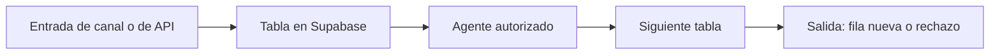

Salida: una fila o una excepción. No hay paso válido que viva solo en n8n o en el chat del asesor.

### PLP-PRO-002 Funnel

Cláusula 8.2. Dueño: Comercial Lead.

1. Atribuir el lead a una fila de `fuentes_lead`.
2. Cuando exista la campaña, llenar `campana_id` y su presupuesto.
3. Avanzar `leads.estado` solo con evidencia: `nuevo`, `contactado`, `calificado`, `cita`, `apartado`, `cerrado` o `descartado`.
4. Guardar presupuesto y objetivo en `perfiles_inversion`.
5. Clasificar con `clasificar_lead`: clase A, B o C a partir de presupuesto, temperatura y forma de pago.
6. Si la temperatura es `frio`, programar `proximo_seguimiento_at` y un seguimiento.
7. Si es `tibio` o `caliente`, pedir match en PLP-PRO-007.
8. Al cerrar la venta, crear la comisión desde el match. `pagada` solo con unidad `vendido`.

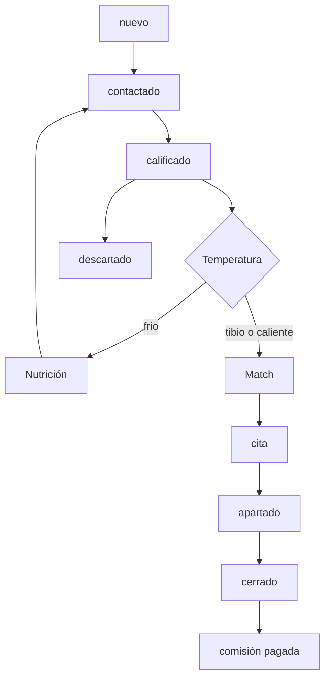

### PLP-PRO-003 Ingreso WhatsApp

Cláusula 8.5. Dueño: Backend Lead. Liga: PLP-ING-001.

1. Recibir el cuerpo crudo de Meta.
2. Comparar `x-hub-signature-256` con el HMAC del secreto de la app. Si falla, responder 401 y no crear lead.
3. Insertar `webhook_eventos` con `clave_idempotencia` igual al id del mensaje.
4. Si la clave ya existe, responder 200 y terminar.
5. Normalizar el teléfono a dígitos. Guardar E.164 en `prospectos.telefono`.
6. Buscar `leads.telefono_normalizado`.
7. Si no existe, insertar prospecto, lead con `prospecto_id` e interacción `entrante` / `recibido`.
8. Si existe, actualizar `ultimo_msg_cliente_at` en las dos tablas e insertar la interacción.
9. Pasar el texto al calificador y seguir en PLP-PRO-006.

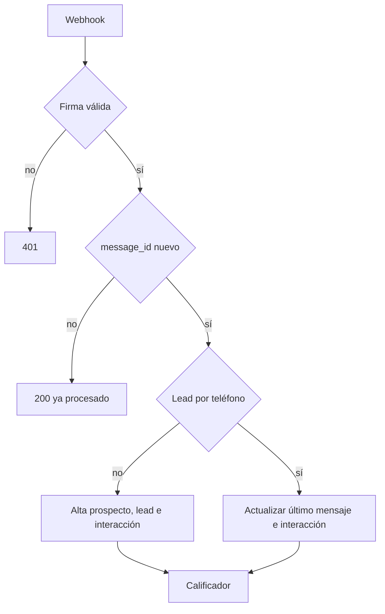

Hoy este protocolo está especificado. `webhook_eventos` e `interacciones` están en cero.

### PLP-PRO-004 Salida de mensajes

Cláusula 8.6. Dueño: Comercial Lead.

1. Crear `borradores` en `pendiente`, ligado al `prospecto_id`.
2. Dejar que el trigger rechace lista negra y cualquier precio mientras `lista_precios_vigente()` sea falso.
3. El asesor escribe `aprobado_por` y pasa el estado a `aprobado`.
4. Medir `now()` contra `ultimo_msg_cliente_at`.
5. Si la diferencia es menor a 24 horas, enviar el texto libre.
6. Si es mayor, enviar solo una plantilla de PLP-REG-001 apartado 4 con estado `approved` en Meta, y guardar su nombre en `borradores.plantilla`.
7. Pasar el borrador a `enviado` y crear la interacción `saliente` / `enviado` con el id que devuelve Meta.
8. Actualizar `ultimo_msg_asesor_at` y `proximo_seguimiento_at`.

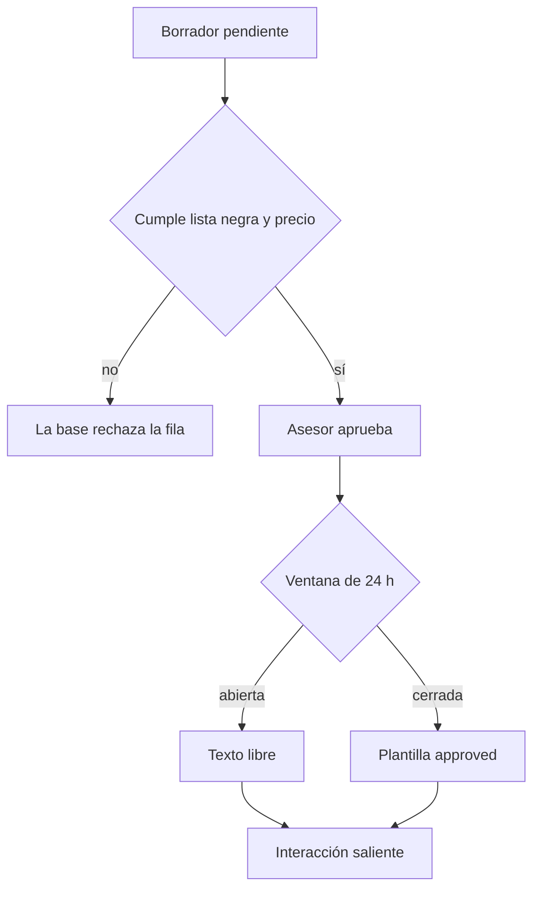

### PLP-PRO-005 Modelo de datos

Cláusula 7.5. Dueño: Backend Lead.

1. Dar de alta el desarrollo, la torre y la unidad antes de ofrecerla.
2. Registrar la fuente antes del lead de esa fuente.
3. Colgar perfil, scoring, matches e interacciones del `lead_id`.
4. Colgar borradores, citas y seguimientos del `prospecto_id`.
5. Escribir el historial de la unidad solo por el trigger. Nadie edita `unidad_historial` a mano.
6. Liquidar en `comisiones` a partir de `match_id`.

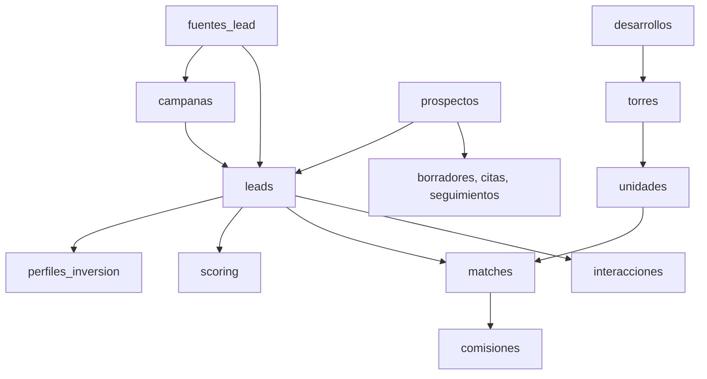

### PLP-PRO-006 Prospecto y lead

Cláusula 8.5. Dueño: Backend Lead.

1. Escribir primero el prospecto con lo que el cliente dijo.
2. Escribir el lead en la misma transacción, con `prospecto_id` y la fuente.
3. Dejar que el trigger calcule `telefono_normalizado`.
4. Escribir la temperatura en el lead.
5. Copiar temperatura, estado y `ultimo_msg_cliente_at` al prospecto antes de cerrar la transacción.
6. Revisar con las consultas 1.1 y 1.2 de PLP-REG-001. El resultado de producción es cero huérfanos.

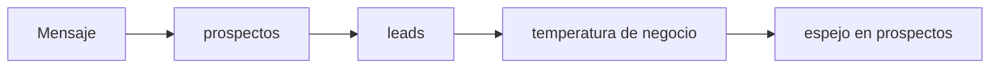

### PLP-PRO-007 Inventario y matching

Cláusula 8.5 y 8.6. Dueños: Backend Lead y Comercial.

1. Confirmar `lista_vigente` solo cuando la lista oficial pueda usarse con clientes.
2. Ofrecer únicamente filas de `v_unidades_ofertables`.
3. Tomar leads `tibio` o `caliente` con perfil de inversión.
4. Insertar de 1 a 3 matches `propuesto`, con `score` y `explicacion`.
5. Dejar `precio_ofrecido` vacío mientras la unidad no esté vigente.
6. Al aceptar, la base aparta la unidad.
7. Traducir el match aceptado en un borrador `pendiente` para PLP-PRO-004.

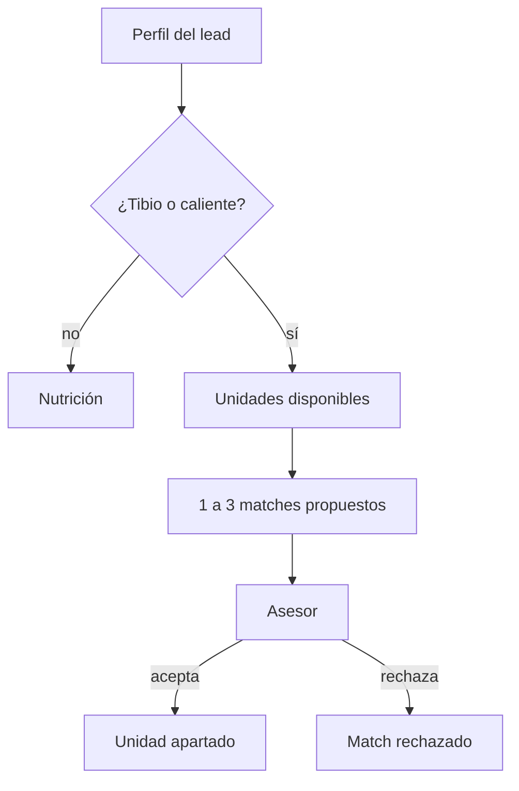

Hoy hay 204 disponibles, vigencia apagada en las 605 y 0 matches. El protocolo está escrito y el paso 4 no corre.

### PLP-PRO-008 Funciones de borde

Cláusula 8.1. Dueño: Backend Lead.

1. Publicar una función con JWT de plataforma, o con `verify_jwt = false` y secreto propio.
2. Si falta el secreto, responder 503 y no tocar datos.
3. `easybroker-sync` solo lee EasyBroker y hace upsert por `public_id`.
4. `lead-alert-email` solo corre tras un insert de `leads_prueba_formulario`.
5. Retirar `easybroker-load`, que ya responde 410.
6. Programar el sync en un calendario verificable. `pg_cron` no está instalado.

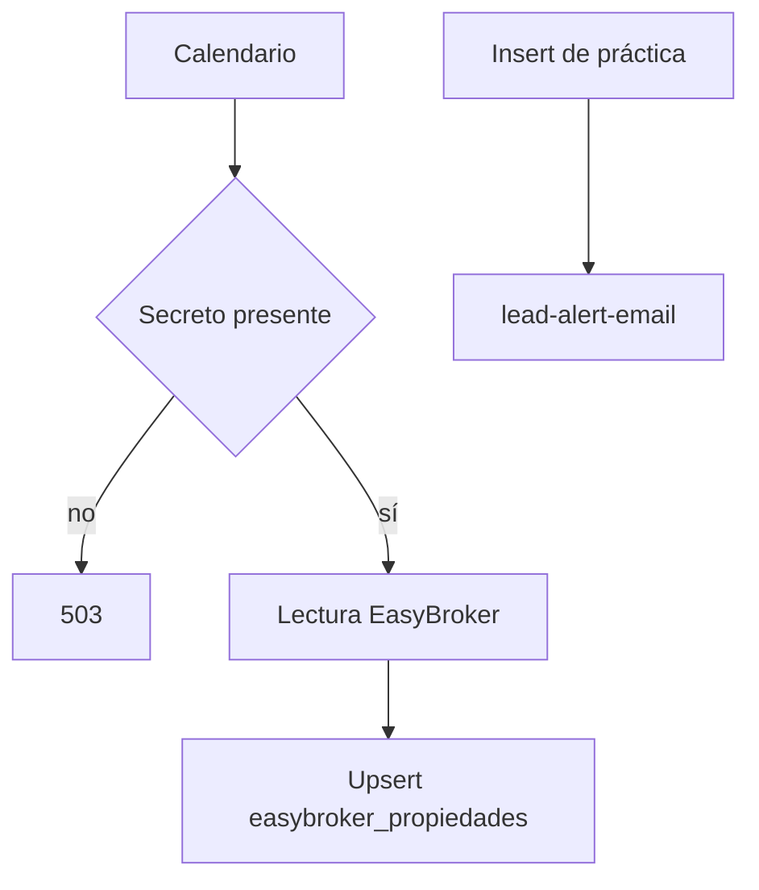

### PLP-PRO-009 Seguridad

Cláusula 7.5, con referencia a controles de acceso de ISO/IEC 27001. Dueño: Backend Lead.

1. Mantener RLS activo en todas las tablas de `public`.
2. Dejar a `anon` sin lectura del CRM.
3. Reservar `service_role` al backend.
4. Dar a cada agente solo las celdas de `agente_permisos` que su trabajo necesita.
5. Abrir el panel de asesores después de cambiar `asignado_a` a un identificador de `auth.users`.
6. Antes de esa policy, revocar los grants de `authenticated` sobre las vistas que muestran teléfono.

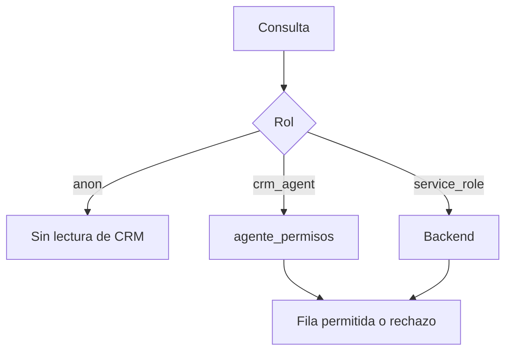

### PLP-PRO-010 Salida a producción

Cláusula 6.1 y 8.1. Dueño: CTO.

1. Verificar el número en Meta y guardar esa evidencia.
2. Aprobar las tres plantillas.
3. Cerrar PLP-PRO-003 con un mensaje de prueba que deje webhook e interacción.
4. Cerrar PLP-PRO-004 con un envío aprobado y la ventana de 24 horas evaluada.
5. Confirmar la lista de precios y el cruce de inventario.
6. Calificar con un modelo distinto de `migracion-prospectos`.
7. Generar de 1 a 3 matches de prueba sobre unidades disponibles.
8. Recién entonces crear la primera fila de `campanas`.

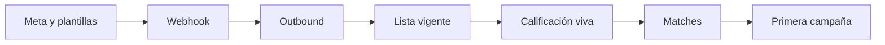

### PLP-PRO-011 Métricas

Cláusula 9.1. Dueño: Comercial Lead.

1. Contar temperatura y etapa sobre `leads`.
2. Medir la primera respuesta con las marcas de mensaje y, cuando existan, con `interacciones`.
3. Publicar comisión por fuente solo con `comisiones` unidas a `fuentes_lead` por el match.
4. Declarar en el tablero la ventana de fechas y si la cifra es `pagada` o también `devengada`.
5. Excluir `leads_prueba_formulario` y `lab_meta_demo`.
6. Mientras no haya comisiones, mostrar el indicador vacío.

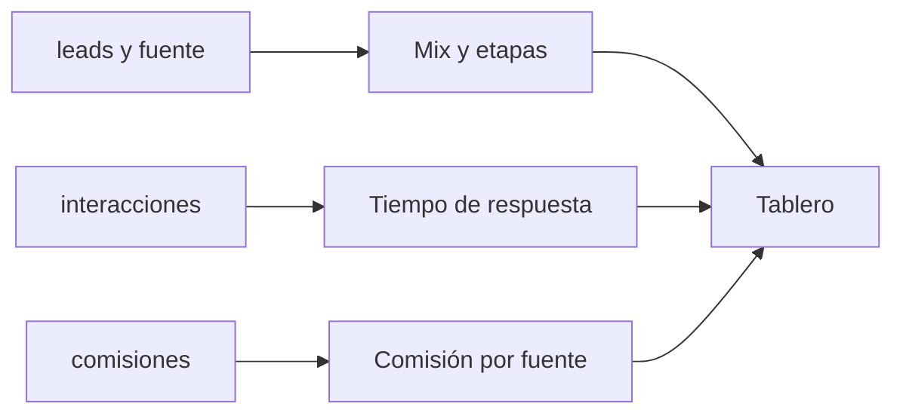

### PLP-PRO-012 Laboratorio y producción

Cláusula 8.7. Dueño: Backend Lead.

1. Escribir simulaciones de anuncios solo en `lab_meta_demo`.
2. Escribir pruebas de formulario solo en `leads_prueba_formulario`.
3. Impedir que esas tablas tengan llave hacia `leads` o `comisiones`.
4. Antes del arranque, exportar y vaciar la práctica, y decidir fila por fila si la semilla de 15 leads es cliente o prueba.
5. Borrar una semilla de prueba en este orden: scoring, perfil, borradores, citas, seguimientos, interacciones, matches, comisiones, leads, prospectos.

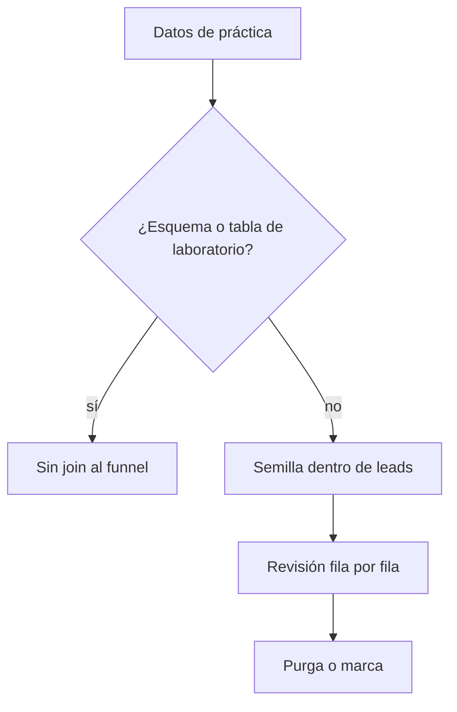

### PLP-PRO-013 Mejora continua

Cláusulas 9.1, 10.2 y 10.3. Dueño: CTO. Este protocolo envuelve a los otros doce.

1. Planear: cada proceso tiene un criterio de producción en su mapa y una consulta en PLP-REG-001.
2. Hacer: el proceso escribe en Supabase.
3. Verificar: correr la consulta. Cero filas cierra la regla. Un cero vacío, como interacciones en cero, deja el P0 abierto.
4. Actuar: abrir o actualizar la brecha, subir la revisión del proceso y volver a verificar.

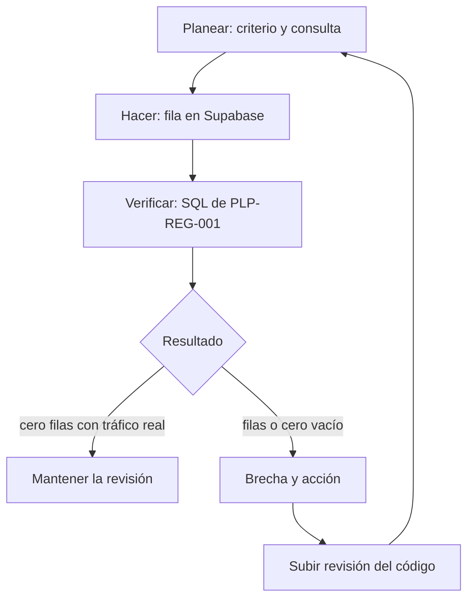

Cadencia: P0 en el momento en que aparece. P1 en menos de 24 horas. P2 en la revisión semanal. La primera verificación del 2026-10-05 dejó abiertos el match de los 12 leads tibios o calientes, 8 agendas vencidas, 12 respuestas fuera de 5 minutos y la ventana de 24 horas sin interacciones.

## 5. Historial

| Revisión | Fecha | Cambio |
| --- | --- | --- |
| 01 | 2026-10-05 | Emisión del manual, ligas de ingreso y protocolos PLP-PRO-001 a PLP-PRO-013. |
