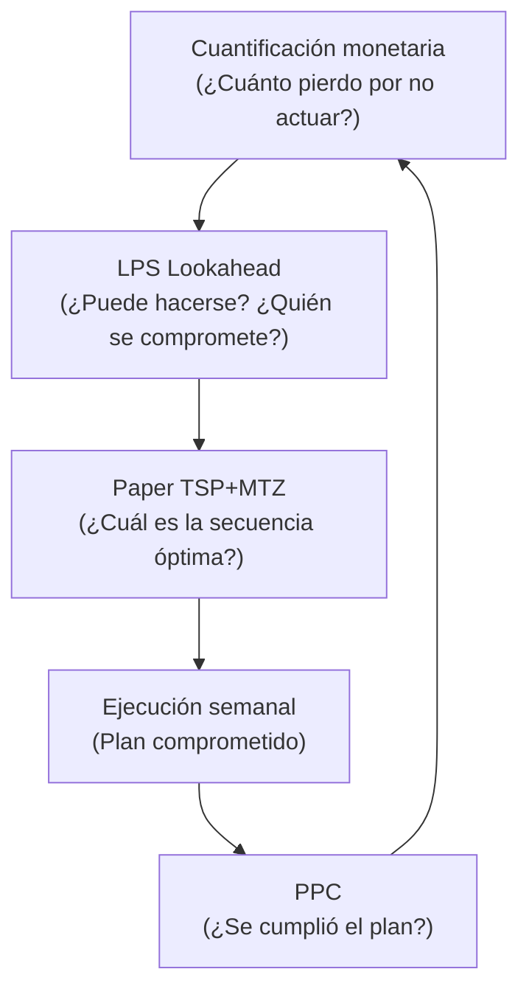

# Secuenciación de empaque farmacéutico: síntesis de investigación

> Fecha de investigación: 2026-10-06 | Fuentes consultadas: 18

## Resumen ejecutivo

El paper de Soria-Argüello et al. (2026) demuestra que la secuenciación óptima de productos en líneas de empaque farmacéutico — mediante clustering por similitud + TSP con restricciones MTZ — reduce tiempos de setup entre 13.6% y 19.3% frente a la programación manual. Sin embargo, el paper ataca solo el MUDA de **espera** (setup); no modela inventario, transporte, defectos ni movimiento. La integración con **LPS (Last Planner System)** aporta el mecanismo de ejecución operativa (lookahead, compromiso semanal, PPC), mientras que un marco práctico de **cuantificación monetaria de desperdicios** (denominado "LFI" en material de enseñanza, sin definición académica estándar) sirve como capa de priorización de restricciones. Para simulación visual en aula, la estrategia recomendada es en capas: Mermaid → SimPy → AnyLogic Online.

---

## 1. Hallazgos del paper principal

### 1.1 Metodología

[Soria-Argüello et al., 2026](https://perfiles.ibero.mx/es/publications/a-prescriptive-analytics-framework-for-modeling-product-sequencin/) propone un framework de analytics prescriptivo en dos etapas:

| Etapa | Técnica | Objetivo |
| :--- | :--- | :--- |
| **Descriptiva** | Clustering por similitud de atributos (sustancia activa, tamaño de blíster, formato) | Agrupar productos en familias homogéneas |
| **Prescriptiva** | TSP con restricciones Miller-Tucker-Zemlin (MTZ) | Minimizar tiempo total de setup dentro de cada familia |

**Solvers utilizados:**
- **Gurobi** (optimización exacta) para instancias pequeñas
- **Ant System** (metaheurística) para instancias de alta complejidad — resultados comparables o superiores al solver exacto

**Datos:** 9 meses de datos históricos de 4 líneas de producción reales en una empresa farmacéutica.

### 1.2 Resultados cuantitativos

| Métrica | Valor | Fuente |
| :--- | :--- | :--- |
| Reducción de setup (vs. manual) | **13.6% – 19.3%** | [Soria-Argüello et al., 2026](https://perfiles.ibero.mx/es/publications/a-prescriptive-analytics-framework-for-modeling-product-sequencin/) |
| Cambios mayores evitados (clustering) | **~100/año** | Trabajo previo del mismo grupo: [Soria-Argüello & Ruiz-Morales](https://perfiles.ibero.mx/en/publications/mathematical-model-for-product-family-design-and-product-sequenci-3/) |
| Setup reducido (caso individual) | **4.5h → 1.5h** | Mismo trabajo previo |
| Trade-off documentado | Más cambios menores al reducir cambios mayores | Paper 2026 |

### 1.3 Lo que el paper NO cubre (oportunidades)

| MUDA no modelado | Implicación | Oportunidad de extensión |
| :--- | :--- | :--- |
| **Inventario** | No considera stock intermedio | Integrar políticas de lote mínimo |
| **Transporte** | No optimiza layout de planta | Combinar con simulación de flujo (FlexSim, Plant Simulation) |
| **Movimiento** | No analiza ergonomía del operario | Estudios de tiempo y movimiento |
| **Defectos** | Asume calidad perfecta post-setup | Modelar retrabajo por temperatura/cambio de formato |
| **Sobreproducción** | No modela demanda | Integrar con plan maestro de producción |

---

## 2. Integración Paper + LPS + Cuantificación monetaria

### 2.1 Cadena de decisión completa



### 2.2 Posicionamiento de cada capa

| Nivel | Herramienta | Pregunta que responde | Tipo de salida |
| :--- | :--- | :--- | :--- |
| **Modelo matemático** | TSP + MTZ (paper) | ¿Cómo ordenar para minimizar setup? | Secuencia óptima |
| **Marco de control** | LPS | ¿Puede ejecutarse? ¿Quién se compromete? | Plan semanal, PPC |
| **Evaluación de valor** | Cuantificación monetaria (LFI*) | ¿Cuánto se pierde por no hacerlo? | ROI, priorización |

> *LFI (Loss Function Index): **no es un concepto académico estándar**. No existe en la literatura de lean manufacturing, optimización ni analytics prescriptivo. Es un marco heurístico de material de enseñanza para traducir desperdicio a pérdida monetaria. En documentación formal, usar "índice de pérdida monetaria" o "cuantificación de costos de desperdicio".

### 2.3 LPS en contexto farmacéutico

[IGLC, 2024](https://iglcstorage.blob.core.windows.net/papers/attachment-002696c2-e0ac-4d9c-a62d-87ffea2ca14d.pdf) documenta la implementación de LPS en la fase de Commissioning & Qualification (C&Q) de un proyecto farmacéutico:

- **PPC** (Percent Plan Complete) aportó estabilidad tras 4–6 semanas de lookahead maduro
- Los mayores beneficios vinieron del análisis de **RNC** (Reasons for Non-Completion), no solo del PPC
- Recomendación: implementar LPS de extremo a extremo, no por fases aisladas

**Conexión con el paper:** La secuenciación manual "construida por personal experimentado" es exactamente el problema que LPS aborda mediante planificación colaborativa y eliminación de restricciones en el lookahead.

### 2.4 Ejemplo de integración: sensor sucio en cambio de rollo

| Paso | Capa | Acción | Resultado |
| :--- | :--- | :--- | :--- |
| 1 | Cuantificación | 18 paros/día × $4,200/paro = $75,600/día de pérdida | Prioridad ALTA |
| 2 | LPS Lookahead | Restricción: "sensor sucio causa paros no planificados" | Compromiso: limpiar sensor en cada cambio |
| 3 | Paper TSP | Secuencia optimizada reduce cambios mayores | Menos eventos de limpieza profunda |
| 4 | PPC | Medir cumplimiento del plan semanal | Validar que paros bajan de 18 a ~2/día |
| 5 | Feedback | Recalcular ahorro real vs. esperado | ROI: 193× ($16,800 ahorro / $87 costo limpieza) |

---

## 3. Los 7 MUDA en el flujo de empaque

### 3.1 Matriz de detección

| MUDA | Señal en diagrama de flujo | Pregunta clave | Ejemplo en empaque |
| :--- | :--- | :--- | :--- |
| **Sobreproducción** | Triángulo de inventario antes de proceso sin demanda | ¿Se produce antes de que el siguiente paso lo necesite? | Blísters de SKU no en secuencia inmediata |
| **Espera** | Reloj ⏱ o cola entre operaciones | ¿Cuánto tiempo sin valor añadido? | Máquina parada en cambio de formato |
| **Transporte** | Flecha entre áreas no adyacentes | ¿Se puede eliminar o acortar? | Semi-terminado a almacén temporal y regreso |
| **Sobreproceso** | Operación duplicada ✓✓ | ¿El cliente paga por este paso? | Limpieza profunda por cambio de formato (no sustancia) |
| **Inventario** | Triángulo grande entre procesos | ¿Stock mayor al necesario? | Producto terminado esperando empaque final |
| **Movimiento** | Persona caminando 🚶 | ¿El operario se desplaza a buscar? | Herramienta de ajuste fuera del puesto |
| **Defectos** | Retrabajo 🔄 | ¿Existe porque algo falló antes? | Blíster mal sellado por cambio de temperatura |

### 3.2 MUDA atacados por el paper

| MUDA | Cómo lo resuelve | Resultado medido |
| :--- | :--- | :--- |
| **Espera** (setup) | Secuenciación TSP + MTZ | −13.6% a −19.3% en setup |
| **Sobreproceso** (cambios mayores innecesarios) | Clustering por sustancia activa | ~100 cambios mayores menos/año |

---

## 4. Herramientas de simulación: comparación

### 4.1 Software industrial (nivel 1)

| Software | Metodología | Gemelo digital | Fortaleza clave | Escenario ideal |
| :--- | :--- | :--- | :--- | :--- |
| **AnyLogic** | Multi-método (DE + agentes + dinámica) | Fuerte | Java, ejecución en navegador | Demostración en aula, escenarios complejos |
| **Tecnomatix Plant Simulation** | Orientado a objetos | Fuerte | Algoritmos genéticos, SimTalk | Optimización de secuencias, layout |
| **FlexSim** | Orientado a objetos | Fuerte | 3D, integración CAD/ERP | Cuellos de botella, líneas de ensamblaje |
| **Arena** | Orientado a bloques | Limitado | SIMAN, VBA, módulos ricos | Manufactura tradicional (evaluar ciclo de vida) |
| **Simio** | Objetos inteligentes | Fuerte | Risk-Based Scheduling nativo | Manufactura, logística |

### 4.2 Herramientas ligeras / código abierto

| Herramienta | Tipo | Fortaleza | Limitación | Instalación |
| :--- | :--- | :--- | :--- | :--- |
| **SimPy** | Biblioteca Python (DES) | Colas, recursos, análisis con Pandas/Matplotlib | Sin interfaz visual | `pip install simpy` |
| **Mermaid** | Diagramas en Markdown | Flujos editables en GitHub/Notion/VS Code | Sin simulación cuantitativa | Ninguna (sintaxis) |
| **workflowio** | TUI de simulación | Importa diagramas Mermaid → simulación en terminal | v0.1.0, muy nuevo | `pip install workflowio` |
| **Simulatte** | Framework SimPy | Job-shops con intralogística, AGVs | Requiere Python ≥3.11 | `pip install simulatte` |
| **FactorySimPy** | Componentes SimPy | Máquinas, transportadores, métricas | Beta (v0.1.0b3) | GitHub install |
| **Simantha** | Paquete NIST | Líneas asíncronas, degradación de máquinas | Enfoque académico | `pip install simantha` |

### 4.3 Estrategia en capas para enseñanza

```
Capa 1: Mermaid          → Diagrama de flujo con marcadores MUDA (0 costo, 0 instalación)
Capa 2: SimPy            → Simulación cuantitativa <50 líneas (Jupyter/Colab)
Capa 3: AnyLogic Online  → Demostración 3D en navegador (impacto visual)
Capa 4: Plant Simulation → Evaluación industrial con optimización genética
```

---

## 5. Novedades y descubrimientos de la investigación

### 5.1 Confirmado por fuentes primarias

1. **El paper es reciente (2026)** y aún en preprint (SSRN), con 0 citaciones al momento de la investigación.
2. **La discrepancia 13.6% vs 19.3%** corresponde a diferentes instancias/líneas: el abstract de IBERO reporta hasta 19.3%, mientras que otras fuentes (Exa.ai) citan 13.6% como resultado del caso estudio principal.
3. **workflowio** (sept 2026) es una novedad real: permite importar diagramas Mermaid y simular flujo de materiales en terminal — valida la estrategia Mermaid → simulación propuesta.
4. **Simulatte v0.12** (jun 2026) es un framework SimPy maduro para job-shops con intralogística — alternativa más completa que SimPy puro para líneas de empaque.
5. **LPS tiene evidencia directa en pharma**: el paper de IGLC 2024 documenta 40 semanas de implementación en C&Q farmacéutico.

### 5.2 Descubrimientos propios (no en el paper)

1. **LFI no existe como concepto académico** — búsqueda exhaustiva no encontró "Loss Function Index" en lean, optimización ni manufacturing. Es un marco heurístico de enseñanza.
2. **El trade-off cambio mayor/menor** del paper se alinea con la matriz MUDA: reducir "sobreproceso" (limpieza profunda innecesaria) puede aumentar "espera" (cambios menores más frecuentes) — el LFI ayuda a decidir si el trade-off vale la pena monetariamente.
3. **La integración Paper→LPS→LFI forma un bucle cerrado de mejora continua** que ninguna de las tres piezas resuelve sola.
4. **Para el escenario de 30 días con patrón oculto** (enseñanza), SimPy + datos sintéticos es suficiente; AnyLogic solo se justifica para demostración visual final.

### 5.3 Riesgos y advertencias

| Riesgo | Mitigación |
| :--- | :--- |
| Arena en declive (AutoMod discontinuado) | Evaluar AnyLogic o Plant Simulation para proyectos largos |
| LFI con datos imprecisos | Validar costo/paro con datos reales de planta antes de priorizar |
| Paper en preprint sin peer review | Citar como "preprint" hasta publicación formal |
| workflowio v0.1.0 inmaduro | Usar SimPy directamente para simulaciones serias |

---

## 6. Plantilla de documentación para el equipo

```markdown
# PROYECTO: [Nombre de línea/proceso]
FECHA: [Fecha]
RESPONSABLE: [Nombre]

## 1. Diagrama de flujo actual (con marcadores MUDA)

## 2. Tabla de cuantificación
| MUDA | Ubicación | Tiempo perdido | Costo | Frecuencia | Prioridad |
|------|-----------|----------------|-------|------------|-----------|
| Espera | Setup SKU-A → SKU-B | 4.5 h | $X | 12/sem | ALTA |

## 3. Mapa de causas
- ¿Por qué existe esta espera? → Cambio de sustancia requiere limpieza profunda
- ¿Por qué no se agrupa? → Scheduling manual
- ¿Por qué es manual? → Sin herramienta de optimización

## 4. Propuesta de intervención
- MUDA prioritario: Espera (setup)
- Solución: Clustering + TSP (paper Soria-Argüello)
- Control: LPS con lookahead de 4-6 semanas
- Métrica: PPC + reducción de setup ≥13.6%
```

---

## 7. Próximos pasos recomendados

1. **Obtener el paper completo** del SSRN/IBERO para validar datos exactos de las 4 líneas.
2. **Crear el Excel de 30 días** con datos sintéticos y patrón oculto (firma del operador) para ejercicio en clase.
3. **Prototipar Capa 1+2** (Mermaid + SimPy) en un Jupyter Notebook del repositorio.
4. **Evaluar AnyLogic Personal Learning Edition** para la demostración visual (gratis, navegador).
5. **Documentar el marco LFI** como "cuantificación monetaria de desperdicios" — no como acrónimo académico.

---

## Bibliografía

1. [Soria-Argüello, I., Villicaña-García, E., Montes-Orozco, E., & Urbán-Rivero, L. E. (2026). A Prescriptive Analytics Framework for Modeling Product Sequencing in Pharmaceutical Packaging Lines.](https://perfiles.ibero.mx/es/publications/a-prescriptive-analytics-framework-for-modeling-product-sequencin/)
2. [Soria-Argüello, I., Ruiz-Morales, M., & Ochoa, A. Mathematical Model for Product Family Design and Product Sequencing for a Pharmaceutical Company.](https://perfiles.ibero.mx/en/publications/mathematical-model-for-product-family-design-and-product-sequenci-3/)
3. [IGLC (2024). Improving Commissioning and Qualification Delivery Using Last Planner® System.](https://iglcstorage.blob.core.windows.net/papers/attachment-002696c2-e0ac-4d9c-a62d-87ffea2ca14d.pdf)
4. [Ballard, G. (2000). The Last Planner System of Production Control. PhD Thesis, University of Birmingham.](https://www.leanconstruction.org/)
5. [workflowio v0.1.0 (2026). PyPI.](https://pypi.org/project/workflowio/)
6. [Simulatte v0.12.0 (2026). PyPI.](https://pypi.org/project/simulatte/)
7. [FactorySimPy v0.1.0b3 (2025). PyPI.](https://pypi.org/project/factorysimpy/)
8. [Simantha — NIST Manufacturing Systems Simulation.](https://github.com/usnistgov/simantha)
9. [AnyLogic — Multi-method simulation software.](https://www.anylogic.com/)
10. [Siemens Tecnomatix Plant Simulation.](https://www.plm.automation.siemens.com/global/en/products/manufacturing-planning/plant-simulation.html)
