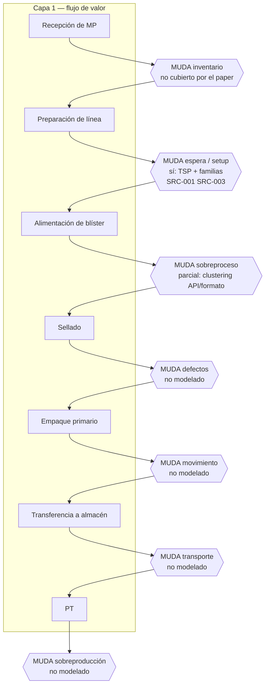

# 7 MUDA en el diagrama de flujo de empaque

Capa 1 = valor (lo que transforma el producto).  
Capa 2 = flujo real.  
Capa 3 = marcador MUDA.  
Capa 4 = dato (tiempo, $, frecuencia) — **didáctico** hasta tener datos de planta.

## Matriz de detección

| MUDA | Señal en el flujo | Pregunta | ¿Paper? | Ejemplo de línea de empaque |
|---|---|---|---|---|
| Sobreproducción | Inventario **antes** de un proceso sin demanda | ¿Este lote se necesita ahora? | No | Blísteres de un SKU que no sigue en la secuencia |
| Espera | Reloj / cola entre operaciones | ¿Cuánto tiempo sin valor? | **Sí (setup)** | Máquina parada por cambio de formato [SRC-001] |
| Transporte | Flecha entre áreas no adyacentes | ¿Se puede eliminar el movimiento? | No | Semi-terminado a almacén temporal y de vuelta |
| Sobreproceso | Operación duplicada o limpieza más profunda de lo necesario | ¿El cliente paga este paso? | **Parcial (clustering)** | Limpieza profunda cuando solo cambió el formato, no el API [SRC-001] |
| Inventario | Triángulo grande entre procesos | ¿Excede lo que pide el siguiente paso? | No | PT esperando empaque final |
| Movimiento | Operario buscando / caminando | ¿El desplazamiento añade valor? | No | Buscar herramienta de ajuste |
| Defectos | Retrabajo / inspección extra | ¿Este paso existe porque algo falló? | No (calidad asumida) | Re-sellar blíster por temperatura post-cambio |

## Flujo tipo (etiquetas paper vs. hueco)

## Plantilla de cuantificación (llenar con datos reales)

Proyecto: ________  
Fecha: ________  
Responsable: ________

| MUDA | Ubicación | Tiempo perdido | Costo | Frecuencia | Prioridad | Fuente del dato |
|---|---|---|---|---|---|---|
| Espera | Setup SKU-A → SKU-B | 4.5 h (ref. abstract 2024) | TBD planta | TBD | Alta | SRC-001 o dato propio |
| Sobreproceso | Limpieza profunda intra-familia | TBD | TBD | TBD | Media | hipótesis; validar |
| … | | | | | | |

Mapa de causas (espera):

1. ¿Por qué la espera? → cambio de sustancia exige limpieza profunda.  
2. ¿Por qué no se agrupa por sustancia? → scheduling manual [SRC-001].  
3. ¿Por qué es manual? → no hay herramienta de secuenciación (el paper propone TSP/familias).

## Cómo usarlo en revisión de equipo

1. Dibujar solo la capa 1. Si un recuadro no transforma, ya es sospechoso.  
2. Superponer esperas y almacenes reales.  
3. Marcar MUDA.  
4. Poner **una cifra o un `TBD`**, nunca un número de conversación sin ficha.  
5. El paper justifica priorizar espera/setup; no cierra el mapa.
