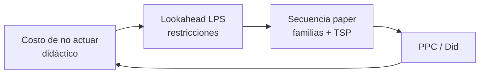

# Encaje paper ↔ LPS ↔ “LFI” (sin forzar el término)

## Posición de cada pieza

| Nivel | Herramienta | Pregunta | Tipo de salida | ¿Está en el paper? |
|---|---|---|---|---|
| Modelo | Familias + TSP (± MTZ) | ¿En qué orden minimizar setup? | Secuencia | **Sí** [SRC-001][SRC-003] |
| Control | LPS | ¿Puede hacerse? ¿Quién se compromete? ¿Se cumplió? (PPC) | Plan semanal | **No** — marco externo [SRC-004] |
| Valor | Pérdida monetaria didáctica (“LFI” de aula) | ¿Cuánto cuesta no actuar? | $ / restricción, ROI | **No** — no es término académico |

El paper no contiene LPS ni LFI. El encaje es una **capa de decisión para el equipo**, no una variable más del TSP.

## Dónde se inserta cada uno en LPS

Master / phase (**Should**) ← aquí entra la secuencia óptima del paper.  
Lookahead (**Can**) ← aquí entra la cuantificación de restricciones (el “LFI” didáctico o una matriz pérdidas-costos [SRC-012]).  
Weekly plan (**Will**) ← compromiso de setup, limpieza de sensor, cambio de familia.  
Did / PPC ← ¿se respetó la secuencia y se eliminó la restricción?

Si una restricción de alto costo (sensor sucio, cambio de API no agrupado) no se hace ready, el PPC cae aunque el TSP sea óptimo en el papel.

## Precauciones

1. Meter dólares en el TSP **cambia el objetivo** (min tiempo → min costo). Eso no está en los abstracts.  
2. Los $ de aula dependen de supuestos (`lfi.py`). Si los datos de planta son malos, la priorización miente; el LPS exige trabajo “sound”.  
3. No llamar “Loss Function Index” en un artículo o a un cliente como si fuera estándar. Taguchi QLF es otra cosa [SRC-010]. Nombre interno sugerido: **costo de no eliminar la restricción**.

## Bucle que sí se puede enseñar (didáctico)

El gráfico `bucle_mejora.png` de este lab es **didáctico**: una curva suave de paros, no un resultado empírico del preprint.
